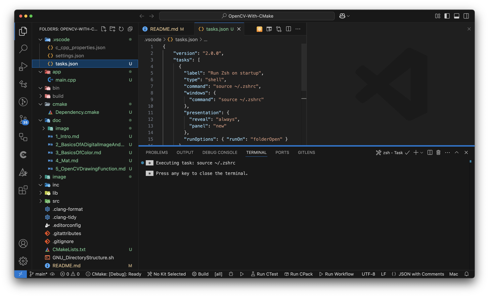
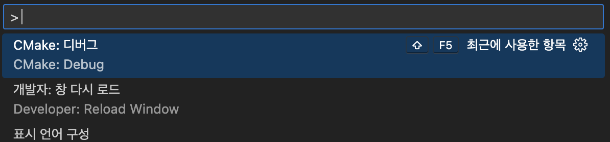
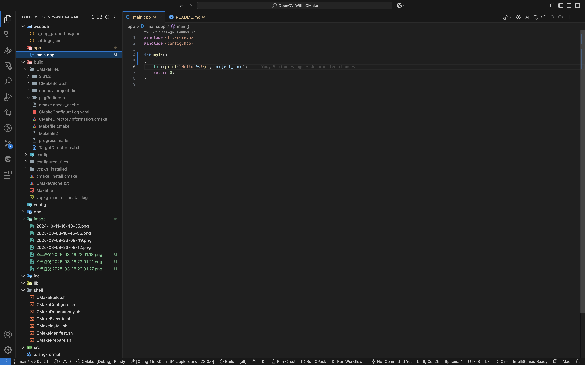

# OpenCV With CMake

---

## 실습

---
> ### 📄 목차

#### 1). OpenCV
1. [Intro](./doc/1_Intro.md)
2. [BasicsOfADigitalImageAndVideo](./doc/2_BasicsOfADigitalImageAndVideo.md)
3. [BasicsOfColor](./doc/3_BasicsOfColor.md)
4. [BasicsOfOpenCV](./doc/4_BasicsOfOpenCV.md)
5. [MatOperator](./doc/5_MatOperator.md)
6. [OpenCVDrawingFunction](./doc/6_OpenCVDrawingFunction.md)
7. [MemoryManagementAndPixelAccess](./doc/7_MemoryManagementAndPixelAccess.md)
8. [IntensityTransformation](./doc/8_IntensityTransformation.md)
9. [HistogramEqualization](./doc/9_HistogramEqualization.md)
10. [SpatialFiltering](./doc/10_SpatialFiltering.md)
11. [ColorProcessing](./doc/11_ColorProcessing.md)
12. [ImageSegmentation](./doc/12_ImageSegmentation.md)
13. [VideoSegmentation](./doc/13_VideoSegmentation.md)
14. [MorphologicalOperation](./doc/14_MorphologicalOperation.md)


#### 2). 그 외..

1. [Matirx Calculus](./doc/Extra/MatrixCalculus.md)

---

## 세팅

---

> ### 📄 1. CLI로 CMake GNU 파일 제작 Shell 스크립트 실행하기


<div align=center>
    
</div>

```bash
# sh GNU_DirectoryStructure.sh <ProjectName>

# 본인의 경우 다음과 같이 생성함
sh GNU_DirectoryStructure.sh OpenCV-With-CMake
```

---

> ### 📄 2. VSCode 터미널이 Zsh가 아닐때,


#### 1). 쉘 환경 변수에 code 명령 추가하기

<div align=center>
    
</div>

---

#### 2). ‘tasks.json" 사용하기
* 마치 github action에서 yaml을 만들듯.
vscode에서 파일이 열릴때, 등등 이벤트에 수행할 커맨드를 추가할 수 있다.

1. [vscode task onstartup](https://www.roboleary.net/vscode/2020/10/19/vscode-task-onstartup.html)
2. [automated task fix vscodel](https://www.roboleary.net/vscode/2023/12/31/automated-task-fix-vscode.html)

<div align=center>
    
    <h5></h5>
</div>

#### 3). CMake Debug vcpkg 환경에서 사용하기

#### 만약 VCPKG 를 사용했다면, 특수한 설정을 하지 않으면 디버깅을 할 수 없다.
* 왜냐하면 VCPKG를 사용한 이상 앞으로 다음과 같은 쉘을 사용해서 Configure 해줘야 하기 떄문이다.
  ```shell
  cmake -B build -DCMAKE_TOOLCHAIN_FILE=${VCPKG_ROOT}/scripts/buildsystems/vcpkg.cmake
  ```
* 문제는 아무런 설정 없이는 이와 같은 CMakeCache를 Argument로 넘겨줄 수 없다는 것이 문제다.
    따라서 다음과 같은 절차가 필요하다.

##### ① `CMakePreset.json` 설정하기

* **`Invalid macro expansion in <name>`** 문제 해결하기
  * 다음과 같은 에러가 발생한다면 프리셋에서 사용한 환경변수 매크로가 잘못되었는지 확인하면 된다.
    ```bash
    CMake Error: Could not read presets from <현재_열려있는_프로젝트>
    Invalid macro expansion in <프리셋_이름>
    ```
  * `"binaryDir"` 주소 수정하기!
      ```json
      /* 최상단 루트 현재 디렉토리에 CMakePreset.json 만들기*/
      {
          "version": 2,
          "configurePresets": [
              {
                  "name": "opencv-project",
                  "displayName": "도구 체인 파일을 사용하여 사전 설정 구성",
                  "description": "Unix Makefiles 생성기, 빌드 및 설치 디렉터리 설정",
                  "generator": "Unix Makefiles",
                  // ${workspaceFolder}는 vscode에서만 이해하는 환경 변수다! 따라서 "${sourceDir}/build/" 로 바꿔야 한다!!
                  "binaryDir": "${workspaceFolder}/build/", // ❌
                  "cacheVariables": {
                      "CMAKE_BUILD_TYPE": "Debug",
                      // ENV{VCPKG_ROOT} 이렇게 ENV를 대문자로 쓰면 안된다, 따라서 env{VCPKG_ROOT} 와 같이 작성해야 한다.
                      "CMAKE_TOOLCHAIN_FILE": "$ENV{VCPKG_ROOT}/scripts/buildsystems/vcpkg.cmake", // ❌
                      // ENV{VCPKG_ROOT} 이렇게 ENV를 대문자로 쓰면 안된다, 따라서 env{VCPKG_ROOT} 와 같이 작성해야 한다.
                      "CMAKE_INSTALL_PREFIX": "$ENV{VCPKG_ROOT}/installed/arm64-osx" // ❌
                  }
              }
          ]
      }
      ```

##### ② CMake : 디버그

<div align=center>
    
    <h5></h5>
</div>

##### ③ setting.json 설정

* [CMake DebugConfig 설정하기](https://github.com/microsoft/vscode-cmake-tools/issues/3908)
*  만약 127 GDB를 찾지 못했다는 등, 디버거가 실행이 되지 않고 종료 되었다면. 확인해 볼 것!
    ```bash
    ...XcodeDefault.xctoolchain/usr/bin/lldb --version code 127과(와) 함께 종료되었습니다.
    ```
* cmake.debugConfig를 setting.json에 설정하는 것이다.
    ```json
    /* .vscode/setting.json */
    ...
    "cmake.debugConfig": {
        "cwd": "${workspaceFolder}",
        "MIMode": "lldb"
    },
    ...
    ```

##### ④ 결과

---

> ### 3. 📄 VSCode에서 라이브러리를 못찾아 올떄,

<div align=center>
    
    <h5>분명 CMake Configure&Generate 했는데도 못불러온단 말이지..</h5>
</div>

<div align=center>
    
    <h5>.vscode/c_cpp_properties.json 을 수정하면 된다.</h5>
</div>


<div align=center>
    
    <h5>include path를 잘 찾아온다.</h5>
</div>

---

> ### 📄 4. CMake 세팅

#### 1). CMakeLists.txt 설정

##### ① XXX_SOURCE_DIR의 생성 순서

FetchContent_MakeAvailable 이후에 생긴다.

```txt
FetchContent_MakeAvailable(${DEP_LIST})
set(DEP_SOURCE_DIR ${DEP_SOURCE_DIR} "${spdlog_SOURCE_DIR}/include") # spdlog 헤더 (필요에 따라 경로 수정)
set(DEP_SOURCE_DIR ${DEP_SOURCE_DIR} "${OpenCV_SOURCE_DIR}/include") # opencv_world 옵션 활성화: 모든 모듈을 하나의 통합 라이브러리로 빌드
```

##### ② CMake `find_package()`

* `find_package()` **이전에 선언**해야 하는 변수가 있고, **이후에 선언**해야 하는 변수가 있다.

* 만약 mac에 패키지 매니저인 brew와 vcpkg를 사용중이라면
두 패키지 매니저 두가지 중 어느 곳에 깔린 패키지를 가져와야 하느냐.
  > Fair point. Suppose if you have set a toolchain to use vcpkg. Now you want to use apache-arrow from the brew installation. so a solution would be the set the brew path in find_package(Arrow CONFIG REQUIRED PATHS /usr/local/lib/cmake/
  arrow NO_DEFAULT_PATH). This one loads the dependencies of the arrow package by looking into packages installed by vcpkg, which is not what we want. Then you end up by writing find_package recursively for all the dependencies.
  * 결론은 명시적으로 `find_package`를 사용할 수 있다.
    ```txt
    ...

    find_package(fmt REQUIRED)
    set(DEP_LIBS ${DEP_LIBS} fmt::fmt)

    find_package(nlohmann_json REQUIRED)
    set(DEP_LIBS ${DEP_LIBS} nlohmann_json::nlohmann_json)

    // 대표적으로 find_package 이전에 선언해야 하는 변수
    set(OpenCV_ROOT "${VCPKG_INSTALLED_DIR}/arm64-osx/share/opencv4")
    find_package(OpenCV REQUIRED)
    // 대표적으로 find_package 이후에 선언해야 하는 변수
    set(DEP_LIBS ${DEP_LIBS} ${OpenCV_LIBS})
    message(STATUS "OpenCV_LIBS ${CMAKE_TOOLCHAIN_FILE}")

    find_package(spdlog REQUIRED)
    set(DEP_LIBS ${DEP_LIBS} spdlog::spdlog)

    ...

    target_link_libraries(${PROJECT_NAME} PUBLIC
        ${DEP_LIBS}
    )
    ```


---

#### 2). VCPKG 클래식 모드 사용

#### FetchContent는 버리자! 화난다 진짜 VCPKG 쓰자.

##### ① 환경 변수 설정
```shell
# ~/.zshrc
export VCPKG_ROOT="$HOME/vcpkg"
export PATH="$PATH:$VCPKG_ROOT"
```

##### ② VCPKG 설치 밎 업데이트
```bash
cd ~/vcpkg
git pull
sudo chmod 700 ./bootstrap-vcpkg.sh
sh ./bootstrap-vcpkg.sh
```

* Package With Feature
    * `vcpkg install "ffmpeg[core,avcodec,avdevice,avfilter,avformat,ffmpeg,ffplay,ffprobe,nvcodec,opencl,postproc,sdl2,swscale,nonfree]:arm64-osx" --recurse`
    1. **대괄호([]) 표기**
       * **의미:** vcpkg에서는 패키지 설치 시 기본 기능 외에 추가 옵션이나 “피처(feature)”를 선택할 수 있도록 대괄호([])를 사용합니다.
       * **차이점:**
         * **예: `opencv4[ffmpeg]`**
           → OpenCV4를 설치할 때 ffmpeg 관련 기능(예: 동영상 디코딩/인코딩 지원)을 추가로 활성화합니다.
         * **예: `opencv4` (대괄호 없이)**
           → 기본 피처만 설치하게 됩니다.
    2. **`--recurse` 옵션**
       * **의미:** 일부 패키지는 피처를 추가하거나 변경하면 의존하는 다른 패키지들도 함께 재빌드(rebuild)되어야 합니다.
       * **차이점:**
         * `--recurse` 사용 시**
           → 설치 계획에 포함된 패키지의 변경 사항(예: 피처 추가)으로 인해 재빌드가 필요한 모든 관련 의존 패키지들도 함께 다시 빌드하도록 승인합니다.
         * `--recurse` 미사용 시**
           → 변경된 피처로 인해 일부 의존 패키지가 재빌드되어야 하는 상황에서 설치가 실패할 수 있습니다.

* 이 명령을 zsh에서 쓸 수 없는 이유?
  * zsh는 대괄호`[]`를 파일 이름 패턴(글로빙)으로 해석하기 때문에 발생
  * 즉, opencv4[ffmpeg] 부분이 쉘에 의해 패턴으로 인식되어 올바른 문자열로 전달되지 않으므로
  "bad pattern" 오류가 나타난다..
    ```
    vcpkg install 'opencv4[ffmpeg]:arm64-osx' --recurse
    ```

##### ③ `vcpkg integrate install` & `-DCMake_TOOLCAHIN_FILES`
* 클래식 모드를 사용하면 로컬 저장소에 전역적으로 설치한 패키지를 사용하는 것이다.
  다음 커맨드를 사용해보자.
    ```bash
    vcpkg integrate install
    ```

* 전역으로 설치된 패키지를 현재 프로젝트 `/<현재프로젝트 디렉토리>/CMakeLists.txt` 에서 사용하도록 (연결해 주려면) 툴체인을 사용해야 한다.
    ```bash
    cmake -B build -DCMAKE_TOOLCHAIN_FILE=${VCPKG_ROOT}/scripts/buildsystems/vcpkg.cmake
    cmake --build build
    ```

##### ③ c_cpp_properties.json `includePath` 설정
* vscode에서 "c_cpp_properties.json" 의 includePath를 설정해 줘야한다.
  ```json
  {
    "configurations": [
        {
            "name": "Mac",
            "includePath": [
                ⭐️ "~/vcpkg/installed/arm64-osx/include/**", ⭐️
                "${workspaceFolder}/build/configured_files/**",
                "${workspaceFolder}/src",
                "${workspaceFolder}/inc"
            ],
            "macFrameworkPath": [
                "/Applications/Xcode.app/Contents/Developer/Platforms/MacOSX.platform/Developer/SDKs/MacOSX.sdk/System/Library/Frameworks"
            ],
            "cStandard": "c17",
            "cppStandard": "c++17",
            "intelliSenseMode": "macos-clang-arm64",
            "configurationProvider": "ms-vscode.cmake-tools",
            "compilerPath": "/usr/bin/clang++"
        }
    ],
    "version": 4
  }
  ```

---

#### 3). VCPKG 메니페스트 모드
##### ① `vcpkg.json` 로 menifest mode 진입

```json
# vcpkg.json
{
  "$schema": "https://raw.githubusercontent.com/microsoft/vcpkg-tool/main/docs/vcpkg.schema.json",
  "name": <PROJECT_NAME>,
  "version": "0.0.1",
  "dependencies": [
  ],
  "builtin-baseline": "782ccc18d8b819cdef6794a6c03eb3d9f7cd04aa"
  // <$VCPKG_ROOT>로 이동하고 터미널에서 git log 했을때 최상단의 커밋의 hex코드 전부 복붙
}

```

##### ② `vcpkg add port <EXTERNAL_LIBRARIY>`

* https://learn.microsoft.com/ko-kr/vcpkg/commands/install

* vcpkg CLI Add port
    ```bash
    vcpkg add port fmt
    vcpkg add port nlohmann-json
    vcpkg add port spdlog
    vcpkg add port opencv4
    ```
    ```bash
    vcpkg integrate install
    ```

* Add port 결과
    ```json
    # vcpkg.json
    {
      "$schema": "https://raw.githubusercontent.com/microsoft/vcpkg-tool/main/docs/vcpkg.schema.json",
      "name": "opencv-project",
      "version": "0.0.1",
      "dependencies": [
        "fmt",
        "nlohmann-json",
        "spdlog",
        "opencv4"
      ],
      "builtin-baseline": "782ccc18d8b819cdef6794a6c03eb3d9f7cd04aa"
    }
    ```
* feature 추가
  * `opencv4` 대신 좀더 늘려 쓰자.
    ```json
    "dependencies": [
        {
            "name":"opencv4",
            "features": ["ffmpeg", "opencl"]
        },
    ]
    ```
* manifest에서 install

---


> ### 📄 `cmake -B build --fresh`이후 발생하는 문제

* 갑자기 `spdlog`가 문제다.
    ```bash
    CMake Error at CMakeLists.txt:23 (find_package): By not providing "Findspdlog.cmake" in
    CMAKE_MODULE_PATH this project has asked CMake to find a package configuration file
    provided by "spdlog", but CMake did not find one.

    Could not find a package configuration file provided by "spdlog"
    with any of the following names:

    spdlogConfig.cmake
    spdlog-config.cmake
    Add the installation prefix of "spdlog" to CMAKE_PREFIX_PATH
    or set "spdlog_DIR" to a directory containing one of the above files.
    If "spdlog" provides a separate development package or SDK,
    be sure it has been installed.
    ```
* 사실 `--fresh`를 하는 이유는, `CMakeCache`를 초기화 하기 위함인데.
  이럴때는 극단적으로 모두 삭제해 버리자.
  ```shell
  rm -rf build
  mkdir build
  ```

> ### 📄 `add_subdirectory()`의 변수들의 Scope
---

> ### 📄 실행
<div align=center>
    
    <h5>FetchContent를 버리니 병이 나았습니다. 🥰</h5>
</div>

---

> ### 📄 참고

---

#### 1). [삼각형의 실전! CMake 초급](https://inf.run/og3Jm)
* 이 강의를 통해 ...
    1. CMake CLI,
    2. C/C++ 라이브러리 의존성 관리
    3. 모던 CMake의 모듈러 디자인에 대해 이해했고, 확장성 있는 빌드 시스템 작성법을 배웠음

---

#### 2). [컴퓨터 비전 한동대 황성수 교수님](http://www.kocw.net/home/m/cview.do?lid=f879dfef45031db6)

* 이 강의를 통해
  1. 컴퓨터 비전 이론 익히기
  2. C++을 통한 컴퓨터 비전 프로젝트 만들기

#### 3). [컴퓨터 비전 특강](https://www.youtube.com/watch?v=N6vP0T1Xabg&list=PLoJdZ7VvEiRNQwM3pcwHWwLQutIYMs4KK&index=1)
* 유튜브 특강

#### 4) OpenCL CMake Cache 설정
* https://blog.naver.com/91blacksheep/221492188605
* https://joonwooson.gitbooks.io/opencv/content/
* https://www.youtube.com/watch?v=e7GtcsSJ51s
* https://www.youtube.com/watch?v=yccbaXqRtNU
* https://velog.io/@jinhasong/OpenCV-4.4
