### 공간 필터링

*\#소벨 필터, \#가우시안 필터, \#경계면 필터링*

<div align=center>
    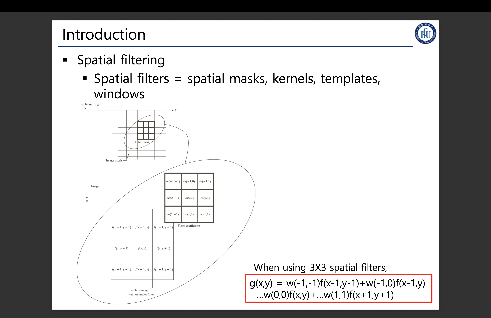
    <h5></h5>
</div>

---

#### 공간 필터링의 용어

* SpatialFilters를 활용해 이미지를 전처리 하는 작업을 한다.

* SpatialFilters는, SpatialMasks, Kernels, Templates, Windows
라는 다양한 이름으로 불리고 있다.

* 커널 다변수 함수 $k(y, x)$과 원본 이미지 행렬 $i(y, x)$ 이 있다면,
* 커널과 이미지 행렬간 합성곱(Convolusion Mul)을 실행한다.
* 그 컨볼루젼 곱의 결과 $g(y, x)$를 anchor point의 픽셀과 교체하는것이다.

---

#### 필터링
* 영상의 원하는 정보만 통과하고, 나머지는 걸러내는 작업,

---

#### 커널 (마스크, 윈도우)
* 필터링을 진행할때, 사용되는 2차원 행렬 N x M크기를 가지고 있고,
N, M 각각 1,3,5 등등 홀수를 가지고 있다.
* 커널의 고정점 (anchor point)를 행렬의 정 중앙을 사용하도록 한다.


#### 1). 평균 필터 (Average Filter)

<div align=center>
    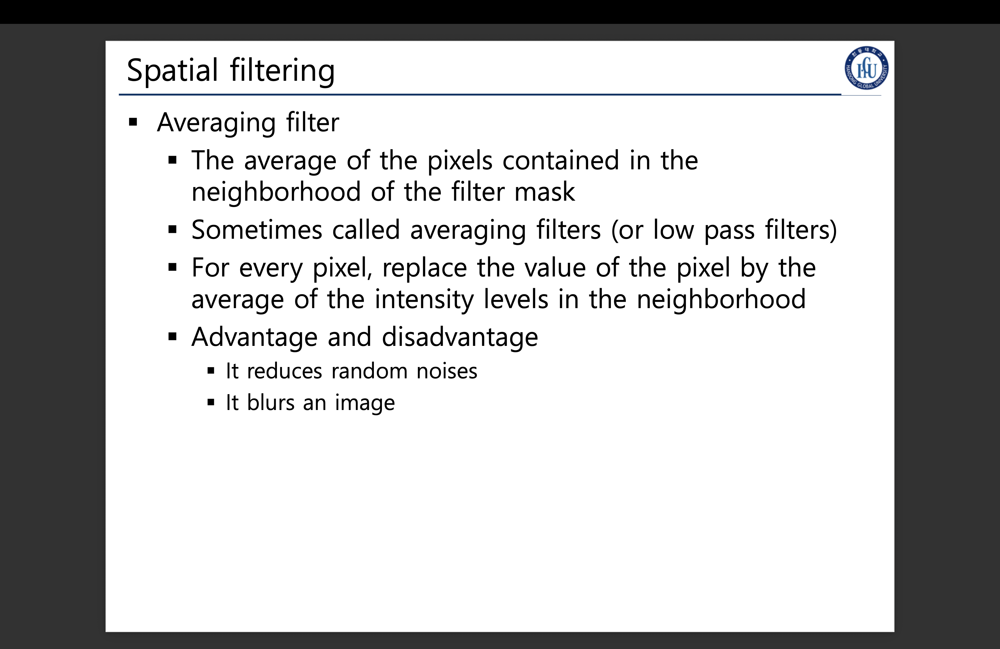
    <h5></h5>
</div>
<div align=center>
    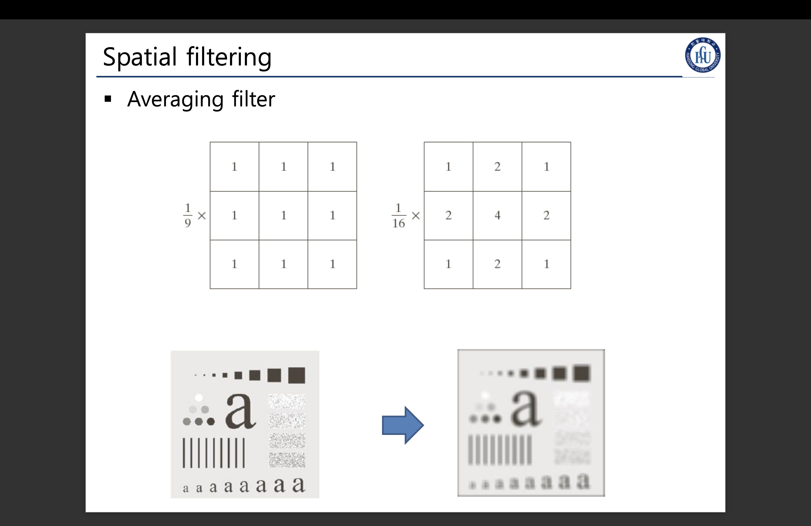
    <h5></h5>
</div>

* 필터 마스크의 주변 픽셀의 값을 마스크 내부 픽셀들의 평균을 적용하는 필터다.
  좌측은 무가중치 평균 필터이지만, 우측은 가중치를 두고, 합성곱 평균 수행하는 마스크라는 것.
* lowpass fiters라고 불리기도 한다.
* 장단점
  1. 노이즈 감소,
  2. 이미지 블러링 영상 자체가 블러링이 발생한다.


---

#### 2). 가우시안 필터 (gaussian filter)

<div align=center>
    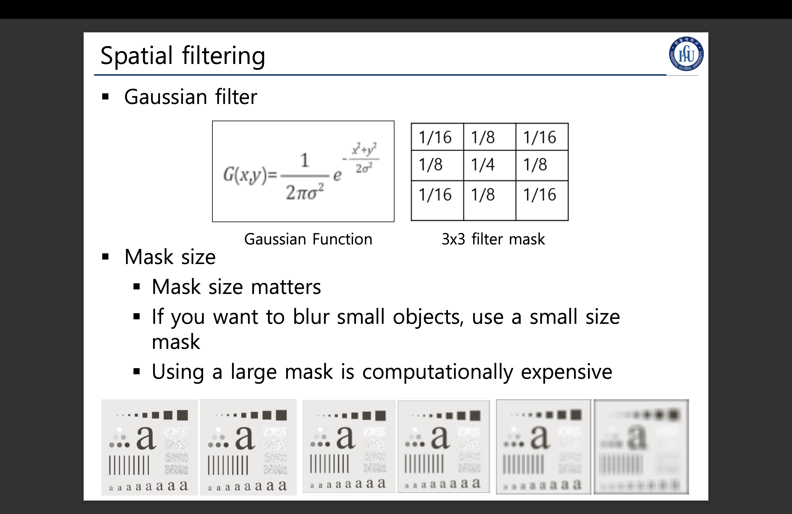
    <h5></h5>
</div>

* 이것도 가중치 평균을 두고 수행한다.
* 의도적으로 이미지 플러링을 하는데
* 가우시안 필터는 마스크의 사이지에 따라 필더 정도를 더 강하게, 약하게 한다.
* `getGaussianKernel()`을 사용하면 `filter2D()`에서도 응용할 수 있음.

<div align=center>
    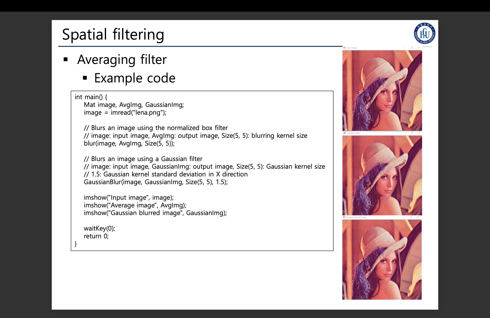
    <h5></h5>
</div>

<div align=center>
    
    <h5></h5>
</div>

---

#### 3). Sharpening

<div align=center>
    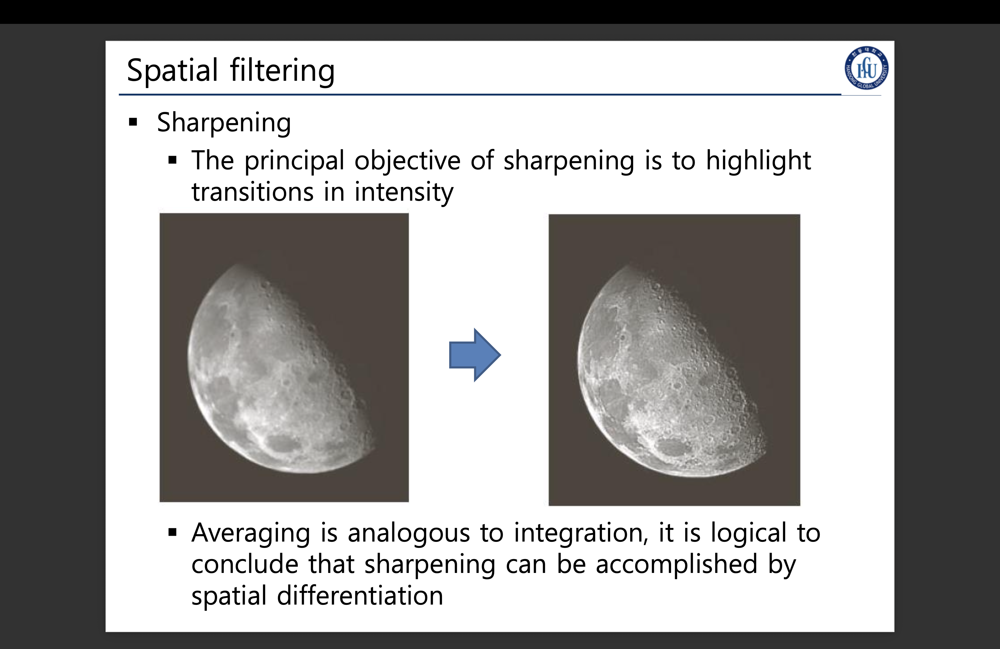
    <h5></h5>
</div>

* 인텐시티값의 하이라이팅
  밝기값의 차이가 나는 부분을 더 강조시키는 원리다.
  값의 변화를 알고 싶다면, "미분 계수가 큰지 작은지 알아내는 것이다"
* high-pass filter이라고 불리기도 하다.

##### ① 2차 미분을 통한 샤프닝

<div align=center>
    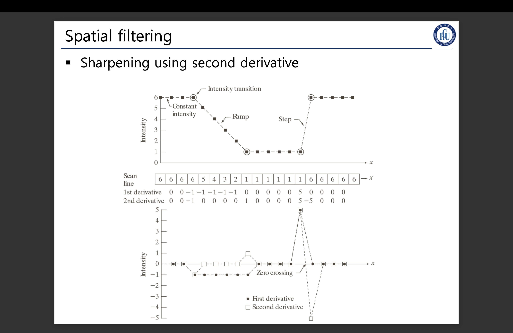
    <h5>1차미분과 2차미분의 결과</h5>
</div>

<div align=center>
    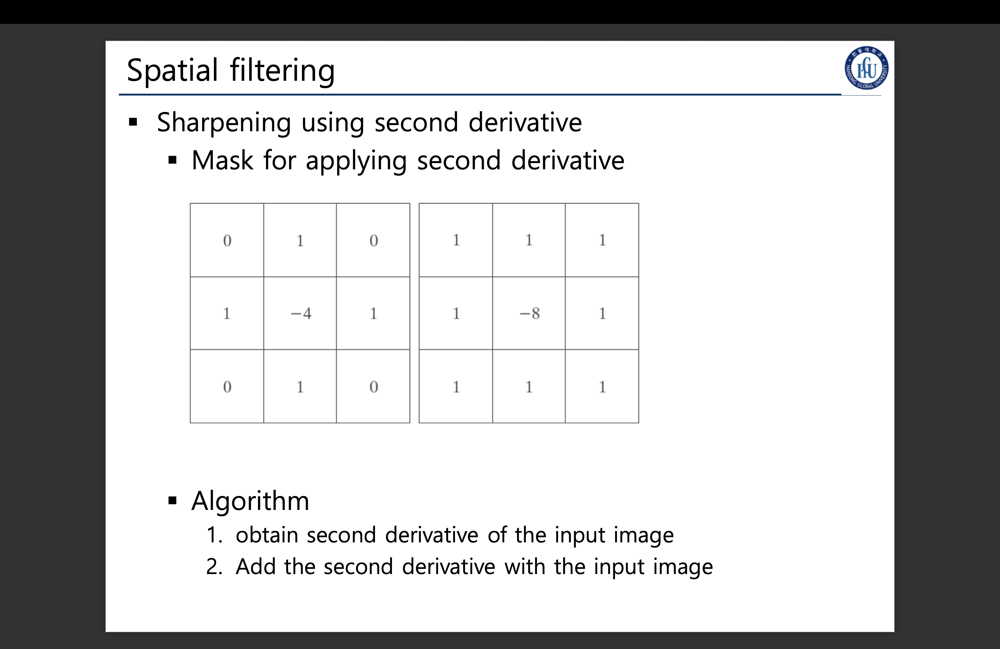
    <h5>위 마스크를 사용하면 2차 미분을 구할 수 있다.</h5>
</div>

<div align=center>
    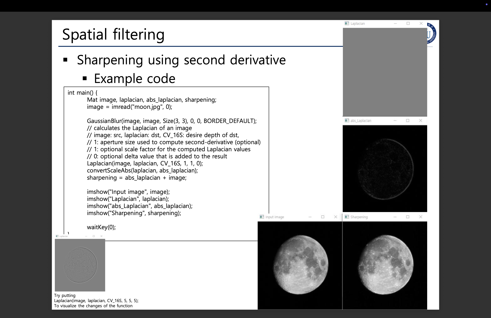
    <h5></h5>
</div>

* 평균화는 행렬 적분이고, 샤프닝은 공간 행렬 미분을 수행하는 것과 동일하다.
  즉, smooting과 sharpening은 서로 수학적인 관점이 있다.
  * 1차미분과 2차미분의 결과
    * 1차 미분의 결과 : 순수하게 미분 전의 Tangent 변화
    * 2차 미분의 결과 : 기울기가 갑자기 변화하는 부분을 검출 가능.
  * 따라서 샤프닝은 2차미분을 수행한 결과를 얻어야 한다.
  그리고 그 결과를 원본 영상에 더해야 한다.

<div align=center>
    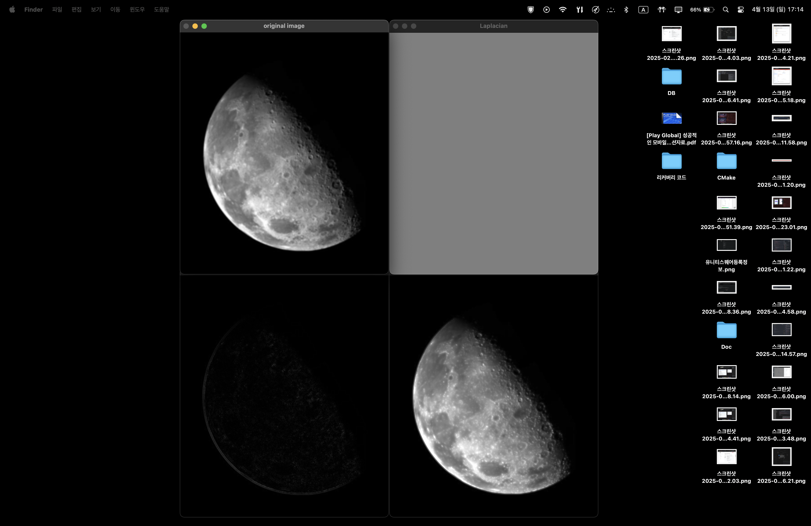
    <h5></h5>
</div>


##### ② 언샤프 마스크를 통한 샤프닝

<div align=center>
    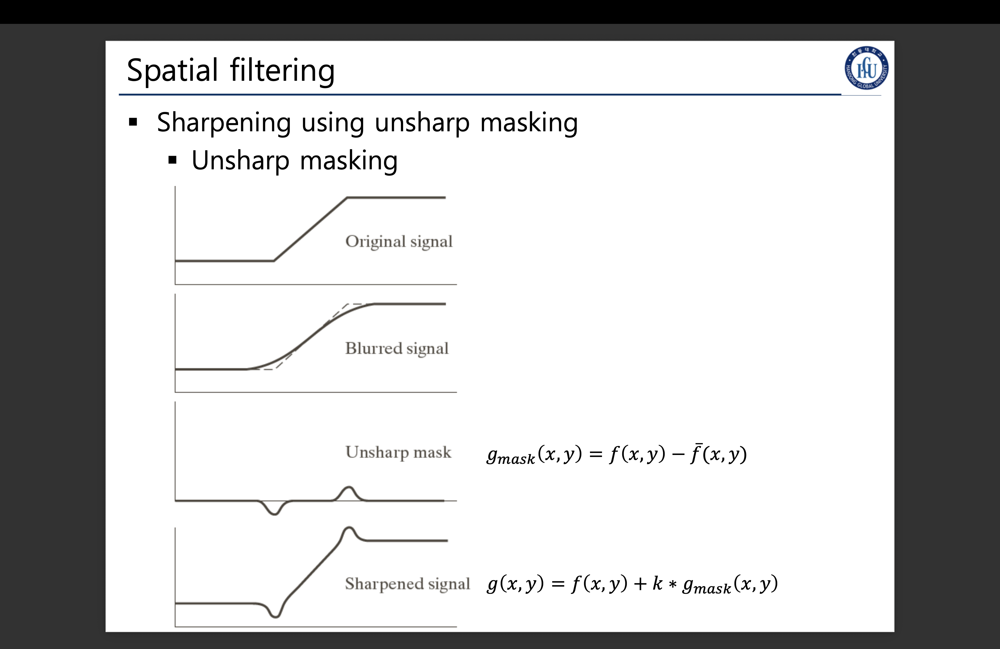
    <h5>언샤프 마스크를 오리지널 이미지에 더한 결과가 Sharpened signal이 나타난다.</h5>
</div>

<div align=center>
    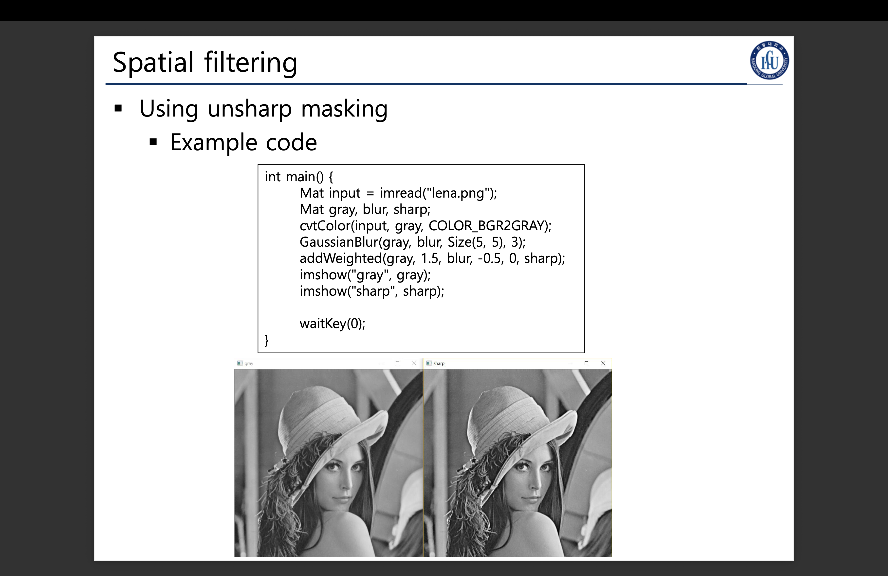
    <h5></h5>
</div>

* 혹은 블러를 수행할 때, 사용되었던 언샤프 마스크를 역으로 획득해,
* 원본 이미지에 적용함으로 샤프닝을 적용할 수도 있다.


---

#### 4). 중앙값 필터 (Median filter)
<div align=center>
    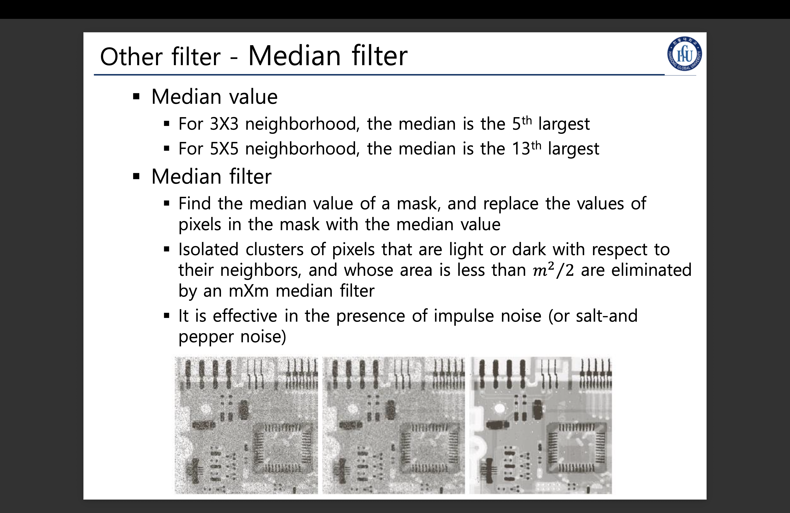
    <h5></h5>
</div>

<div align=center>
    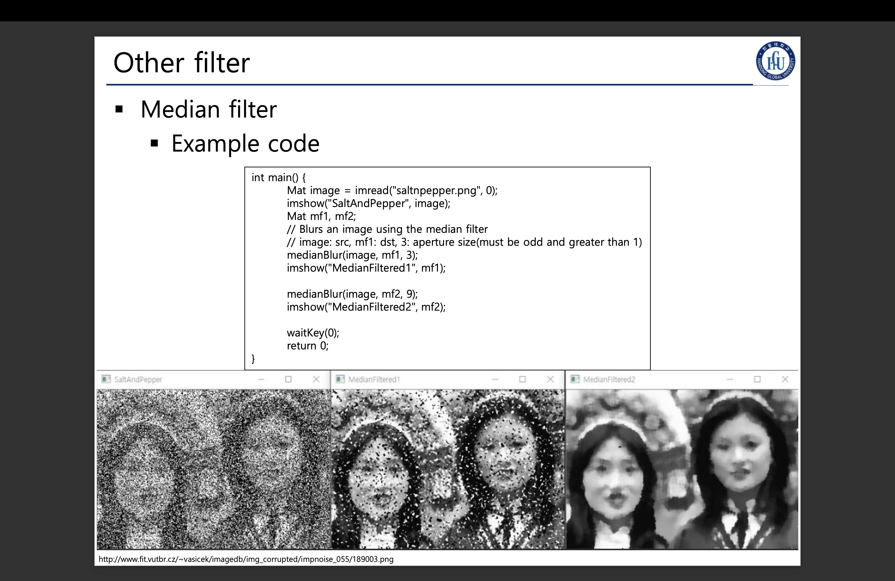
    <h5></h5>
</div>

* 이미지 처리에서 임펄스 노이즈 제거를 위해 널리 사용되는 비선형 필터링 기법이다.
* 흰색, 검은색 노이즈가 나타날때 Salt-and-Pepper noise라고 한다.
* "N x N"크기의 SpatialMasks에서 중앙값은?
  1. 3 x 3 에서는 5번째로 큰 것이 중앙값이다.
  2. 5 x 5 에서는 13번째로 큰 것이 중앙값이다.

* 공간 마스크에서 중앙값을 찾고, 마스크 내부의 값들을 모두 중앙값으로 교체한다.
* 작은 크기의 밝거나 어두운 픽셀군을 제거한다, 주변 픽셀과 비교하여 밝거나 어두운 픽셀군을 제거하기 때문
* 장단점
  * 평균 필터에 비해 계산 비용이 높을 수 있음
  * 하지만, 경계면 엣지 정보를 유지해야 하는 이미지에 매우 효과적이다.

<div align=center>
    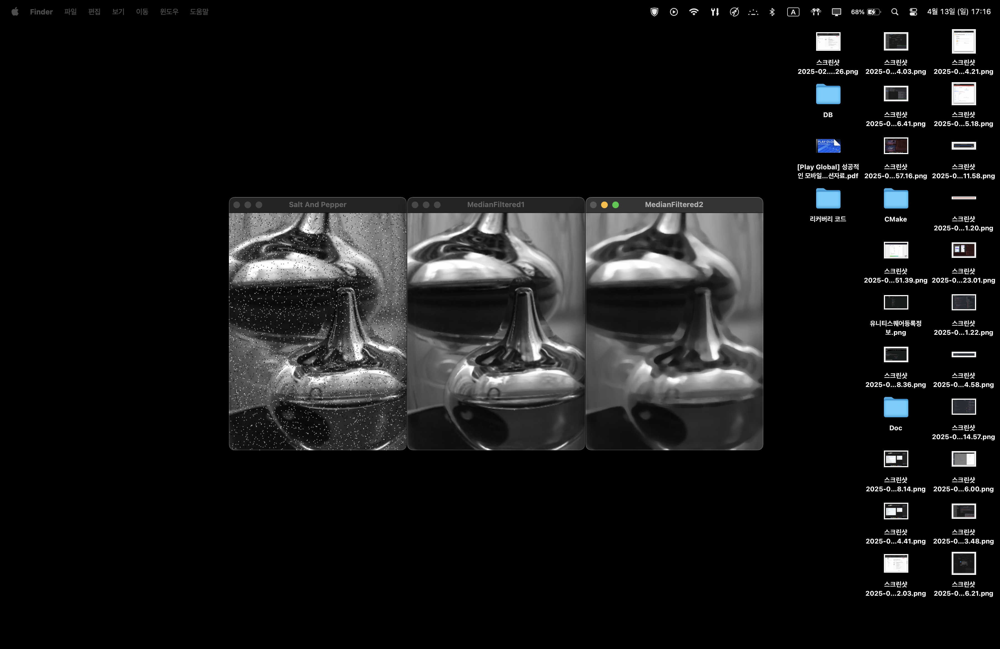
    <h5></h5>
</div>

---

#### 5). 앰보싱 필터링

* 픽셀값 변화가 적은, 기울기가 가파르지 않은 영역을 회색처리를 하는 것이다.
* 엠보싱을 수행하는 커널
    |-1|-1| 0|  |-2|-1| 0|
    |--|--|--|--|--|--|--|
    |-1| 0| 1|또|-1| 1| 1|
    | 0| 1| 1|는| 0| 1| 2|

* 엠보싱 필터는 커널 값이 음수와 양수를 모두 포함하고
    * 필터링 연산 과정에서 픽셀 값이 음수가 될 수 있습니다.
    * OpenCV에서 기본 CV_8U(0~255 범위) 타입은 음수 값을 저장할 수 없으므로, 음수 값은 0으로 클램핑됩니다.
    * 결과: 일부 경계 정보가 손실됩니다.

```cpp
int chapter10::SpatialEmbossFiltering() {
    Mat image = imread("./resources/lena.jpg", 0);
    Mat embossKernal = (Mat_<int>(3, 3) <<  -2 ,-1 ,0,
                                            -1 ,1 ,1,
                                             0 ,1 ,2);
    Mat embossed_float_image, embossed_delta_image;

    // filter2D 함수의 delta 파라미터에 128을 추가하는 것은,
    // 필터 연산 후 손실을 방지하는 다른 방법으로,
    // 필터링 결과에서 발생할 수 있는 음수 값을 중간 값(예: 128)을 기준으로 이동시켜,
    filter2D(image, embossed_delta_image, -1, embossKernal, Point(1, 1), 128);

    // 또한 CV_32F로 결과를 저장하여 필터 연산 후 손실을 방지하는 다른 방법으로 쓸 수 있다.
    filter2D(image, embossed_float_image, CV_32F , embossKernal);
    embossed_float_image.convertTo(embossed_float_image, CV_8U);

    imshow("origial image", image);
    imshow("emboss delat image", embossed_delta_image);
    imshow("emboss float image", embossed_float_image);
    waitKey(0);
    return 1;
}
```

<div align=center>
    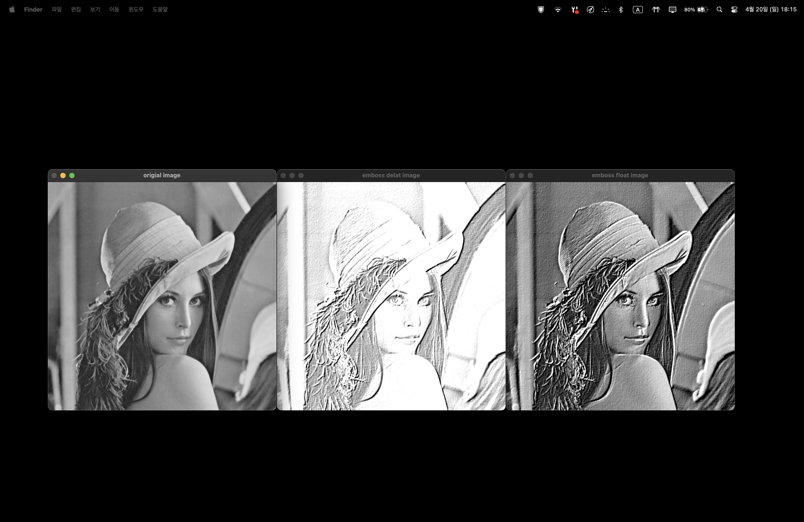
    <h5></h5>
</div>

### [히스토그램 평활화, 필터 및 이미지 향상](https://iitmcvg.github.io/summer_school/Session2/)
