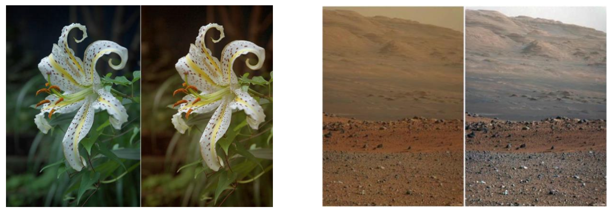

## 11 Color Processing

#### 컬러 영상을 Preprocessing하는 작엄.
* 이전까지는 모두 GrayScale에 대해서 작업었다 (Average Filter, Intencity Transformation, Histogram Equlization)
* 그렇다면 컬러의 프리프로세싱은 어느 컬러모델에서 진행하냐면 HSI(I를 건들던지), YCbBb(Y를 건들던지)이 있겠다.

> ### 📄 1. Usage of HSI

#### 1). HSI의 특징

##### ① Intensity images is decoupled

* Intensity와, Hue는 독립적인 채널을 가지고 있다는 것.
* 이 말은 즉, RGB와는 다르게, Hue값이 바뀌어 색조가 아무리 바뀌더라도,
Intiecity에 영향을 끼치지 않는 것이 장점이다.
* 또, 다른 말로, 어둡던, 밝던, 원본 색조에 영향을 미치지 않으므로,
밝기값이든, 색조든 서로의 변경에는 강하다라는 말이 된다.

##### ② Color Slicing
* 특정 색상을 가진 픽셀을 검출하는데 유용하게 사용할 수 있다. (빨간색을 검출, 보라색을 검출 등등..)
* Hue Channel의 Range을 정해주면 되기 때문이다.
* Saturation을 0으로 만듦으로 GaryScale 이미지를 만들 수 있다.

##### ③ Color Conversion
* 특정 색을 다른 색으로 치환시키는 기법을 사용할 수 있고, Hue Channel을 이용하면 된다.

    
    <h5>1번 : 원본 이미지 2번 : Intencity를 낮춘것  3번 : 주황값을 제외하고 Saturation을 0으로 만든것 4번 : Hue 채널을 조정시킨것</h5>

> ### 📄 2.  Pseudo Coloring

#### 1). Pseudo Coloring의 의의
#### 인간의 눈이 회색조의 사진을 볼 때, 실제 GrayScale이 0~255의 범위를 가지더라도 30 ~ 50 수치만큼의 변화밖에 구별해내지 못한다.   반면에 색상에 대해 가시광선 100k ~ 10m 범위만큼이나 민감하게 구별해 낼 수 있다.

* 따라서 회색조에 색상을 매핑 시킴으로서, 이미지의 정보를 인간이 인지하기 쉬운 형태로 만든다면,
더 넓은 범위의 정보를 인지할 수 있게 된다. 바르 고것을 pseudo-coloring이라고 하는것이다.
*하지만, 이떄, 각 색상이 의미하는 바가 무엇인지 표시할 필요가 있다.*

#### 2). 절차

1. Intensity Slicing 기술을 통해 진행
2. Each intensity is assigned a color
   0~255개의 인텐시티가 있다면 각각의 값마다 컬러를 매칭해준다.

    
    
    <h5></h5>

> ### 📄 3. Color Balancing

#### 1). 컬러 밸런싱이란,

* 조명에 따라서 이미지의 컬러가 달라질 수 있겠다, 하지만, 그러한 조명에 불구하고,
가장 원본색상을 가진 이미지를 어떻게 얻을 수 있을까?
그게 바로 바로 컬러 밸런싱이다.
* 이미지를 구성하는 색상의 강도를 전체적으로 조정하는 작업을 의미함.
  색상의 강도 :색의 밝기나 채도와 관련된 값
  색의 밝기(명도)를 증가시키거나 감소시키는 등.
* 흔히 색 보정이나 색상 균형 작업에서 사용하는 개념이다.

#### 2). 간단한 컬러 밸런싱 선형 변환

$$
\begin{bmatrix}
R \\
G \\
B
\end{bmatrix} =
\begin{bmatrix}
\frac{255}{R'_w} & 0 & 0 \\
0 & \frac{255}{G'_w} & 0 \\
0 & 0 & \frac{255}{B'_w}
\end{bmatrix}
\begin{bmatrix}
R' \\
G' \\
B'
\end{bmatrix}
$$

* 여기서 $R'_w$가 의미하는 바는 **입력 이미지에서 빨간색(Red) 채널의 최대값**(혹은 기준값)을 의미하고,
    다른 색상 채널인 초록, 파랑도 마찬가지로 $G'_w, B'_w$ 로 대응되고
    동일하게 각각 녹색과 파란색 채널의 최대값을 의미한다.
* $\frac{255}{R'_w}$의 의미는 이미지의 각 채널에 해당하는
모~~든 픽셀의 각 채널 $\begin{bmatrix} R'\\ G'\\ B'\\ \end{bmatrix}$ 에다가 $R'_w$를 나눠주고
$[0, 1]$ 의 범위로 정규화(normalize)한 뒤에,
다시 255를 곱함으로 $[0, 255]$ 의 범위를 갖도록 보정한다.

* 그 정규화 된 Red값이 바로 $R$ 인 것이고,
이 작업을 통해 빨간색, 녹색, 파란색 각각의 채널이 고르게 조정되어 이미지의 색 균형이 맞춰지게 된다.
*예를 들어, 특정 색상이 과도하게 밝거나 어두운 경우, 이를 조정하여 자연스러운 색감을 얻을 수 있음*

    
    <h5></h5>

#### 3). 이미지에서 흰색 추정

    
    <h5>이 컬러체커가 바로 "원래 흰색" 이란 것을 얻기 위해 사용된다.   만약 이 원래 흰색이 촬영시 255가 아니라면? 그만큼 차이나는것을 보정하면 된다.</h5>

#### 만약 위의 체커보드 없다면 흰색을 어떻게 추정할 수 있을까?

##### ① Gary World Assumption
* 이론상, 사진의 모~~~든 픽셀 생상을 뽑아서 평균을 내보면 회색인 128에 가깝게 나타날 것이다 라고 가정하고, 이때, 실제 128이 나타나지 않는다면?
* 그 만큼을 보정해 준다

##### ② White Pixel Are also brightest
* 사진에서 가장 밝은 부분이 곧 255 라고 가정하고, 보정을 하는것 이다.
