## Image Segmentation

---

> ### 📄 소개

---

#### 이미지를 다양한 구역으로 분할(파티셔닝) 하는 절차


#### 1). 용례
* Object Calssification : 객체 판별 응용된다.
    *지문의 굴곡, 곡선을 더 잘 판별하기 위해, 매끄러운 흑백 대비를 1(객체), 0(배경) 분리*

<div align=center>
    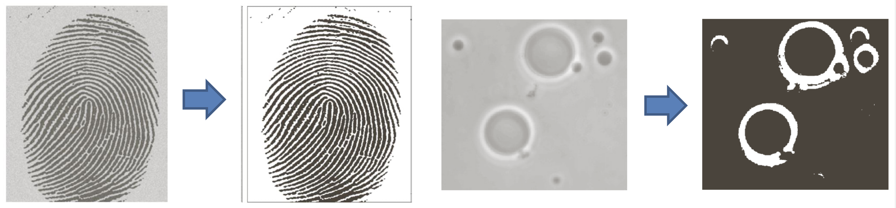
    <h5></h5>
</div>

---

> ### 📄 Segmentation

* input : gray-scale image
* output : binary image 오직 흰(255), 검(0)으로 이뤄진 이미지가 결과로 나온다
  여기서 하얀색에 해당하는 것이 분할된 객체에 해당한다.


#### 1). 스레숄딩

* 일단, 이미지를 이진화 하기 전의 전제, 가정은 바로 다음과 같다.
  1. 배경과 객체의 각 밝기(강도)가 다르다.
  2. 배경은 배경끼리, 객체는 객체끼리 밝기값의 차이가 별로 없이 균질하다.

* Intensity를 가로축으로 하고, 픽셀 수를 세로축으로 하는 히스토그램을 사용할 것이다.
  그리고 $[0 ... 255]$ 사이의 임계값 $T_n$을 둠으로 이러한 임계치에 따라
* 이 밝기의 역치를 적절한 값으로 두는것이 바로 Segmentation의 핵심이다!
<div align=center>
    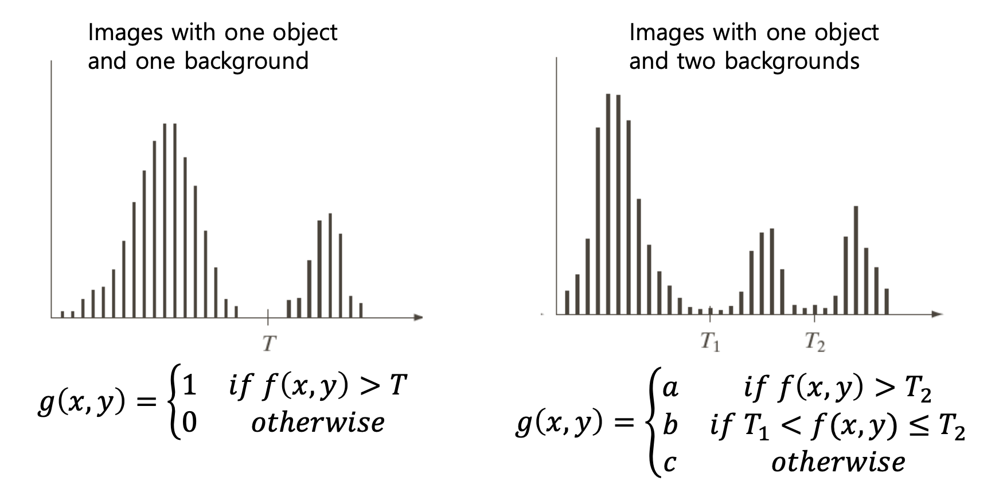
    <h5>좌 : 이미지와, 배경이 각각 1개씩 분할<br>우 : 한개의 객체와 두개의 배경</h5>
</div>

---

#### 2). 올바른 Segmentation을 방해하는 요소들
##### ① Noise

<div align=center>
    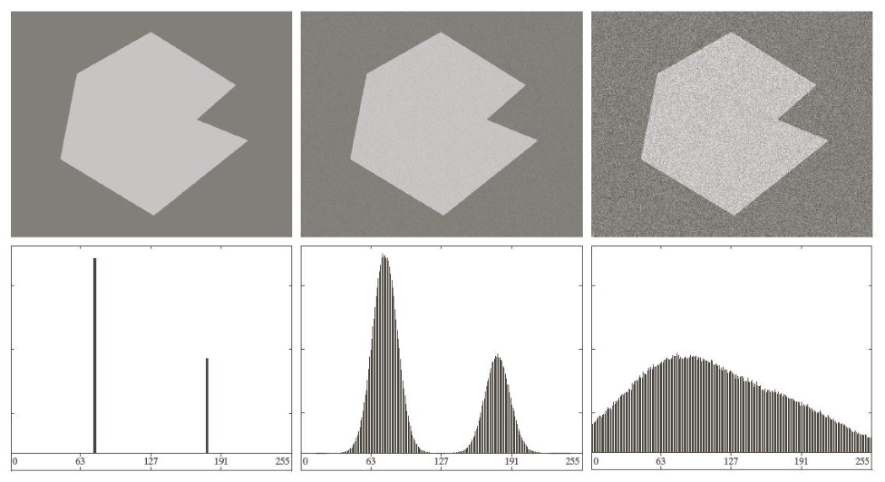
    <h5>노이즈는 히스토그램의 쓸데없는 평활화 를 야기한다</h5>
</div>

##### ② 광원과 반사.

<div align=center>
    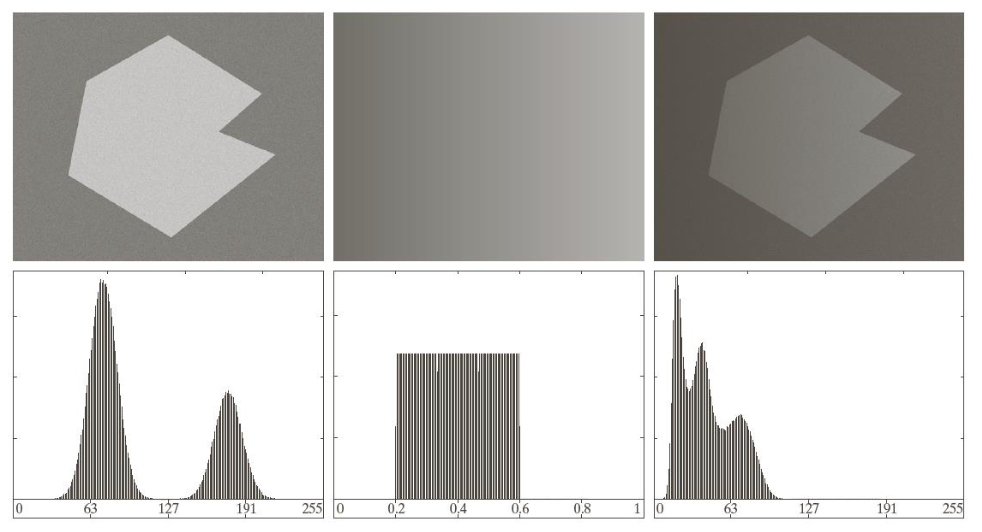
    <h5>광원으로 생기는 빛 반사와 그림자는<br>명, 암에 대한 그라데이션을 만들고, <br>이는 히스토그램의 Skew화를 야기한다.</h5>
</div>

---

#### 3). Denoising (Smooting)
* 노이즈를 제거하지 않고, Segmentation의 결과와
* 노이즈제거 (Smooting) 후, Segmentation의 결과는 확연하게 차이가 난다.
* 따라서 Spatial Smooting Filter을 적용하고 Threholding 과정을 거치는것이
더 유의미한 결과를 얻는데 도움을 준다.

---

> ### 📄 영역 스레숄딩

---

#### 쓰레숄딩을 사용하되, 특정 영역에 따라서 다른 스레숄딩을 적용할 수 있다.


#### 1). 전역 스레숄딩

##### 동일한 스레숄딩을 모든 픽셀에 대해서 적용하는 것이다. 최적의 임계값을 얻어내는것이 목적이다.

##### ① 기본 절차
1. 전 지역에 걸쳐 사용할 스레숄딩을 초기에 설정한다.
2. 스레숄드를 사용해 Segmentation을 진행하여
    스레숄드 T를 기준으로 이미지를 두가지의 그룹(물체와 배경)으로 나눈다.
3. 각 그룹에 대해 평균을 계산한다 (물체의 평균 m1, 배경의 평균 m2)
4. 그리고 그 두가지 평균을 또 평균으로 사용해 새로운 스레숄드로 사용한다.
5. 2부터 3번까지의 절차를 계속 반복하고, T가 특정 값으로 수렴하게 될때를 끝으로 한다.

<div align=center>
    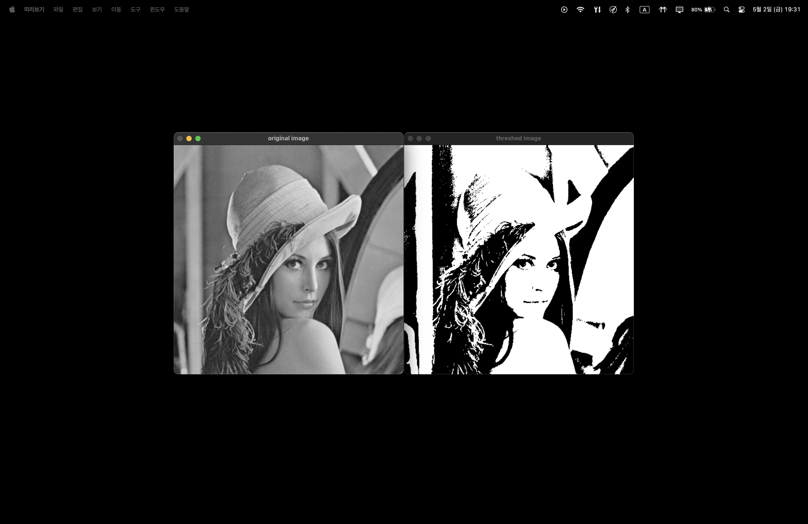
    <h5></h5>
</div>

##### ② Otus's 방법론
* **전제**
  * 어떤 스레숄드가 가장 좋은 스레숄드인지 모르겠지만,
    최적의 스레숄드를 사용해 결과를 냈다면, 그 결과는 반드시
      1. 같은 클래스 끼리 밝기값은 매우 균질할 것이고
         *"동일한 클래스에 속하는 요소들의 분산 ($ \sigma_W^2 $)"을 최소화 하여*
      2. 다른 클래스 끼리 밝기값은 매우 클 것이다.
         *"서로다른 클래스 끼리의 분산 ($ \sigma_B^2 $)" 은 최대화 하도록 하여, 클래스간 구분이 뚜렷하게 만들어야 한다.*
  * *여기서 말하는 클래스는 (객체, 배경)이러한 것을 말한다.*
  * 잘 설정된 쓰레숄드는 클래스가 각 픽셀의 밝기 값(intensity value)과 관련하여 명확히 구분되도록 해야 한다

* 이 방법은 **이미지의 히스토그램에 기반한 계산에 의존**한다.
    Otsu의 방법은 이미지의 히스토그램을 사용하여 픽셀 강도를 두 개의 클래스로 나누는데,
    1. 배경 클래스 (Class 0): 픽셀 강도가 임계값 K 이하인 픽셀.
    2. 객체 클래스 (Class 1): 픽셀 강도가 임계값 K 초과인 픽셀.

<div align=center>
    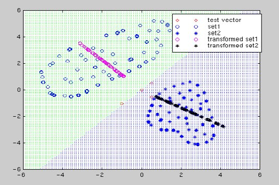
    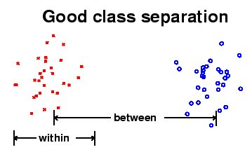
    <h5></h5>
</div>

<div align=center>
    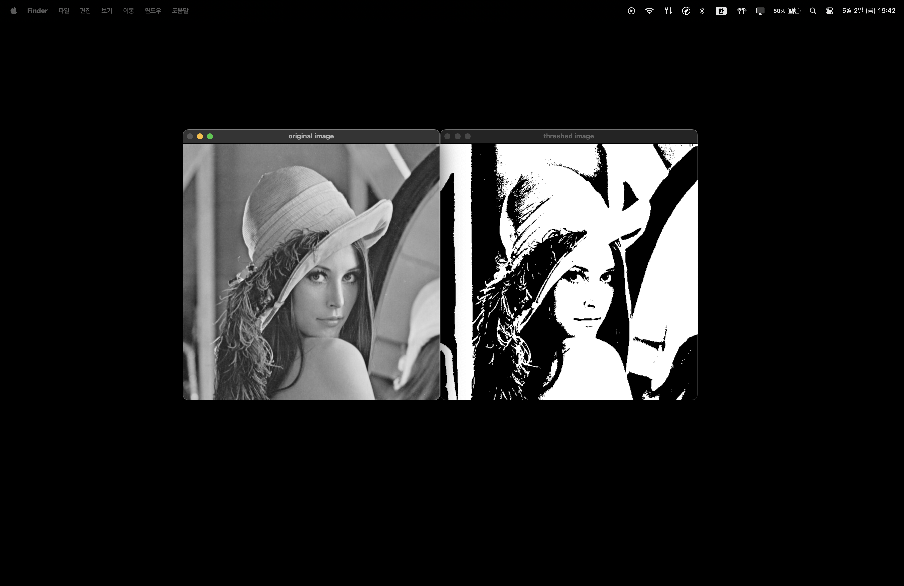
    <h5></h5>
</div>

* **장/단점**
<div align=center>
    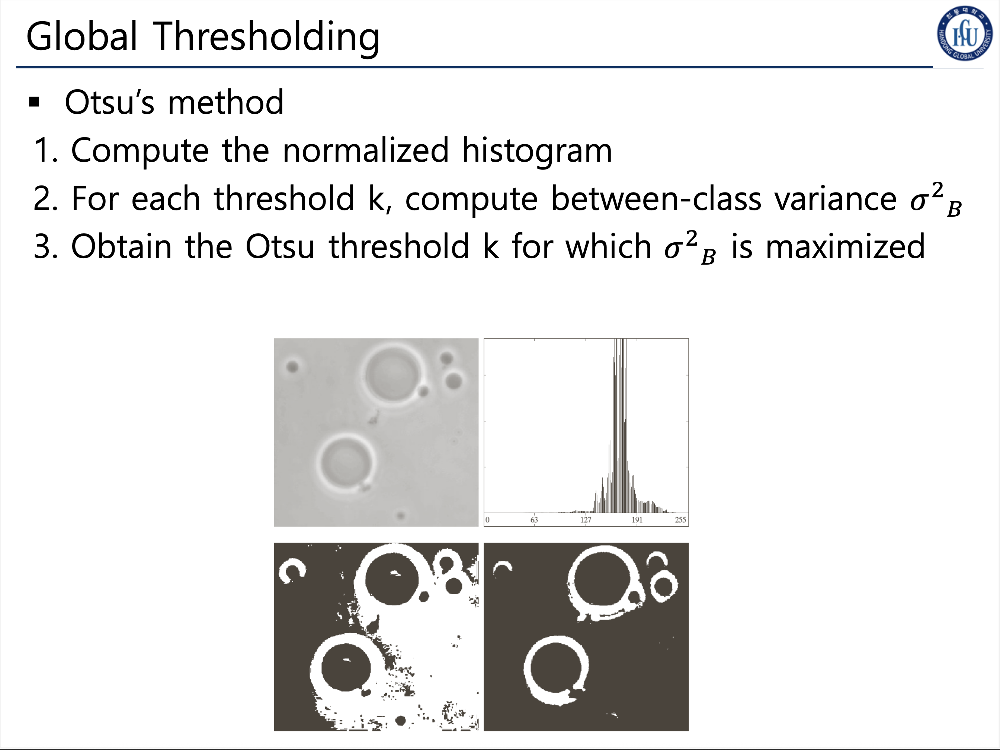
    <h5>좌 : 일반 스레숄드를 사용한 경우 | 우 : Otus's 방법을 사용한 사례</h5>
</div>

  * 객체와 배경의 강도 차이가 뚜렷한 이미지에 매우 효과적이며,
  임계값을 자동으로 선택하여 사용자 개입 없이 동작 가능하다.
  * 하지만, 객체가 여러 클래스로 나뉘는 경우에서는 비효율적이고 강한 조명 변화나 노이즈에 민감할 수 있어,
  * 반드시 디노이징 프로세스등, 보완 기법을 사용해야 한다.


  <details>
      <summary> 📂 수식 펼치기 📂  </summary>

  1. **전체 분산 (\( \sigma_T^2 \))**
     전체 픽셀 강도의 분산은 다음과 같이 정의됩니다:
     \[
     \sigma_T^2 = \frac{1}{N} \sum_{i=1}^L (i - \mu_T)^2 \cdot h(i)
     \]
     - \( N \): 총 픽셀 수.
     - \( L \): 픽셀 강도 레벨의 최대 값 (예: 256).
     - \( h(i) \): 히스토그램에서 강도 \( i \)의 빈도.
     - \( \mu_T \): 전체 픽셀 강도의 평균.

  2. **클래스 확률 및 평균**
     - 클래스 0 (배경):
       \[
       P_0(t) = \sum_{i=1}^t P(i), \quad \mu_0(t) = \frac{1}{P_0(t)} \sum_{i=1}^t i \cdot P(i)
       \]
     - 클래스 1 (객체):
       \[
       P_1(t) = 1 - P_0(t), \quad \mu_1(t) = \frac{1}{P_1(t)} \sum_{i=t+1}^L i \cdot P(i)
       \]

  3. **클래스 간 분산 (\( \sigma_B^2 \))**
     두 클래스의 분산은 다음과 같이 계산됩니다:
     \[
     \sigma_B^2(t) = P_0(t) \cdot P_1(t) \cdot (\mu_0(t) - \mu_1(t))^2
     \]

  4. **최적의 임계값 \( t^* \) 선택**
     클래스 간 분산 \( \sigma_B^2(t) \)을 최대화하는 임계값 \( t^* \)를 선택합니다:
     \[
     t^* = \arg\max_t \sigma_B^2(t)
     \]

  * **예제 코드**
     ```cpp
     Mat image = imread("image.jpg", IMREAD_GRAYSCALE);
     Mat binaryImage;
     double thresh = threshold(image, binaryImage, 0, 255, THRESH_BINARY | THRESH_OTSU);
     ```
  </details>

---

#### 2). 지역(적응형) 스레숄딩

##### 각 픽셀마다 쓰레숄드를 다르게 적용하는 것.
* 일명, 이전에 배웠던 `adaptiveThreshold(...)` 함수를 사용하는 것 이다.

<div align=center>
    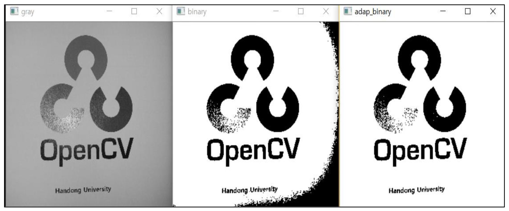
    <h5>중 : 전역 스레숄딩 | 좌 : 지역 스레숄딩</h5>
</div>

##### ① `ADAPTIVE_THRESH_MEAN_C`

* 주변의 있는 픽셀의 분포를 사용하여 평균을 취하고, 상수 C를 빼서 스레숄드 정하기.

##### ② `ADAPTIVE_THRESH_GAUSSIAN_C`

* 가중치 평균을 구하고, 상수 C를 빼서 스레숄드 정하기.

##### ③ 혹은 이미지 파티셔닝

<div align=center>
    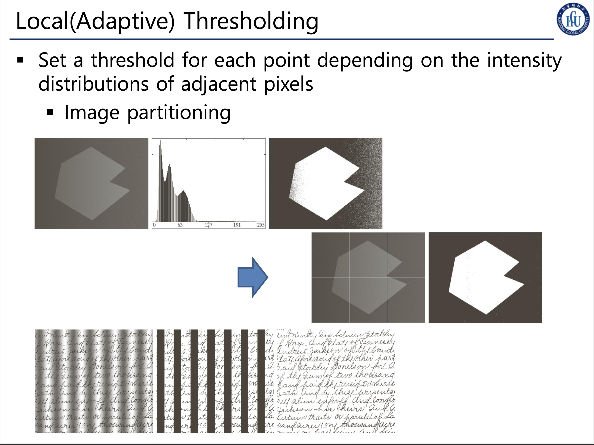
    <h5></h5>
</div>

<div align=center>
    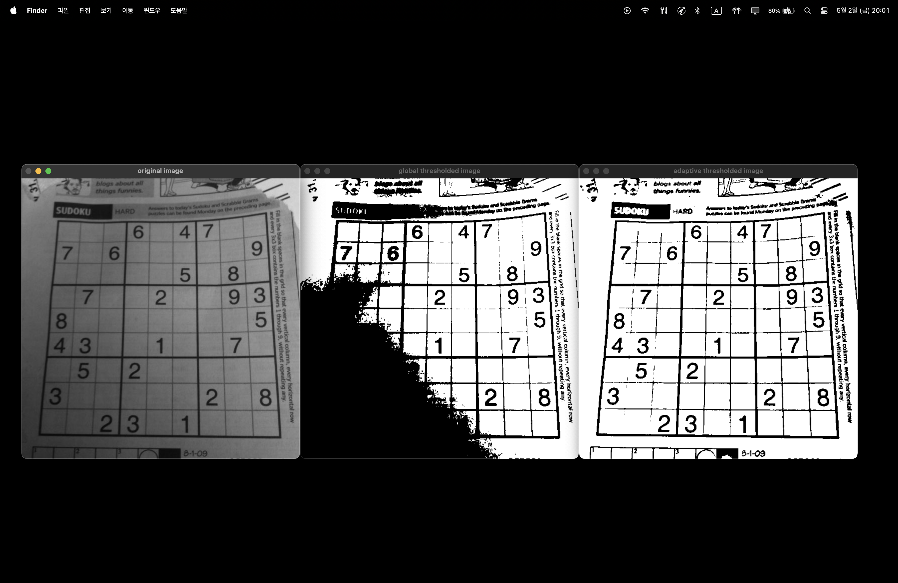
    <h5></h5>
</div>

---

> ### 📄 참고
1. [Linear Discriminant Analysis](https://www.dtreg.com/solution/linear-discriminant-analysis)
