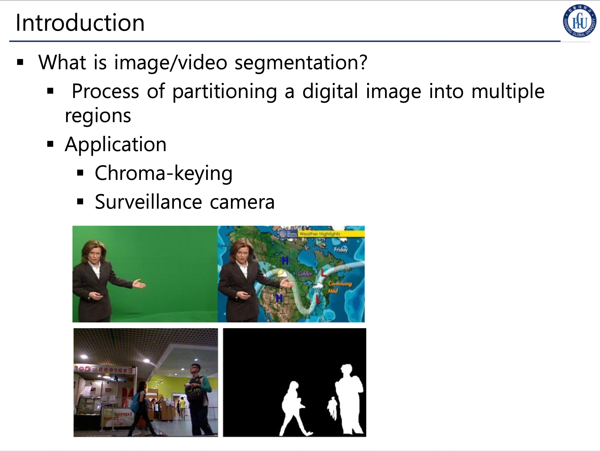
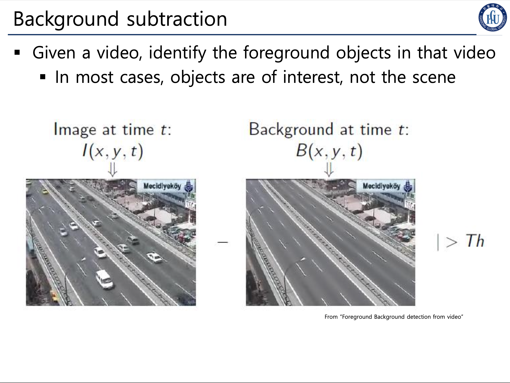
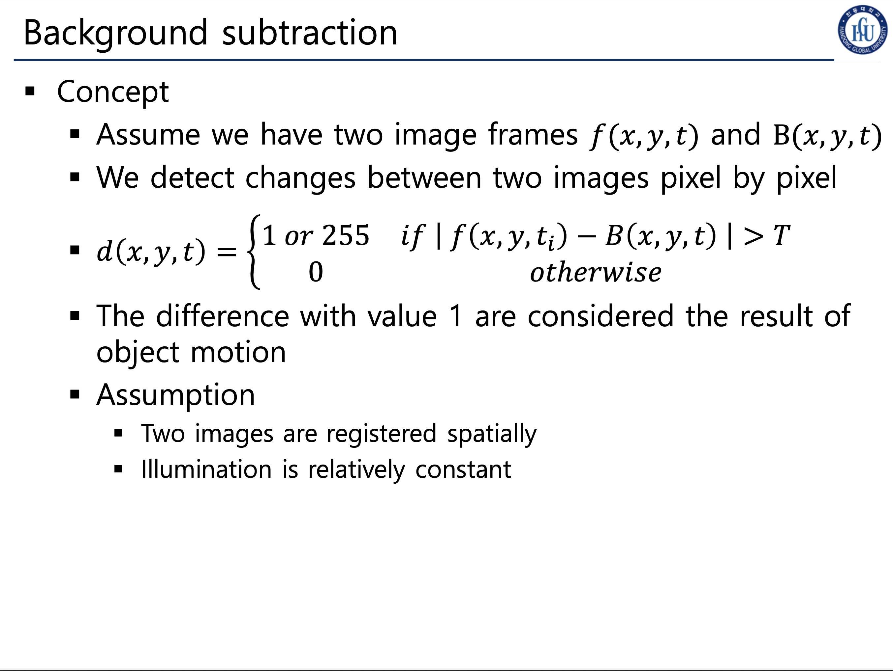
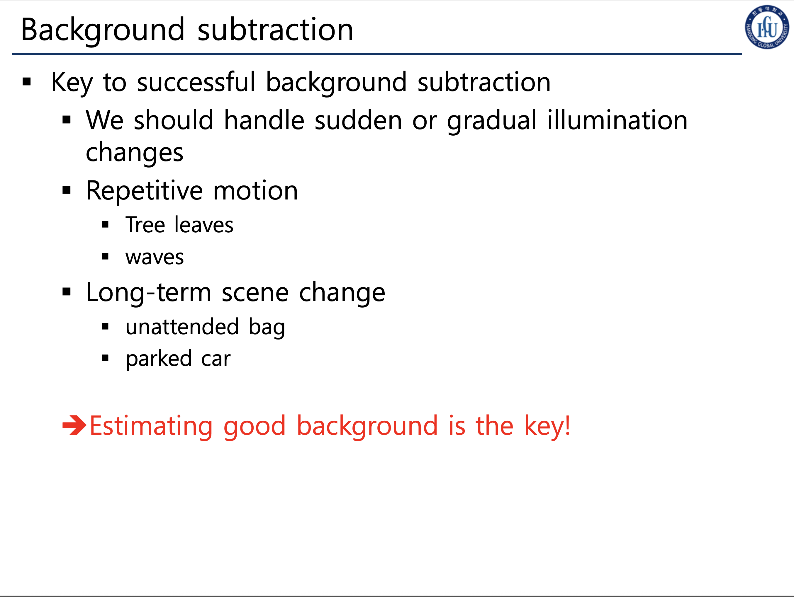
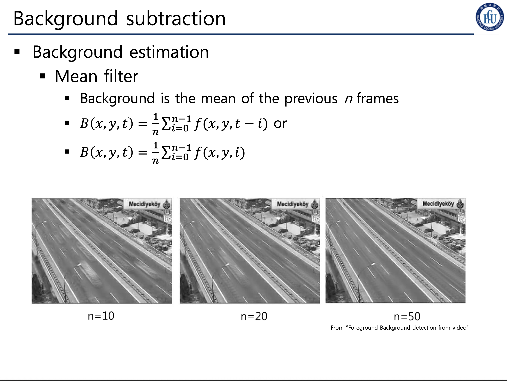
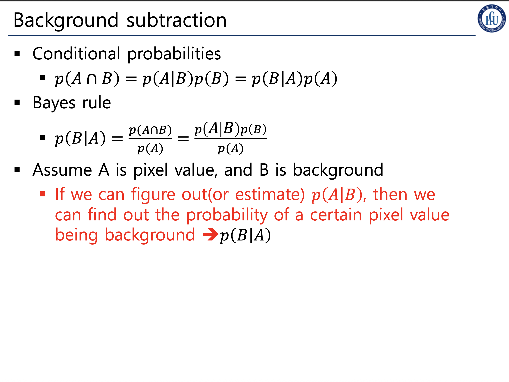
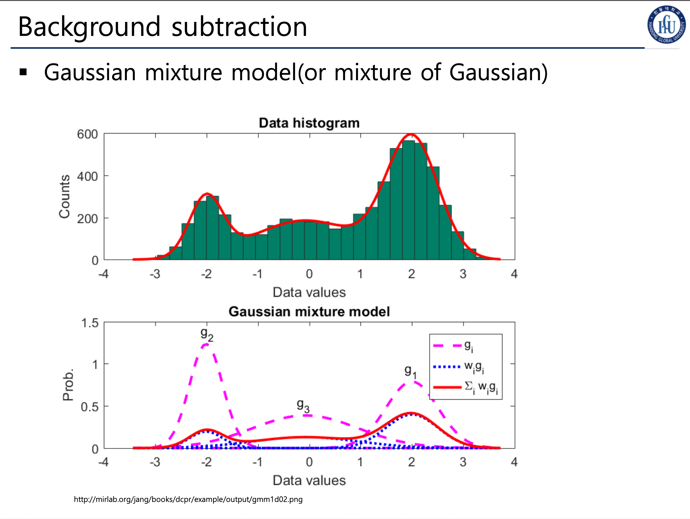
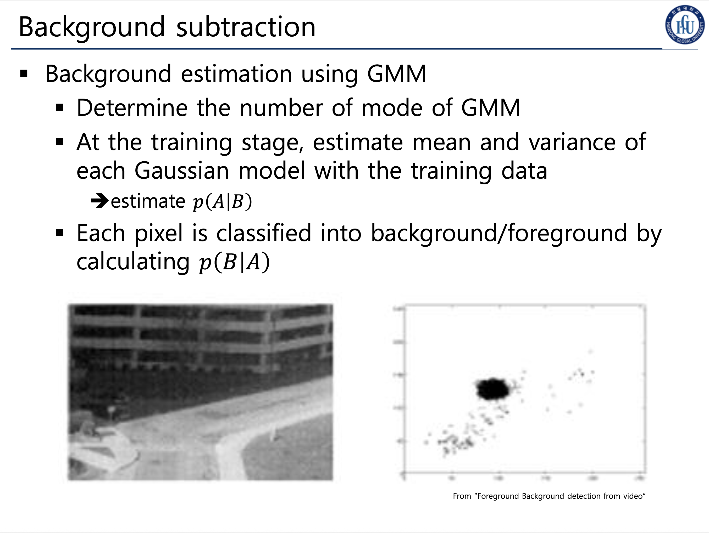

 
 
 
 

## Video Segmentation

### 배경 추출
* 배경이 아닌 Foreground 오브젝트를 식별하기 위한 절차다, 일명, 비디오에서 프레임마다 변화되는 요소가 관심있는 요소인 것이고, 그 외에 정적인 것들은 관심 대상이 아니라는 것 이다.

#### 1). 컨셉
* x는 cols, y는 rows, t는 스레숄드
한 프레임을 $f(x,y,t)$와 같이 표현 하고,
배경 요소를 $B(x,y,t)$라고 두자.
* 추가로 전제로 두어야 하는 것이 있는데.
    * 두 이미지가 공간적으로 정합되어 있다 (Spatially registered)
    카메라가 고정되어 있어, 모든 프레임의 픽셀 위치가 일치한다고 가정합니다
    * 조명 조건이 상대적으로 일정하다 (Illumination is relatively constant)
    큰 조명 변화 없이 배경과 전경의 밝기 차이만으로 객체를 구분할 수 있다고 봅니다
* 두 프레임 이미지간 픽셀들을 대조하며 변화를 감지하는 것이 핵심이다.
* 그래서 그 Video에서 object detect 한 것을 바로 $d(x, y, t)$란 이미지라고, 두고,
  1. $|f(x,y,t) - B(x,y,t)| > T$ 즉, 배경과, 프레임의 차이가 특정 스레숄드를 넘어간다면 "1으로, 즉 감지된 이미지로 처리한다"
  2. 만약 임계치를 넘어서지 않는다면 0
* 이렇게 0과 1로 이뤄진 이진화된 프레임을 만드는것이다. 그리고 1이 바로 우리가 관심있는 Object라는 것이다.

#### 2). 성공적인 배경 추출을 위한 키 포인트

1. 갑작스럽거나, 점진적으로 진행되는 광원 변화에 대해 처리를 해야한다.
2. 반복적인 음직임
   * 나무의 이파리 혹은, 바다의 파도
3. 배경인척 하는 객체들.
   * 주차된 차

### 배경 추정

#### 1). Mean Filter

* 영상의 특징이라면 프레임이 있다는 것이다.
* 즉, Mean Filter을 단일 이미지에서 적용했다면, 커널을 통해 중심에서 부터 픽셀 주변부를 검출해 평균을 내렸다면,
* 지금은 프레임에 걸쳐서 평균을 낼 수도 있다는 것 이다.
* 그렇게 사용하는 변수는 $N$ Frame이 되겠다.

#### 2). 조건부 확률?

* $A$는 픽셀 값, $B$ 는 배경
* 논리 기호들이 들어가는데
* 베이즈 정리

#### 3). GMM (Gaussian mixture model)

* GMM을 사용하여 배경제거를 할 수도 있다.
