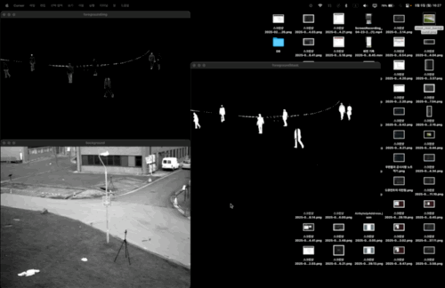
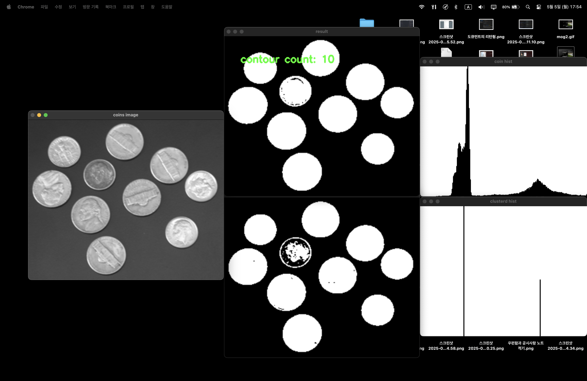

## Video Segmentation

> ### 📄 1. 개요
* 여러개의 영역으로 나누기 위해 사용한다.
* 용례
  1. 크로마키 : 사람과, 배경을 분할 -> 사람 영역만을 추출하여, 가상의 이미지를 합친다.
  2. 감시 카메라 : 고정된 위치에서 촬영을 할 때, 음직이는 영역을 추출하기 위해 사용

> ### 📄 2. Background Subtraction (배경 추출)
* 배경이 아닌 Foreground 오브젝트를 식별하기 위한 절차다,
    1. 일명, 비디오에서 프레임마다 변화되는 요소가 관심있는 요소인 것이고,
    2. 그 외에 정적인 것들은 관심 대상이 아니라는 것 이다.

#### 1). 컨셉
* x는 cols, y는 rows, t는 스레숄드
* 현재 영상 $f(x,y,t)$와 같이 표현 하고, 배경 영상 $B(x,y,t)$라고 두자.
* 추가로 전제로 두어야 하는 것이 있는데.
    1. 두 이미지가 공간적으로 정합되어 있다. (Spatially registered)
        카메라가 고정되어 있어, 동일한 위치에서 촬영 되었다고 가정한다.
    2. 조명 조건이 상대적으로 일정하다고 가정한다. (Illumination is relatively constant)
        큰 조명 변화 없이 배경과 전경의 밝기 차이만으로 객체를 구분할 수 있다고 봅니다.
        즉, 대낮이라면 낮에 촬영된 배경과, 새벽이라면 새벽에 촬영된 배경을 써야한다는것이다.

#### 2). 두 프레임 이미지간 픽셀들을 대조하며 변화를 감지하는 것이 핵심이다.
* image at time : $I(x,y,t)$ / background at time : $B(x,y,t)$
  * $| I(x,y,t) - B(x,y,t) | > T_h$
    *(현재 영상으로 부터 배경 영상의 차이가 특정 임계를 달성한다는 것은 원래 배경에 없던 특정한 사물, 물체가 나타났다라고 해석 할 수 있다는 것이다.)*

* 그래서 그 Video에서 object detect 한 것을 바로 $d(x, y, t)$란 이미지라고, 두고,
  * $|f(x,y,t) - B(x,y,t)| > T$
    1. 즉, 배경과, 프레임의 차이가 특정 스레숄드를 넘어간다면 "1으로, 즉 감지된 이미지로 처리한다"
    2. 만약 임계치를 넘어서지 않는다면 0
  * 이렇게 0과 1로 이뤄진 이진화된 프레임을 만드는것이다.
    그리고 1이 바로 우리가 관심있는 Object라는 것이다.

#### 3). 성공적인 배경 추출을 위한 키 포인트

##### ① 광원 변화 처리하기
* 갑작스럽거나, 점진적으로 진행되는 광원 변화에 대해 처리를 해야한다.
##### ② 반복적인 움직임 처리하기
* 나무의 이파리 혹은, 바다의 파도
##### ③ 배경인척 하는 객체들 처리하기
*  주차된 차

> ### 📄 3. 배경 추정

#### 1). Mean Filter & Median Filter (Pixel Based Subtraction)

* 영상의 특징이라면 프레임이 있다는 것이다.
* 즉, Mean Filter을 단일 이미지에서 적용했다면, 커널을 통해 중심에서 부터 픽셀 주변부를 검출해 평균을 내렸다면,
* 지금은 프레임에 걸쳐서 평균을 낼 수도 있다는 것 이다.
* 그렇게 사용하는 변수는 $N$ Frame이 되겠다.

    
    
    <h5></h5>

    
    <h5>참고로 시간이 무지막지하게 걸린다!!!... GPU 연산으로 처리할 수는 없을까?</h5>

#### 2). 조건부 확률?

* 베이즈 정리
    * **$p(A \cap B)$** : $이벤트 A, 이벤트 B가 동시에 일어날 확률
        * $= p(A | B)p(B)$ : 이벤트 B가 일어났을때, A가 일어날 확률
        * $= p(B | A)p(A)$ : 이벤트 A가 일어났을때, B가 일어날 확률
    * $p( B | A) = \frac{p(A \cap B)}{p(A)}$
      * A가 일어날 확률 분에, A, B 이벤트가 동시에 일어날 확률 분모

* $A$는 픽셀 값, $B$ 는 배경이라고 했을 때,
  백그라운드가 특정 밝기값 A를 가질때, 이게 배경일 확률을 구함으로,
  특정 픽셀이 배경인지, 객체인지 검증할 수도 있다.

#### 3). GMM (Gaussian mixture model)

* GMM을 사용하여 배경제거를 할 수도 있다.
* 각각의 배경 영상에서 특정한 값을 가지고 있겠지? 이걸 모델링함으로
* 여러개의 가우시안 함수를 통해 특정한 데이터 값이 존재할 확률을 모델링 하는것이다.

* 2차원 히스토 그램을 그려서, 가우시안 mixture 모델링을 진행한다. 이를 통해서 배경 추정을 한다.
* 각각의 가우시안 평균과 표전 편차를 구함으로 $p(A | B)$을 구해야 한다 (배경에서 A라는 픽셀 값을 가질 확률)
* 그렇게 확률에 따라서 배경일지, 객체일지 판단 한다는 것 이다.

    
    
    <h5></h5>

> ### 📄 응용

#### 1). AbsDiff 마스킹

    
    <h5></h5>

#### 2). 배경 추정 모델 사용 "MoG2"

    
    <h5></h5>

#### 3). 컨투어 개수 카운트

##### ① 클러스터링
* 히스토그램에서 봉우리에서 가장 피크가 높은것을 검출하고,
그 피크 주변부의 픽셀을 마치 모래속 개미 귀신과 같이 빨아들이는 작업을 수행한다.
* 그런데.. 이같은 방법이 사싱 Otus Method랑 거희 비슷하다는 것이다..

    
    <h5>상단 : 100을 스레숄딩한 결과  하단 : kmean 클러스터링한 결과 </h5>

