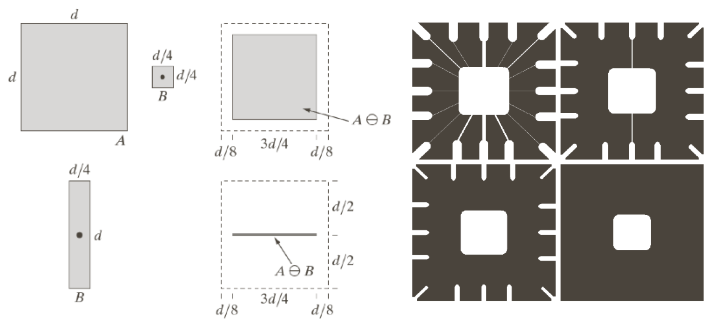

## Morphological Operation

    
    
    <h5></h5>

<!-- * 하나의 사람이 존재하는것에 반해, 물체 내부에 배경으로 판단되는 부분들이 존재해서,
구멍이 숭숭 뚫려 있다.

* 이러한것을 후처리 하는 방법이 있는데 바로 Morphological Operation을 사용할 수 있다. -->

---

#### 배경 제거가 끝났다, 따라서 객체를 이제 추정할 수 있는데.  그 결과를 바로 쓰기에는 부족하다.
* 바로 객체 사이사이에 구멍이 뻥뻥 뚫려 있다. 문제는 이걸 스레숄딩으로 처리할 수도 없는게.
스레숄딩도 특정 임계값 이상, 이하에 따라 흑 백을 나누는데.
* 이미 영상 자체가 이진화가 진행되어 0, 1으로밖에 이뤄지지 않는 상태라서, 해답이 될 수 없다.
* 이럴때는 **모폴로지 연산**을 통해, 구멍(노이즈)를 매우거나 지우거나 할 수 있다.

---

> ### 📄 1.  Input, Output

* Input이 되는 Mat은 두가지 있다.
  1. image : 원본이 되는 이진화 된 이미지.
  2. kernal : 커널 이미지 $ K_{n * n}$ $\{x | x = 2n + 1, n은 정수\} $
    openCV에서는 구조화된 요소 행렬을 간단하게 생성할 수 있도록
    getStructuringElement()함수를 제공
  3. iteration : 연산 반복 횟수 반복횟수가 많아지만 모폴로지 연산의 효과가 더 강해진다.
* Output은 마찬가지로 이진화 된 이미지

---

> ### 📄 2.  침식(Erosion) & 팽창(Dilation)

<!-- * 가장 기초적인 Morphological Operation 연산이다.
* A라는 이미지를 B라는 이미지로 침식/팽팡 을 해보자.
* B라는 이미지를 픽셀마다 하나하나 이동시키면서 교집합/합집합을 수행하게 된다.
* 이러한 B를 바로 Structure Element라고 불리는 커널이다. -->

    
    <h5></h5>

#### 1). Erosion

**Erosion of A By B(Kernal)**

    
    
    <h5>커널처럼 생긴 부위는 점으로 대체?</h5>

* Erosion은 이진화 이미지의 하얀 외곽 테두리 부분을 축소시키거나 얇게 만들어 준다.

---

#### 2). Dilation

**Dilation of A By B(Kernal)**

    
    
    <h5></h5>

* Dilation은 이진화 이미지의 하얀 외곽 테두리를 부분을 키우거나, 굵게 만들어 준다.

---

> ### 📄 3.  Opening & Closing

    
    <h5></h5>

---

#### "침식->팽창" 혹은 "팽창->침식" 즉,  모폴로지 연산을 했다가 다시 본래 크기 이미지로 돌려 놓는 작업이다.

* 이런 작업을 통해, 노이즈를 삭제하거나, 외곽 영역을 더 부드럽게 만들어 주는 효과를 만든다.

#### 1). Opening (침식->팽창)

* 작은 크기의 날카로운 피크나, 동떨어진 섬과 같은 점을 효과적으로 제거한다.
* 컨투어를 부드럽게 만들어 주고,
* 지협(두개의 몸체나 엽사이를 연결하는 좁은 부위)를 허물어 주고,

---

#### 2). Closing (팽창->침식)

* 마찬가지로 컨투어를 부드럽게 만들고
* 지협을 매꿔준다, 즉, 작은 구멍을 하얀색으로 매꿔준다.

---

> ### 📄 참고
1. [이미지 Erosion과 Dilation](https://blog.naver.com/samsjang/220505815055)
2. [[계산사진학] Morphological Image Processing](https://velog.io/@claude_ssim/%EA%B3%84%EC%82%B0%EC%82%AC%EC%A7%84%ED%95%99-Morphological-Image-Processing)
