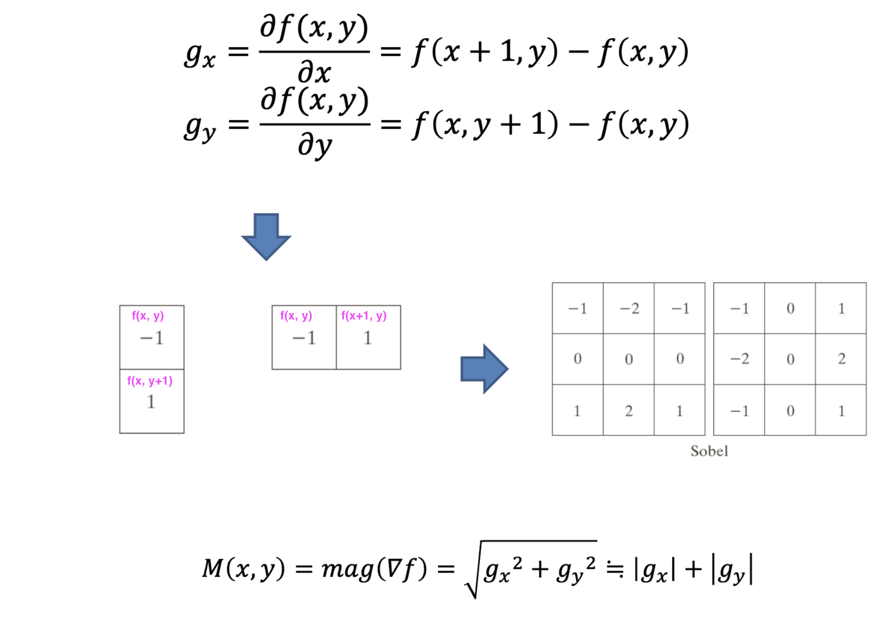

## Edge Detection

> ### 📄 1.  Introduction

#### 1). 에지란?
* 에지 픽셀
  * 에지 픽셀이란 영상 내에서 밝기값(또는 색상값)이 급격하게 변화하는 지점에 위치한 픽셀을 의미한다.
* 에지
  * 에지란 이러한 에지 픽셀들이 연속적으로 모여 형성된 선 또는 곡선을 말한다.
    영상에서 추출된 모든 객체의 외곽선 정보는 일반적으로 리스트 형태로 반환된다.
  * 외곽선 정의 (검은 배경과 흰색 도넛)
    * 도넛 객체의 바깍쪽을 외곽선을 정의한다.
    * 또한, 도넛 내부에 구멍, 검은 홀(그러니깐 도넛이지)이 존재한다면, 그 구멍을 둘러싼 픽셀 역시 외곽선으로 검출한다.

#### 2). 에지를 검출하는 방법 (1차원)

* 1차원 신호에서 에지를 검출하기 위해서는 1차 미분(차분) 계수의 크기를 사용할 수 있음!
즉, 신호의 변화율이 큰 지점이 에지에 해당한다.

#### 3). 에지를 검출하는 방법 (2차원)

* 2차원 영상에서는 각 픽셀에서의 그라디언트(gradient, 기울기)를 계산,
* 그 크기와 방향(아크탄젠트)을 이용하여 에지를 검출할 수 있음!
    * $f(x, y)$ : 2차원 데이터
    * $\nabla{f(x, y)}$  : 그라디언
      * 2차원 데이터 각각 점에서 x축과, y축 방향으로 미분한 결과는 벡터
      * x, y각 축의 미분 결과 벡터를 행렬로 묶어서 또다시 2차원 데이터로 엮은 것
    * $M(x, y)$ : f그라디언트도 일종의 벡터 집합이고, 이것을 피타고라스 법칙으로 빗변의 크기를 구하면 된다.
      *텍스쳐로 표현된다면 흑(변화가 미비함), 백(변화가 가파름)이 되겠다.*
    * $a(x, y)$ : 그라디언트의 (x, y)좌표에 가지는 벡터의 아크 탄젠트를 구해, 각도를 구한것.
      *텍스쳐로 표현된다면 적(가로축) 녹(세로축)이 되겠다*
      

          
          
          
          <h5></h5>
      

#### 4). 노이즈가 에지 검출에 미치는 영향

* 노이즈는 에지 검출 결과에 큰 영향을 미치므로,
에지 검출 전 반드시 노이즈를 줄이는 전처리(예: 가우시안 블러 등)가 필요하다.

---

> ### 2. 📄 외곽선(Contour) 검출

#### 1). `findContours()` 함수

* `findContours()` 함수는 이진화된 영상에서 객체의 외곽선을 검출하는 데 사용된다.
  이전 강의에서는 동전의 개수를 세는 데 사용했지만, 다양한 모드와 방법을 통해 외곽선 검출 및 계층 구조 분석에도 활용할 수 있음!

##### ① Mode (외곽선 검색 방법)

1. **RETR_EXTERNAL**
   * 가장 바깥쪽(최상위) 외곽선만 검출한다.
     내부에 존재하는 홀(구멍)이나 중첩된 외곽선은 무시된다.
   * 계층 정보는 저장하지 않음!
2. **RETR_LIST**
   * 영상 내의 모든 외곽선을 검출한다(바깥쪽, 안쪽 모두).
   * 하지만 외곽선 간의 계층 구조(부모-자식 관계)는 저장하지 않음!
3. **RETR_CCOMP**
   * 모든 외곽선을 검출하고, 2단계 계층 구조(바깥쪽-안쪽)로 분류한다.
   * 바깥쪽 외곽선과 그 내부의 홀(자식 외곽선)만 계층 구조로 저장한다.
   * 계층 구조가 2단계(부모-자식)로 제한된다.
4. **RETR_TREE**
   * 영상 내의 모든 외곽선을 검출하고, 모든 계층 구조(부모-자식, 형제 등)를 트리 구조로 저장한다.
   * 가장 상세한 계층 정보를 제공한다.

##### ② Method (외곽선 근사화 방법)

* **CHAIN_APPROX_NONE**
  모든 외곽선 점의 좌표를 저장한다(곡선의 모든 픽셀).
* **CHAIN_APPROX_SIMPLE**
  수평, 수직, 대각선 방향의 연속된 점들은 끝점만 저장하여 데이터 양을 줄임.
* **CHAIN_APPROX_TC89_L1**, **CHAIN_APPROX_TC89_KCOS**
  각각 L1 거리, 코사인 거리 기반의 근사화 알고리즘을 사용한다.

---

#### 2). 외곽선의 계층 구조

* 객체 내부에 또 다른 객체(구멍 등)가 있을 수 있으므로, 외곽선 간에는 포함 관계가 존재할 수 있음!
* 외곽선의 계층 구조는 이러한 포함 관계(부모-자식, 형제 등)에 따라 결정된다.
* 계층 구조 정보는 외곽선 분석 및 객체 분할에 유용하게 사용된다.

---

> ### 3. 📄 외곽선 처리

##### 1. `boundingRect()`
* 주어진 외곽선 점들을 감싸는 가장 작은 크기의 축에 평행한 사각형(바운딩 박스)을 구한다.
* 외곽선 정보가 이미 있다면, `boundingRect()`가 가장 효율적.

##### 2. `minAreaRect()`
* 외곽선 또는 점들을 감싸는 최소 면적의 회전된 사각형을 구한다.
* 객체가 기울어져 있을 때도 최소 크기의 사각형을 찾을 수 있음!

##### 3. `minEnclosingCircle()`
* 외곽선 또는 점들을 감싸는 최소 크기의 원을 구한다.

##### 4. `arcLength()`
* 임의의 곡선을 이루는 점들의 집합에 대해, 해당 곡선(혹은 폐곡선)의 길이를 계산한다.

##### 5. `contourArea()`
* 임의의 외곽선이 감싸는 영역의 면적을 계산한다.

---

> ### 4. 📄 외곽선 근사화

* 외곽선 또는 곡선을 단순화하여 근사화하는 `approxPolyDP()` 함수가 제공된다.

* 이 함수는 더글라스-포이커(Douglas-Peucker) 알고리즘을 사용하여 곡선 또는 다각형을 근사화한다.
* 근사화 과정:
  1. 입력 곡선에서 가장 멀리 떨어진 두 점을 직선으로 연결한다.
  2. 이 직선에서 가장 멀리 떨어진 외곽선상의 점을 찾아 근사화 점으로 추가한다.
  3. 새로 추가된 점과 기존 점을 연결하여 위 과정을 반복한다.
  4. 새 점과 직선 사이의 거리가 epsilon(허용 오차)보다 작아지면 근사화가 완료된다.
* epsilon 값은 일반적으로 입력 곡선의 전체 길이에 대한 비율로 설정한다.

* 근사화된 외곽선의 점 개수를 통해 도형의 종류(삼각형, 사각형 등)를 판단할 수 있음!
* 삼각형, 사각형이 아닌 경우, 외곽선 길이와 면적의 비율을 이용해 원형에 가까운지 등을 판별할 수 있음!(비율이 1에 가까울수록 원에 가까움).

---

> ### 5. 📄 Sobel operators

    
    
    <h5></h5>

|Y축|방향|중앙차분||X축|방향|중앙차분|
|:-:|:-:|:-:|:-:|:-:|:-:|:-:|
|-1|0|1||-1|-2|-1|
|-2|0|2||0|0|0|
|-1|0|1||1|2|1|

|X||||||||Y|
|--|--|--|--|--|--|--|--|--|
|50|50|100|100||50|50|100|100|
|50|200|200|100||50|0|0|100|
|50|200|200|100||50|0|0|100|
|50|200|200|100||50|0|0|100|
|50|50|50|100||50|50|50|100|

#### 1). 절차
* 차분
    * x 축 방향의 한칸 옆과 직선의 기울기 $f(x + 1, y) - f(x, y)$
    * y 축 방향의 한칸 위와 직선의 기울기 $f(x, y + 1) - f(x, y)$
* 소벨 마스크 3 x 3을 사용한다.
* 그리고, x축 방향의 미분 절댓값 + y 축 방향의 미분 절댓값은 $M(x, y)$와 근사한다
* 그리고 이 근사된 크기에 스레숄딩을 취하면
* 소벨 마스크를 사용한 에지 검출 결괴를 얻을 수 있다.

* Gradient - based
  * Sobel operator, Prewitt operator, Robert operator

> 실제로 소벨 필터에는 가우스 필터가 이미 포함되어 있습니다. 필터 커널의 "2"는 중앙의 픽셀을 보존하기 위한 것이 아니라 이미지를 매끄럽게 하고 출력의 노이즈를 줄이기 위한 것입니다. x 방향의 소벨 필터에는 y 방향과 그 반대 방향의 가우스 필터가 포함됩니다. 소벨 필터는 기본적으로 프리윗 필터와 가우시안 필터를 조합한 것입니다.

#### 2). `Sobel()`

    
    <h5></h5>

---

> ### 6. 📄 Canny Edge Detector

    
    <h5></h5>

#### 1). 절차
1. 입력 영상을 가우시안 필터로 스무딩하여 노이즈를 제거합 니다.
2. Sobel 마스크를 이용해 그라디언트의 크기와 방향을 계산한다.
3. ⭐️ 비최대 억제(Non-maxima suppression)를 적용
   * 각각의 픽셀에 대해 에지와 에지 방향을 구하면, p5기준으로 인접한 4방향 혹은 8방향 픽셀들을 찾고,
   * 에지가 될 가능성 적은것을 제거한다.
      * 그라디언트 방향을 따라 국소 최대값만 남기고 나머지는 억제(0으로 설정)한다.
      * 즉, M(x, y)의 값이 해당 방향의 이웃 픽셀 중 하나라도 더 크지 않으면 0으로 만듭니다.
4. 이중 임계값(double thresholding)과 연결성 분석(connectivity analysis)을 통해 최종 에지를 검출하고 연결한다.
   * $M(x, y) \ge T_{High}$ : 에지로 간주
   * $M(x, y) < T_{Low}$ : 비에지로 간주
   * 그 외의 경우 : 연결성 분석을 통해 에지 여부 결정
     * 만약 high와 연결되어 있다면 에지로 간주
     * 그렇지 않다면 에지로 간주하지 않는다.

* Gaussian - based
  * Canny edge detector, Laplacian of Gaussian

#### 2). `Canny()`

    
    <h5></h5>

---

> ### 📄 7. 참고

* [Finding the Edges (Sobel Operator)](https://www.youtube.com/watch?v=uihBwtPIBxM)
