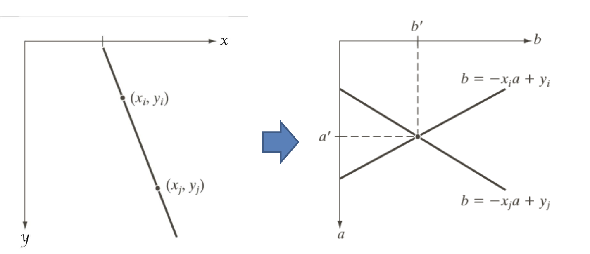
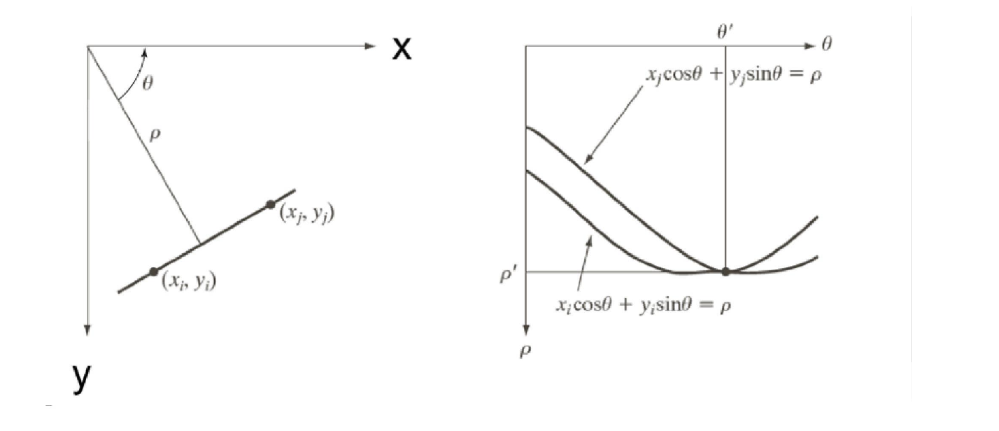
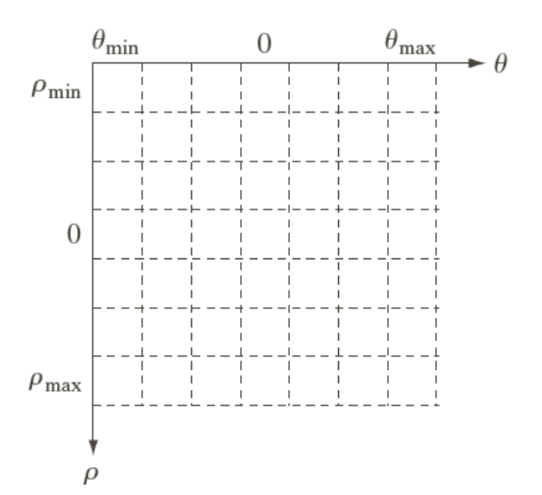
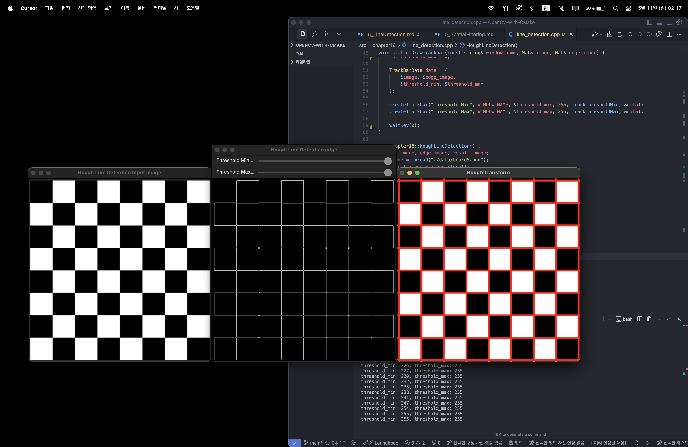

## Line Detection

---

> ### 📄 1. Line

#### 1). 2D 좌표의 Inhomogeneous Coordinate에서의 직선의 방정식

#### Inhomogeneous: $ax + by + c = 0$
* Inhomogeneous(비동차) 좌표계는 우리가 일반적으로 사용하는 2차원 평면 좌표계입니다.

##### ① 일반적인 직선의 방정식
* $(x, y)$는 평면 위의 점이고, $a, b, c$는 실수 계수입니다.
  $$
  ax + by + c = 0
  $$

##### ② 기울기-절편 형태
* $m$은 기울기, $n$은 y절편입니다.
* $m = \frac{-a}{b}$, $n = \frac{-c}{b}$
  $$
  y = mx + n
  $$


---

#### 2). 2D 좌표의 Homogeneous Coordinate에서의 직선의 방정식

#### Homogeneous: $l^T p = 0$, $l = (a, b, c)$, $p = (x, y, 1)$

* Homogeneous(동차) 좌표계는 컴퓨터 비전, 그래픽스 등에서 변환을 쉽게 하기 위해 사용하는 좌표계입니다.
* 2D 평면의 한 점 $(x, y)$는 homogeneous 좌표계에서 $(x, y, 1)$로 표현됩니다.

* 직선의 방정식은 다음과 같이 표현됩니다.
  $$
  l = (a, b, c) \\
  p = (x, y, 1) \\
  l^T \cdot p = 0
  $$


* 즉, 와 동일합니다.
  $$
  a x + b y + c = 0
  $$

* Homogeneous 좌표의 장점:
  - 무한대의 점(평행선의 교점 등)을 표현할 수 있습니다.
  - 행렬 곱셈으로 변환(이동, 회전, 스케일 등)을 쉽게 표현할 수 있습니다.

---

> ### 📄 2. Hough Transform

#### 이미지의 점을 파라미터 공간으로 변환하여 직선을 검출하는 알고리즘
* Hough Transform은 이미지에서 직선(또는 원, 곡선 등)을 검출하는 대표적인 알고리즘입니다.
  * 원 검출같은 경우는 특정한 $(c_1, c_2, c_3)$이 반복적으로 사용 되었을때 원으로 판단할 수 있다.
    $$
    (x - c_1)^{2} + (x - c_2)^{2}  = c_3
    $$

#### 1). 에지 픽셀

* 이전에서 (Canny든, Sobel) 이든 경계면 검출을 수행했을 것이다.
* 그 경계선은 일종의 "에지 픽셀"을 원소로 한 집합이라고 했다.
* 여기서도 말하는 에지 픽셀은 그 "에지 픽셀"이다.

#### 2). 기본 원리

1. 기울기-절편 형태 직선의 방정식 $y = mx + n$
   * 여기서 각 에지 픽셀을 지나는 다양한 직선의 방정식이 있을텐데
   이에 대해 **(m *기울기*, n *절편* )** 쌍 의 모든 가능한 조합을 찾아내는 것 이다.
   * (m, n)쌍은 곧 직선이고, 이러한 직선의 집합이 나올텐데
   * 집합은 곧 공간 -> (m, n) 공간을 만들어 버리고
    그 원소들 중에서 (a, b) 원소가 가장 빈번하고, 많이 사용 되었을때
   * $y = ax + b$ 라는 직선이 있다고 추정할 수 있다.
     * 점 $(x_i, y_i) $를 직선의 개수 : 무수히 많음
     * 점 $(x_j, y_j) $를 직선의 개수 : 무수히 많음
     * 점 $(x_i, y_i), $(x_j, y_j) 두가지를 동시에 지나는 직선의 개수 : **오직 하나**

     <div align=center>
        
        <h5></h5>
     </div>

2. 하지만, 기울기-절편 직선의 방정식은 수직의 기울기를 표현할 수 없다.
   * 따라서 극 좌표계의 직선의 방정식을 사용해야 모든 방향의 직선을 안정적으로 표현할 수 있다.
   * 극좌표 **($\rho$ 원점에서 직선까지의 수선의 거리, $\theta$ 극좌표 각도)** 표현을 사용한 극좌표 직선의 방정식은 다음과 같다.
        $$
        \rho = x \cos \theta + y \sin \theta
        $$
   * 집합은 곧 공간, 아예 $(\rho, \theta)$ 공간은 만들어 버리고
   * 이 공간을 곡선(사인 곡선)으로 변환합니다.
     * "마찬가지로 점 $(x_i, y_i)$, $(x_j, y_j)$ 두가지를 동시에 지나는 직선"과 &<br> 수선의 거리, 극좌표의 각도 $(\rho, \theta)$는 유일함

     <div align=center>
        
        <h5></h5>
     </div>

3. 각 에지 픽셀에 대해 여러 $\theta$ 값을 대입하여 $\rho$를 계산하고
   * 여러 점에서 변환된 곡선이 교차하는 지점이 실제 직선의 파라미터$(\rho, \theta)$가 되고
   * 교차점의 개수가 임계값(threshold) 이상이면 해당 파라미터에 해당하는 직선이 있다고 판단할 수 있음

> ### 📄 3. 허프 변환의 알고리즘.

<div align=center>
    
    <h5>accumulator : 에지 픽셀들이 파라미터 공간에 투표하는 방식으로 직선을 찾는다.</h5>
</div>

1. 이진 에지 이미지 구하기
2. $(\rho, \theta)$ 이산 공간 만들기
   * [ $\rho$ 의 min, max], [ $\theta$ 의 min, max]과 같은 range를 정하고
3. 스레숄드 사용
4. 셀에 해당하는 직선상의 있는 에지 픽셀들의 연결성을 확인해서 최종적으로 직선을 구할 수있다.

> ### 📄 4. OpenCV에서의 사용

##### ① Standard Hough Transform: `cv::HoughLines()`

```
입력: 에지 이미지, 𝜌와 𝜃의 해상도, 임계값 등
출력: 검출된 직선의 (𝜌, 𝜃) 파라미터
```

<div align=center>
    
    <h5></h5>
</div>

##### ② Probabilistic Hough Transform: `cv::HoughLinesP()`
* 확률적 허프 변환 : 연산량이 적고, 빠르다.
* 유한 선분을 사용해 시작점, 끝점이 필요함
* 패러미터
    1. `minLineLength` : 검출한 선분의 최소 길이, 이 값보다 짧은 선분은 결과에서 제외된다.
       주의할 점 : 너무 작게 설명하면 잡음에도 선분이 검출된다. 혹은 너무 크게 설정하면 유의미한 선분도 무시한다.
    2. `maxLineGap` : 선분을 연결할 떄 허용하는 최대 간격(픽셀 단위), 즉 일명 거리에 스레숄딩을 주는 것,
       주의할 점 : 너무 작게 설정하면 하나의 선분이 여러개로 쪼개질 수 있다. 혹은 너무 크게 하면 떨어진 에지 픽셀들이 하나의 선분으로 연결되어, 선분이 아닌데 검출 될 수 있다.
