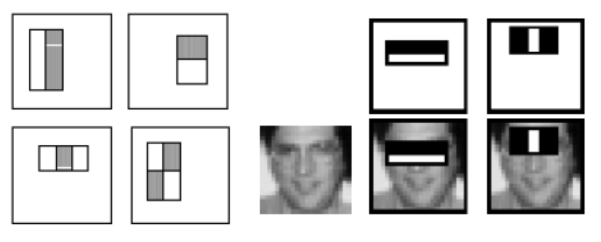
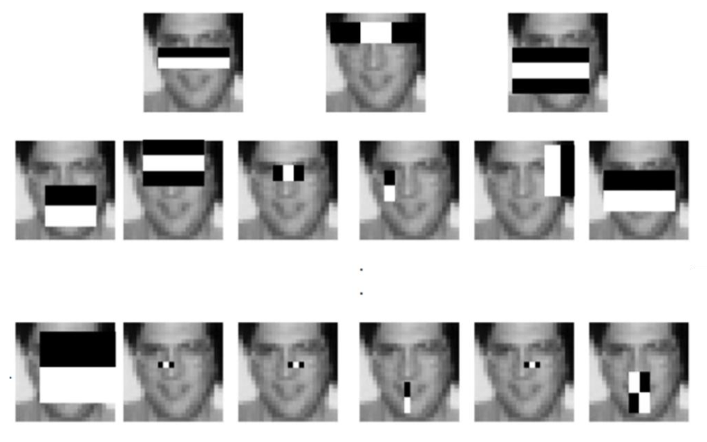
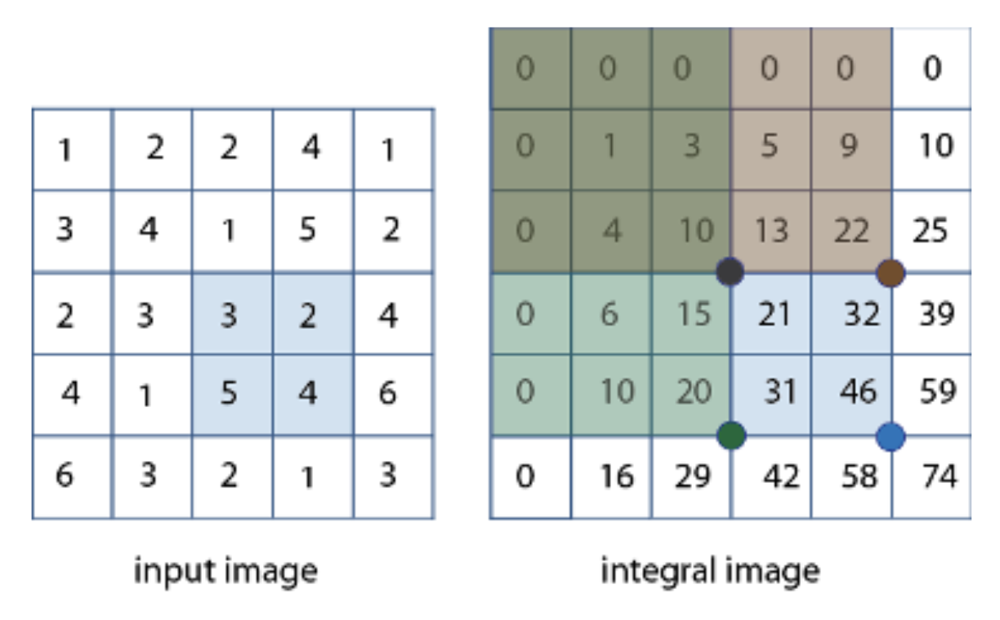
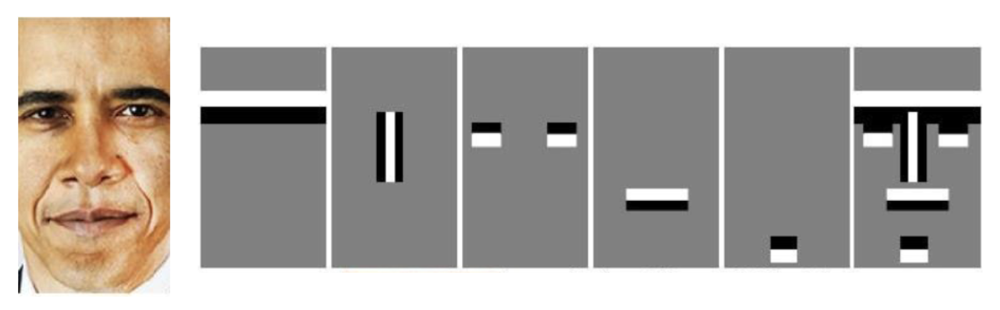
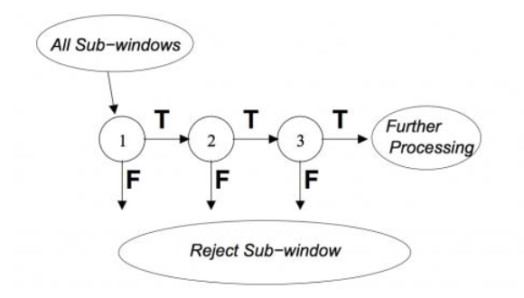

## Face Detection

* Haar-like feature는 얼굴의 특징을 수치적으로 표현하는 방법이고.
* AdaBoost는 이 특징 중 중요한 것만 골라내어 강한 분류기를 만들며.
* Cascade classifier는 여러 강한 분류기를 계단식으로 연결해 빠르고 정확하게 얼굴을 검출.

> ### 📄 앞서..

#### 컴퓨터에서 물체를 검출할 하기 전에 필요한 단계

#### 1). 학습 단계

* 객체인 이미지와 / 객체가 아닌 이미지를 수도없이 준비되야 하고, 특히 non-object images가 훨신 더 많아야 한다.
* 객체를 대표하는 알맞는 feature를 찾아야 하는데
  1. 휴먼 리소스로 고민을 한 끝에 개발된 것이 있는가 반면에
  2. 신경망이 스스로 Feature를 찾기도 한다.
* 찾은 피쳐를 가지고 실제로 물체를 분류를 잘 해주는 식별기, 분류기를 디자인하고, 분류기에게 그걸 학습해 줘야한다.

#### 2). 테스트 단계

* Train Stage에서 찾은 input에서 부터 찾은 feature를 추출한다.
* 학습된 분류기로 객체를 잘 찾는지 확인해 본다.

> ### 📄 1. Haar-like Feature

#### 이미지 내 밝기 변화(에지, 라인 등)를 빠르게 포착하는 사각형 기반 Feature 이미지.

<div align=center>
    
    <h5></h5>
</div>
<div align=center>
    
    <h5></h5>
</div>

##### ① Haar-like Feature 란 무엇인가
* 여기서 Feature란, 첨부 사진의 좌 상단 흑백 블럭을 기준으로
  블럭의 Feature = "백이 포함된 영역에, 흑이 포함된 영역을 뺀 **값**" 인것이다.
* 따라서 Feature는 모양과 형태, 위치, 크기도 다양할텐데
"**그 Feature 중 얼굴을 가장 잘 대표할 수 있는 Freature가 바로 Haar-like Feature**" 인것이다.
    * 그러한 Feature가 바로 첨부 사진의 우상단 "얼굴위에 무심하게 놓여 있는 흑 백 사각형 이미지" 이다.

##### ② Haar-like Feature 사용법
* Feature 내부 영역의 픽셀 합을 계산하고 인접한 영역간의 차이를 구하는 프로세스로 사용된다.
  * 사각형 영역의 합을 빠르게 계산하기 위해 integral image(적분 이미지) 기법을 사용한다.
  * integral image(적분 이미지)란 적분이 넓이를 구하는 것 과 같이
  특정 row, col이 주어지면 그 구간의 합을 빠르게 구할 수 있도록 하는 자료다
  *마치 DP와 같음.*

  <div align=center>
      
      <h5>(3, 3), (4, 4) 영역 : "14 == (10 + 46) - (22, 20)" </h5>
  </div>

* 원본 이미지 내에서 다양한 위치와 크기에서 빠르게 계산할 수 있어 실시간 얼굴 검출에 적합하다.

##### ③ 이걸로 뭘 할 수 있는가?
* Haar-like feature는 사각형 영역의 픽셀 값 합의 차이를 이용해
이미지 내의 특정 패턴(예: 눈, 코, 입 등 얼굴의 특징적인 부분)을 빠르게 포착할 수 있고,
이 특징은 다양한 위치와 크기로 적용할 수 있어, 얼굴의 여러 부분을 효과적으로 표현할 수 있음.
* 이러한 Feature은 이미지의 밝기 변화(에지, 라인 등)를 빠르게 포착할 수도 있다.

> ### 📄 2. Training

#### Haar-like feature를 대량으로 추출하고, <br>AdaBoost 등으로 중요한 특징을 선택해 분류기를 학습하는 단계

##### ① 1. 크기와 위치를 바꿔가며 많은 특징(feature)을 생성할 수 있다
* 이 중에서 사람 얼굴을 분류하는 데 효과적인 특징을 선택한다.
    * Boosting: 여러 개의 약한 분류기(weak-learner)가 모여 강한 분류기(strong-learner)를 만든다.
    * Adaptive: 이미 학습된 약한 분류기의 정확도에 따라 각 샘플의 가중치가 조정된다.

<div align=center>
    
    <h5>주황색 세모 : 얼굴이 아닌 영상<br>파란 동그라미 : 얼굴인 영상<br>크기가 커지고 작아지는것 : 가중치를 부여한 것</h5>
    <h5>결론적으로 4번이 얼굴이냐 아니냐를 잘 분류한 strong leaner 이다. <br>문제는 4번과 같이 영역을 어떻게 나눌까?</h5>
</div>

##### ② 학습 과정

```
1. 데이터 준비 : 얼굴이 포함된 이미지(양성 샘플)와 얼굴이 없는 이미지(음성 샘플)를 준비한다.
2. Haar-like feature 추출
    다양한 위치, 크기, 형태(2-rectangle, 3-rectangle, 4-rectangle 등)의
    Haar-like feature를 이미지 전체에 적용하여 수십만~수백만 개의 feature을 추출한다.
3. 특징 선택(Feature Selection)
    수십만~수백만개의 feature가 일종의 weak leaner 후보들 이다.
    모든 특징을 사용할 수 없으므로, AdaBoost와 같은 알고리즘을 사용해
    분류 성능이 좋은 특징(weak leaner)을 선택한다.
4. 분류기 학습
    선택된 특징(weak leaner)을 조합하여 강한 분류기(strong leaner)를 만든다..
5. Cascade 구조로 학습
    검출 속도와 정확도를 높이기 위해 여러 단계의 분류기(약한 분류기 → 강한 분류기)를 계단식(cascade)으로 구성한다.
    각 단계에서 얼굴이 아닌 영역을 빠르게 배제하고, 마지막까지 살아남은 영역만 얼굴로 판단한다.
```

<div align=center>
    
    <h5>절차적으로 Weak leaner들이 뭉치고 뭉치고.. 해서<br>Strong leaner가 된 모습이다.</h5>
</div>

> ### 📄 3. Cascade classifier

1. 여러 약한 분류기를 이용해 강한 분류기를 생성한다.
   각 강한 분류기는 계단식(cascade)으로 연결된다.

<div align=center>
    
    <h5></h5>
</div>

2. Cascade Classifier의 의미
   * Cascade classifier는 여러 단계의 분류기를 순차적으로 연결한 구조로,
     * 각 강한 분류기 내 약한 분류기의 수는 3 > 2 > 1 순으로 줄어든다.
        * 초반 단계: 계산이 매우 빠르고, 얼굴이 아닌 영역을 대량으로 제거(거짓 음성은 허용, 거짓 양성은 최소화)
        * 후반 단계: 더 복잡한 분류기를 사용해 남은 영역을 정밀하게 판별
   * 여러 개의 분류기를 각 단계(stage)마다 간단한 분류기를 사용해
   비얼굴(non-face) 영역이 쉽게 제거된다.
   * 최종적으로 살아남은 영역만을 얼굴로 판단한다.

> ### 📄 4. openCV function
  * Image : Matrix of the type CV_8U containing an image
where objects are detected.
  * Objects : Vector of rectangles where each rectangle
contains the detected object, the rectangles may be
partially outside the original image.
Face Detection
  * openCV function
  * numDetections : Vector of detection numbers for the corresponding
objects. An object's number of detections is the number of
neighboring positively classified rectangles that were joined together
to form the object.
  * scaleFactor : Parameter specifying how much the image size is
reduced at each image scale.
  * minNeighbors : Parameter specifying how many neighbors each
candidate rectangle should have to retain it.
  * flags : Parameter with the same meaning for an old cascade as in the
function cvHaarDetectObjects. It is not used for a new cascade.
  * minSize : Minimum possible object size. Objects smaller than that are
ignored.
  * maxSize : Maximum possible object size. Objects larger than that are
ignored. If maxSize ==minSize,  model is evaluated on single scale.
