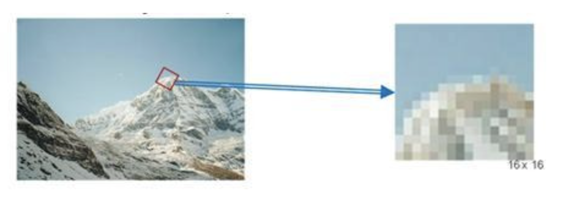
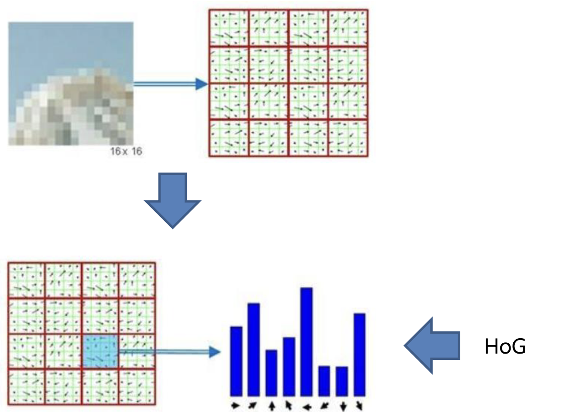
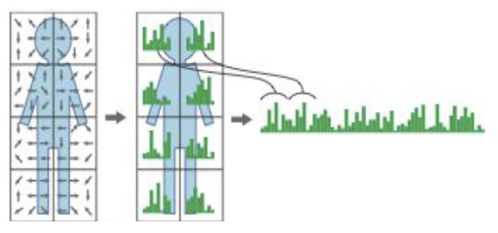
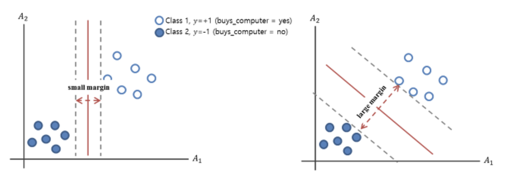

---

## Pedestrian Detection (보행자 감지)

---

> ### 📄 1. Pedestrian Detection
* 이미지나 비디오에서 보행자(사람)를 자동으로 찾아내는 기술.
* 주로 자율주행, 감시 카메라, 로봇 비전 등에서 사용되며,
입력된 영상에서 사람의 위치를 사각형 등으로 표시.
* 다양한 환경(조명, 배경, 크기, 자세 등)에서 사람을 정확하게 검출하기 위해,
강인한 특징 추출과 분류기가 필요하다.

---

> ### 📄 2. Histogram of Oriented Gradients Descriptor

#### HoG는 이미지 내에 객체의 Shape를 나타내는 대표적인 특징(Feature) 추출하는 방법.

* KeyPoint(관심점)과 Descriptor(기술자)를 사용하여 사진을 매칭한다.

#### 1).  SIFT

##### ① 조명의 변화에 강하며, 물체의 방향에 상관없는 기술자를 생성할 수 있다.
##### ② HoG 특징 추출 절차
1. **이미지 분할** : SIFT에서 Scale에 불변한 KeyPoint를 찾음 -> KeyPoint 위치를 찾았다면 warp하여 16x16 사이즈의 윈도우를 만든다.
2. **경계(Edge) 방향 계산** : 16x16의 윈도우의 각 픽셀에 x,y 방향의 미분을 통해 방향(Orientation)과 크기(Magnitude)를 계산한다.
3. **방향 히스토그램 생성** : 8방향 벡터, 8개 bin의 히스토그램을 만든다.
4. **블록 정규화** : 그것을 또 4x4의 영역으로 셀을 만들어 16개의 셀 각각에 대해 정규화를 하여 조명 변화에 강하게 한다.
5. **특징 벡터 생성** : 모든 블록의 히스토그램을 연결(concatenate)하여 최종적으로 하나의 고차원 특징 벡터 제작

<div align=center>
    
    <h5>이미지 분할</h5>
    
    <h5>경계 방향 계산및, 방향 히스토그램 생성</h5>
    
    <h5>특징 벡터 생성 (우측이 vectorization 혹은, concatenatnation인 "고차원 특징 벡터")</h5>
</div>

#### 2). Feature
* 여기서 Feature란, HoG를 사용한 보행자 표현이다.

---

> ### 📄 2. Training

* HoG 특징을 추출 했다면, 보행자와 비보행자(배경 등) 이미지를 이용해 분류기를 학습시킨다.
* OpenCV에서는 주로 SVM(Support Vector Machine) 분류기를 사용한다.

#### 1).  SVM(서포트 벡터 머신)
* SVM은 두 클래스(보행자/비보행자)를 가장 잘 구분하는
**최대 마진 초평면(Hyperplane ??!!)** 을 찾는 지도학습 분류기로,
HoG 특징 벡터를 입력으로 받아, 보행자일 확률이 높은 영역을 검출한다.

<div align=center>
    
    <h5>파란색 원 : 보행자에서 추출한 HoG Feature<br>하얀 원 : 보행자가 아닌 HoG Featuure</h5>
    <h5>여기서 빨간 선이 "식별기 (Classifier)"이다. <br>세로로 하면 마진이 작지만, 여기서 각도를 돌려가면 거리가 최대가 되는 마진을 찾을 수 있다.</h5>
</div>

---

> ### 📄 3. Optimize

#### 보행자 검출의 정확도와 속도를 높이기 위해 전처리, 후처리, 혹은 분류기 설계가 필요하다.

#### 1). 이미지 패치 크기 조정(Image patch resizing)

* 입력 이미지를 다양한 크기로 변환하여, 여러 크기의 보행자를 검출할 수 있도록 함(멀티스케일).

#### 2). 히스토그램 정규화(Histogram normalization)

* 조명 변화에 강인하도록, 블록 단위로 히스토그램을 정규화함.

#### 3). 이미지 피라미드(Image pyramid)

* 이미지를 여러 해상도로 축소/확대하여, 다양한 크기의 객체를 검출.
윈도우 스트라이드(Window stride) 및 패딩(Padding)
슬라이딩 윈도우의 이동 간격과 패딩을 조절하여, 검출 성능과 속도 균형을 맞춤.

#### 4). 후처리(Post-processing)

* 중복 검출된 사각형을 그룹화(Grouping)하여, 최종적으로 하나의 객체만 남기도록 함.

---

> ### 📄 4. OpenCV 함수

#### 1). `HOGDescriptor::HOGDescriptor`

##### HOGDescriptor의 각 파라미터는 탐지 성능과 속도, 오탐/미탐에 직접적인 영향을 미칩니다.

```cpp
HOGDescriptor hog(
    Size(48, 96), // _winSize
    Size(16, 16), // blockSize
    Size(8, 8),   // blockStride
    Size(8, 8),   // cellSize
    9             // nbins
);
```

##### ① `_winSize(Size)`

* HOG 특징을 추출할 탐지 영역 크기로, 일반적으로 $너비 : 높이 = 1 : 2$ 비율을 가진다.
    * **크기가 커지면** 더 큰 객체(사람)를 탐지할 수 있지만, 작은 객체는 놓칠 수 있다.
    * **크기가 작아지면** 작은 객체도 탐지할 수 있지만, 노이즈가 많아지고 오탐률이 증가할 수 있다.

##### ② `blockSize(Size)`

* HOG에서 히스토그램을 계산할 블록의 크기고, 또한 블록을 구성하는 셀(cell)도 여러가지로 구성된다.
    * **크기가 커지면** 더 넓은 영역의 정보를 한 번에 보지만, 세밀한 특징을 놓칠 수 있다. 최대 (16, 16)
    * **크기가 작아지면** 더 세밀한 특징을 잡을 수 있지만, 계산량이 많아지고 노이즈에 민감해짐.

##### ③ `blockStride(Size)`
* 블록을 이동시키는 간격(스트라이드)
  *`arr[i] -> arr[i+1]` 배열에서 인덱스가 한개 증가할 때의 메모리 간격과 같은것을 스트라이드라 부름*
  단 여기서는 커널의 중심점이 몇칸 점프하면서 순회를 할지에 대해 그 **"몇칸"** 에 해당하는 것이 스트라이드
    * **크기가 커지면** 블록이 겹치는 부분이 줄어들어 계산량이 줄지만, 특징의 연속성이 떨어질 수 있다.
    * **크기가 작아지면** 블록이 더 많이 겹치게 되어 특징의 연속성이 좋아지지만, 계산량이 증가함.

##### ④ `cellSize(Size)`
* 아까전에 블록을 구성하는 요소로 셀(Cell)이라고 했다. 히스토그램을 계산하는 최소 단위이다.
    * **크기가 커지면** 한 셀에 더 많은 픽셀이 포함되어 세밀한 특징을 놓칠 수 있다. 최대 (8,8)
    * **크기가 작아지면** 더 세밀한 특징을 잡을 수 있지만, 계산량이 많아짐.

##### ⑤ `nbins (int)`
* 각 셀에서 히스토그램을 만들때, 상하좌우,좌상단.. 등등 벡터 방향을 하나의 가로축 원소로 둔다 치면
    계산할 방향 히스토그램의 bin(방향 개수) 수.
    * **값이 커지면** 방향 정보를 더 세밀하게 구분하지만, 계산량이 많아지고 오버피팅 위험이 있다. (최대 9)
    * **값이 작아지면** 방향 정보를 대략적으로만 구분하게된다.

#### 2). `setSVMDetector`

##### setSVMDetector는 SVM 가중치 벡터(`std::vector<float>`)를 받아 분류기를 설정함.

```cpp
hog.setSVMDetector(HOGDescriptor::getDefaultPeopleDetector());
```

##### ① `setSVMDetector()`

* HOG 특징을 기반으로 객체(사람 등)를 분류할 SVM(서포트 벡터 머신)을 뭘 쓸건지를 설정하는 Setter 함수
* 실제로 사람이 맞는지를 알고싶은데
    이 함수가 없으면 HOG 특징만 추출하고 사람을 분류할 수 없다.

##### ② `HOGDescriptor::getDefaultPeopleDetector()`

* OpenCV에서 미리 학습된 사람 검출용 SVM 가중치 벡터를 반환함.
* **반환 타입:** `std::vector<float>`


#### 3). `HOGDescriptor::detectMultiScale()`

##### detectMultiScale은 실제로 이미지에서 객체를 탐지하는 핵심 함수로,<br>이미지에서 여러 크기의 윈도우를 이동시키며 HOG 특징을 추출하고, SVM 분류기로 객체(사람 등)를 탐지함.
* 이 함수가 없으면 실제로 이미지에서 사람이 어디 있는지 찾을 수 탐지 결과를 얻지 못함.


```cpp
hog.detectMultiScale(
    frame,      // InputImage
    found,      // found locations
    1.2,        // hitThreshold
    Size(8, 8), // winStride
    Size(32,32),// padding
    1.05,       // scale
    6           // groupThreshold
);
```

##### ① `found (vector<Rect>&)`
*  탐지된 객체(사람)의 위치(사각형 좌표) 저장

##### ② `hitThreshold (float)`

* SVM T/F를 결정하는 스레숄드 값 (하필 찍힌 점이 SVM 이미지에서 빨간색 직선 "Classifier"위에 있으면? 애매하겠지. 그걸 이분법하기 위한 임계 Padding이다.)
    * **값이 커지면** 더 엄격하게 탐지하여 오탐(false positive)이 줄지만, 놓치는 경우가 많아짐.
    * **값이 작아지면** 더 많이 탐지하지만, 오탐지를 할 가능성이 높음

##### ③ `winStride (Size)`
* 탐지 윈도우를 이동시키는 간격(스트라이드).
    * **크기가 커지면** 점핑하는 간격이 넓어 탐지 속도가 빨라지지만, 일부 객체를 놓칠 수 있다.
    * **크기가 작아지면** 더 촘촘하게 탐지하지만, 속도가 느려짐.

##### ④ `padding (Size)`
* 이미지 경계에서의 패딩(여유 공간) 크기입니다. 단위는 (8,8), (16,16), (24,24), (32,32)
* sliding window ROI가 패딩된다
    * **크기가 커지면** 경계 근처의 객체도 잘 탐지할 수 있다.
    * **크기가 작아지면** 경계 근처 객체를 놓칠 수 있다.

##### ⑤ `scale (float)`
* 이미지 피라미드의 스케일 팩터입니다  여러 크기의 객체를 탐지하기 위해 이미지를 축소하면서 반복 탐지함.
    * **값이 1에 가까우면**(예: 1.01) 더 많은 크기를 세밀하게 탐지하지만, 속도가 느려짐.
    * **값이 크면**(예: 1.5) 빠르지만, 일부 크기의 객체를 놓칠 수 있다.

##### ⑥ `groupThreshold (int)`
* 중복된 탐지 결과를 그룹화할 때 사용할 임계값입니다.
    * **값이 크면** 여러 번 탐지된 것만 남기므로 오탐이 줄지만, 실제 객체도 놓칠 수 있다.
    * **값이 작으면** 오탐이 늘어날 수 있다.


---

> ### 📄 5. 참고

1. [카이 제곱 : HoG Descriptor](http://vision0814.tistory.com/168)
