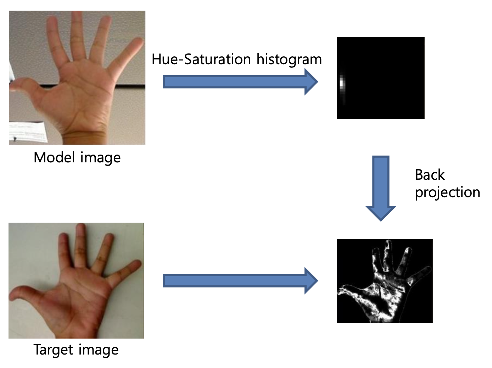

---

## Tracking

---

> ### 📄 1. 기본 컨셉

* ROI (Region of Interesting)은 유저의 개입으로 선택되거나, 자동 감지를 통해 선택된다.
* ROI는 히스토그램이나, Features를 통해 표현되는데.
* Tracking에서 ROI는 주로 이전프레임과, 다음프레임이 있는 "영상"의 문맥에서 말하는 것이고,
    그래서, 목표는 가장 최적로 매칭되는 ROI 조각(patch) 찾는것이다

> ### 📄 2. MeanShift

* 이미지의 ROI의 위치를 추적할 때 사용된다.
* 어떤 밀도 함수(density function)에서 샘플링된 이산(discrete) 데이터로부터,
그 밀도의 최댓값 (peak, mode)을 찾는 절차(Procedure)
즉, 데이터의 분포를 기반으로, 객체가 실제로 어디에 있는지(가장 밀집된 곳) 자동으로 찾는 방법이다.
* 반복적으로 수행되어야 하는(Iterative) 함수다."

#### 1). Histogram Back Project

    
    
    <h5>1. 빨간 범위의 Mask를 히스토 그램을 추출 
2. BackProject, MedianBlur, Threshold를 통해 주사위를 제외한 영역 추출</h5>

#### 2). Mean Shift Procedure

1. 첫번째 타임에 인풋 이미지에서 히스토그램(색상 분포)를 추출한다. (흑백이여서는 안됨!)
2. 히스토그램(색상 분포)를 기반으로, 객체가 있을 위치를 "히스토그램 역투영"으로 가져온다.
3. window라는 검색 영역이 있고, 아까 찾은 위치를 중심 픽셀로 하여,
윈도우 내의 픽셀값의 평균을 계산해 다음 중심을 이동한다.
4. 만약, 중심이 더이상 이동하지 않거나, 특정 임계치 이하가 될 때 까지 반복한다.
5. 이런 반복의 결과로 대상이 가장 일집된 위치로 이동하게 되어 있다.

    
    <h5></h5>

> ### 📄 2. Camshift (Continuously Adaptive Mean Shift)

#### 영상에서 움직이는 객체의 크기와 방향이 변해도 효과적으로 추적할 수 있도록 MeanShift를 확장한 방법이다.

    
    <h5></h5>

#### 1). CamShift는 MeanShift를 어떻게 개선했는가?

* **MeanShift는 Window라는 검색 영역의 크기가 항상 고정되어있다**.
따라서 객체가 멀어지거나 가까워지면서 변하는 크기를 제대로 추적할 수 없었는데.
* **CamShift는** MeanShift의 결과로 얻어진 윈도우(검색 영역) 내의 분포 정보를 이용해
**각 반복마다 윈도우의 이동(Translation), 회전(Rotation), 스케일(Scaling) 변화를 동시에 추적할 수 있다.**

> ### 📄 3. Optical Flow

#### 옵티컬 플로우는 이미지에서 밝은 패턴의 모션을 표현한다.

    
    <h5></h5>

#### 1). KLT(Kanade-Lucas-Tomasi) Algorithm

##### 한 프레임에서 추출한 특징점 Feature를 추출하고, 추출된 Feature를 프레임별로 추적한다.
* 알고리즘은 연속된 영상 프레임에서 특징점(Feature Point, 예: 코너, 모서리 등)의 움직임을 추적하는
* 대표적인 옵티컬 플로우(Optical Flow) 기반 알고리즘이다.

##### ① 전제
1. **밝기 불변(밝기가 변하지 않는다는 가정)**
   * 오브젝트의 밝기(Intensity)는 앞뒤 프레임(잇다라 연속으로 나타나는 영상의 프레임)에서
   거희 변화되지 않거나, 극도록 변화가 최소가 되도록 위치를 찾는것
2. **스몰 모션**
   * 움직였을때, 픽셀 하나는 주변 픽셀부와 비슷한 값을 가질것이다.

$$
I(x, y, y) = I(x + \Delta{x}, y + \Delta{y}, z + \Delta{z})
$$

$$
I(x + \Delta{x}, y + \Delta{y}, z + \Delta{z}) =
I(x, y, y) + \frac{\delta{I}}{\delta{x}}\Delta{x} + \frac{\delta{I}}{\delta{y}}\Delta{y} + \frac{\delta{I}}{\delta{z}}\Delta{z}
$$

$$
\frac{\delta{I}}{\delta{x}}\Delta{x} + \frac{\delta{I}}{\delta{y}}\Delta{y} + \frac{\delta{I}}{\delta{z}}\Delta{z} = 0 (x, y, z 방향의 밝기 변화율 = 미분)
$$

##### ② 절차
1. 첫 프레임에 추적할 특징점 Feature를 추출한다.
2. 다음 프레임에서 해당 특징점 주변의 밝기 패턴이 가장 비슷하거나 잘 맞는 위치를 찾는다.
3. 미분 혹은 **[테일러 급수](./extra/TaylorSeries.md)** 를 통해 주변부 픽셀의 Intensity 변화량을 1차 근사하여, 선형 방정식으로 이동량을 계산한다.

#### 2). KLT Algorithm with pyramids

##### ① 갑자기 웬 피라미드?
* 일반적인 KLT Algorithm는 넓은 영역의 움직임을 다룰 수 없다.
* 따라서 이러한 한계를 극복하기 위해 이미지 피라미드라는것이 필요하다

    
    <h5>위에서 아래로 이동하는 것 처럼 보이는데.. 사실 downsampling하면서 아래에서 위로 올라가는거 아닐까?</h5>

##### ② Image H & Image I
  * **Image H (녹색)** : 기준(reference) 프레임, 보통 이전 시점의 이미지
     `goodFeaturesToTrack()`를 통해 얻어진 "홀드된" 이미지
  * **Image I (파랑)** : 현재(target) 프레임, H와 비교될 다음 시점의 프레임

##### ③ run iterative L–K (Lucas–Kanade)
* `calcOpticalFlowPyrLK()` 함수와 "Image H"와 "Image I"각각의 이미지를 가져다가
    H 에 있던 Feature들이 I에서는 어느 위치로 이동했는지 계산한다.

##### ④ 피라미드 배치와 이미지 크기 변화  “Warp & Upsample”
* 각 단일 이미지는 원본 해상도의 이미지 한 장을 말하고, 각 피라미드 레벨마다 크기(해상도)가 달라진 버전을 만들어 사용.
  1. Downsampling(=피라미드 생성) 은 “영상 자체”를 여러 스케일로 준비하는 단계
        * 가장 아래 레벨(가장 큰 면적)은 원본 해상도이며,
        * 위 레벨로 올라갈수록 반씩(또는 절반 이하) 축소된 해상도의 이미지를 생성.
  1. Warp & Upsample 은 “흐름(field)”을 coarse->fine로 옮겨가면서 보정하는 단계

#### 3). Comparesion "Motion Vector" And "Optical Flow"

##### ① 공통점
* Motion Vector와 Optical Flow는 모두 영상 내에서
  물체나 픽셀의 움직임을 표현하는 개념.

##### ② **Optical Flow(옵티컬 플로우)**
* 영상의 연속된 프레임에서 각 픽셀의 밝기 변화(패턴의 이동)를 기반으로, 모든 픽셀(혹은 특징점)의 이동 방향과 크기를 벡터로 나타낸 것으로.
* 영상 전체 또는 일부 영역에서의 미세한 움직임을 벡터 필드로 표현한다.

##### ③ **Motion Vector(모션 벡터)**
* 주로 비디오 압축(예: MPEG, H.264)에서 사용되는 용어로 블록 단위(픽셀이 아닌 일정 영역)의 움직임을 나타내는 벡터로,
* 한 프레임에서 다음 프레임으로 블록이 어떻게 이동했는지를 나타낸다.
* Optical Flow의 간략화된(압축된) 형태를 계산해서 Motion Vector를 추출할 수 있다.

##### ④ 게임에서 Motion Blur
* 게임에서 모션 블러 효과를 구현할 때, Motion Vector을 사용한다.
* 왜냐하면 각 픽셀 혹은 오브젝트가 이전 프레임에서 현재 프레임으로 얼마나 이동했는지의 정보를 얻어오는것이 바로 **모션 벡터**이기 때문이다.

* 모션 벡터를 계산하는 방법 2가지
  1. Vertex Motion Vector : 버텍스 정점 단위로 "오브젝트 TRS 변환 행렬"을 사용하여 이동 정보를 계산할 수 있다.
  2. Fragment(Pixel) Motion Vector : Screen Space 공간에서 픽셀 단위로 이동정보를 계산한다. Velocity Buffer, Depth Buffer을 사용해 계산하기도 한다.

> ### 📄 참고

* https://developer.nvidia.com/gpugems/gpugems3/part-iv-image-effects/chapter-27-motion-blur-post-processing-effect
* https://dl.acm.org/doi/10.1145/1837026.1837047
