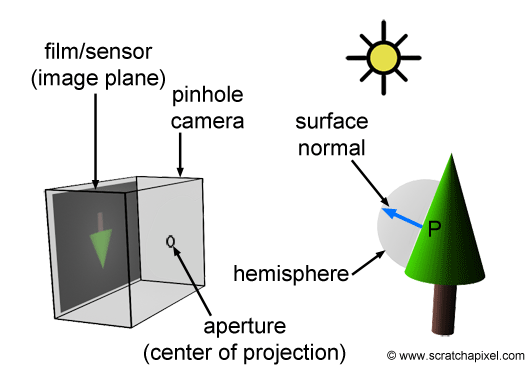

## Camera Model

### 개요

    
    <h5></h5>

* 3D 공간을 2D 이미지 평면으로 투영(매핑) 하는 작업을 시뮬레이팅 해보자.
* 이미지 프로세싱 영역에서, 가장 대표적인 "기하학적 이미지 보간"은 Pinhole Camera Model 에 기반한다.

### 카메라 모델

    
    <h5></h5>

#### 1). 벡터를 통한 3차원 공간에서 직선의 방정식

1. 임의의 점 $P(x, y, z)$
2. 직선 위에 분명히 존재하는 구체적인 점 $P_0(x_0, y_0, z_0)$
3. 방향 벡터 $\vec{v}(a, b, c)$
4. $\vec{P_0P} = t\cdot \vec{v}$

* $t$에 대해 정리하면
$$
\frac{x}{a} = \frac{y}{b} = \frac{z}{c}
$$

#### 2). 법선 벡터를 통한 공간에서 평면의 방정식

1. 평면위 임의의 점 $P(x, y, z)$
2. 평면위에 분명히 존재하는 구체적인 점 $ P_0(x_0, y_0, z_0)$
3. 법선 벡터 $\vec{n}(a,b,c)$
4. 원점으로 부터 거리 $d$

* 평면의 방정식

$$
ax + by + cz + d = 0
$$

#### 3). perspective projection

##### 전제

1. Camera Coordinate 에서 계산 할 것, 따라서 카메라 공간의 기준점인 카메라가 중심 $origin\ (0,0,0)$ 으로 위치하는 점 사용
2. 투영될 이미지의 법선 벡터는 $\vec{n}(0,0,1)$ 투영한 이미지의 거리는 focal length : $f$
3. Ray 벡터 $(X, Y, Z)$ 이고 Ray에 의해 교점하는 투영된 좌표 $(x, y)$

##### 투영 변환 일반화

1. 투영한 이미지의 평변 방정식의 구하기

$$
0\cdot x + 0\cdot y + 1\cdot z = f \\
\therefore 투영될\ 평면\ 방정식은 \ z = f
$$

2. Ray의 직선의 방정식
$$
\frac{x - 0}{X} = \frac{y - 0}{Y} = \frac{z - 0}{Z}
$$

3. 평면의 방정식과 직선의 방정식의 교점
$$
\frac{x}{X} = \frac{f}{Z} \ , \frac{y}{Y} = \frac{f}{Z} \\
x = \frac{f\cdot X}{Z} \,  y = \frac{f\cdot Y}{Z}
$$

4. 따라서.. 투영 변환
$$
\begin{pmatrix}
X \\
Y \\
Z \\
\end{pmatrix}
\rArr
\begin{pmatrix}
x \\
y \\
\end{pmatrix} =
\begin{pmatrix}
\frac{f\cdot X}{Z} \\
\frac{f\cdot Y}{Z} \\
\end{pmatrix}
$$

5. 카메라 공간 -> 픽셀 공간으로 투영행렬 유추해 보기
   * 일단 $\frac{f}{Z}$는 항등하게 곱해진 것을 확인 할 수 있고, Z는 아무렴 좋다 1로 생각해도 무해하다.
   * 동차 좌표계로 생각해 보자.

$$
P
\begin{pmatrix}
f, 0 ,0, 0\\
0, f ,0, 0\\
0, 0 ,1, 0\\
\end{pmatrix} \cdot
\begin{pmatrix}
X \\
Y \\
Z \\
1 \\
\end{pmatrix} =
\begin{pmatrix}
f\cdot X \\
f\cdot Y \\
1 \\
\end{pmatrix}
$$
