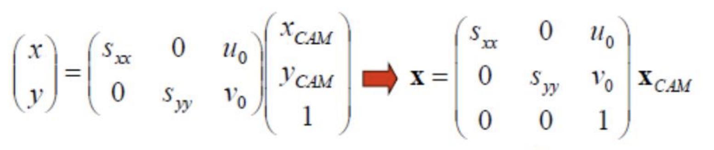
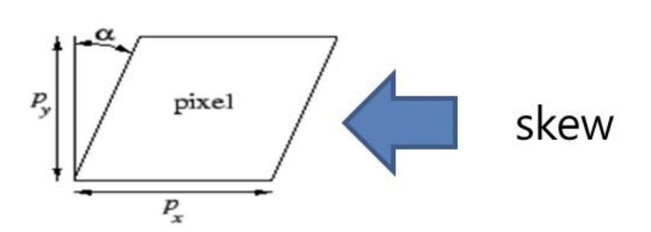
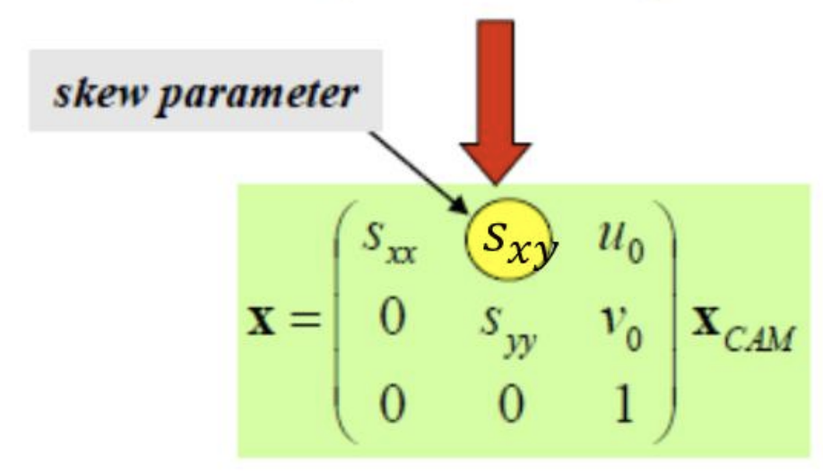

---

## 20 Camera Model

---

### 개요

    
    <h5></h5>

* 3D 공간을 2D 이미지 평면으로 투영(매핑) 하는 작업을 시뮬레이팅 해보자.
* 이미지 프로세싱 영역에서, 가장 대표적인 "기하학적 이미지 보간"은 Pinhole Camera Model 에 기반한다.

> ### 카메라 모델

    
    <h5></h5>

#### 1). 벡터를 통한 3차원 공간에서 직선의 방정식

1. 임의의 점 $P(x, y, z)$
2. 직선 위에 분명히 존재하는 구체적인 점 $P_0(x_0, y_0, z_0)$
3. 방향 벡터 $\vec{v}(a, b, c)$
4. $\vec{P_0P} = t \cdot \vec{v}$

* $t$에 대해 정리하면
$$
\frac{x}{a} = \frac{y}{b} = \frac{z}{c}
$$

#### 2). 법선 벡터를 통한 공간에서 평면의 방정식

1. 평면위 임의의 점 $P(x, y, z)$
2. 평면위에 분명히 존재하는 구체적인 점 $ P_0(x_0, y_0, z_0)$
3. 법선 벡터 $\vec{n}(a,b,c)$
4. 원점으로 부터 거리 $d$

* 평면의 방정식

$$
ax + by + cz + d = 0
$$

#### 3. Perspective Projection

##### 전제

1. Camera Coordinate 에서 계산 할 것,
따라서 카메라 공간의 기준점인 카메라가 중심 $origin\ (0,0,0)$ 으로 위치하는 점 사용
2. 투영될 이미지의 법선 벡터는 $\vec{n}(0,0,1)$ 투영한 이미지의 거리는 focal length : $f$
3. Ray 벡터 $(X, Y, Z)$ 이고 Ray에 의해 교점하는 투영된 좌표 $(x, y)$

##### 투영 변환 일반화

1. 투영한 이미지의 평변 방정식의 구하기

$$
0\cdot x + 0\cdot y + 1\cdot z = f \\
\therefore 투영될\ 평면\ 방정식은 \ z = f
$$

2. Ray의 직선의 방정식
$$
\frac{x - 0}{X} = \frac{y - 0}{Y} = \frac{z - 0}{Z}
$$

3. 평면의 방정식과 직선의 방정식의 교점
$$
\frac{x}{X} = \frac{f}{Z} \ , \frac{y}{Y} = \frac{f}{Z} \\
x = \frac{f\cdot X}{Z} \,  y = \frac{f\cdot Y}{Z}
$$

4. 따라서.. 투영 변환
$$
\begin{pmatrix}
X \\
Y \\
Z \\
\end{pmatrix}
\rArr
\begin{pmatrix}
x \\
y \\
\end{pmatrix} =
\begin{pmatrix}
\frac{f\cdot X}{Z} \\
\frac{f\cdot Y}{Z} \\
\end{pmatrix}
$$

##### 닮음으로 유도하기

$$
Z : X = f : x \ , Z : Y = f : y \\
$$

$$
x = \frac{f \cdot X}{Z} \ , y = \frac{f \cdot Y}{Z}
$$

#### 4. 카메라 투영행렬 유도

* 그래서.. 위와 같은 변환을 **단 하나의** 행렬로 표현하고 싶은데
* 카티시안 데카르트 좌펴계 에서는 불가능 하다
* 하지만 **동자 좌표계를 사용한다면 가능** 하다.
  * $X$와 $x$ 각각을 동차 좌표계로 해석하도록 한다.

* 카메라 공간 -> 픽셀 공간으로 투영행렬 유추해 보기
   * 일단 $\frac{f}{Z}$는 항등하게 곱해진 것을 확인 할 수 있고,
   * Z는 아무렴 좋다(Up to Scale) 1로 만들어도 동일한 것을 가르킨다.
   * 동차 좌표계로 생각해 보자.

$$
\begin{pmatrix}
f &  0  & 0 &  0\\
0 &  f  & 0 &  0\\
0 &  0  & 1 &  0\\
\end{pmatrix}_{P} \cdot
\begin{pmatrix}
X \\
Y \\
Z \\
1 \\
\end{pmatrix} =
\begin{pmatrix}
f\cdot X \\
f\cdot Y \\
Z \\
\end{pmatrix}
$$

* equal up to scale에 의해

$$
\begin{pmatrix}
f\cdot X \\
f\cdot Y \\
Z \\
\end{pmatrix} =
\begin{pmatrix}
\frac{f\cdot X}{Z} \\
\frac{f\cdot Y}{Z} \\
1 \\
\end{pmatrix}
$$

    
    <h5></h5>

* $x$와, $X_{CAM}$
$$
x =
\begin{pmatrix}
x \\
y \\
\end{pmatrix} \
X_{CAM} =
\begin{pmatrix}
x_{CAM} \\
y_{CAM} \\
1 \\
\end{pmatrix}
$$

* $s_{xx}$와 $s_{yy}$ 각각은 "x방향 픽셀 크기(Scale)" "y방향 픽셀 크기(Scale)"

    
    <h5></h5>

$$
x =
\begin{pmatrix}
s_{xx} & 0 & u_0 \\
0 & s_{yy} & v_0 \\
\end{pmatrix} \cdot
\begin{pmatrix}
x_{CAM} \\
y_{CAM} \\
1 \\
\end{pmatrix}
\rArr
\begin{pmatrix}
s_{xx} & 0 & u_0 \\
0 & s_{yy} & v_0 \\
0 & 0 & 1 \\
\end{pmatrix} \cdot
X_{CAM}
$$

* 이처럼 2개의 행렬로 표현했어야 했던것을 하나의 행렬로 표현할 수 있게 되었다.

---

* Camera calibration matrix 분리해석

$$
P = K[I|0]
$$

    
    
    <h5></h5>

* $K$ 행렬의 형태
  * $s_{xy}$ 는 Skew Parameter
      $$
      K =
      \begin{pmatrix}
      s_{xx} & s_{xy} & u_0 \\
      0 & s_{yy} & v_0 \\
      0 & 0 & 1 \\
      \end{pmatrix} \cdot
      \begin{pmatrix}
      f & 0 & 0 \\
      0 & f & 0 \\
      0 & 0 & 1 \\
      \end{pmatrix} =
      \begin{pmatrix}
      fs_{xx} & fs_{xy} & u_0 \\
      0 & fs_{yy} & v_0 \\
      0 & 0 & 1 \\
      \end{pmatrix}
      $$
  * 첨가행렬(Augmented Matrix) $[I|0]$ 행렬의 형태
    $$
    [I|0] =
    \begin{pmatrix}
    1 & 0 & 0 & | & 0\\
    0 & 1 & 0 & | & 0\\
    0 & 0 & 1 & | & 0\\
    \end{pmatrix}
    $$

---

* 만약 CameraCenter가 World Coordinate에서 원점이 아니라면?
* 아까 분리해석할 행렬과 거희 비슷한데. $R$ Rotation, $C$ CameraCenter 를 알면 된다.

    
    <h5></h5>

