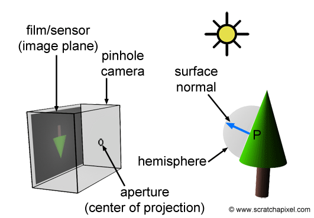
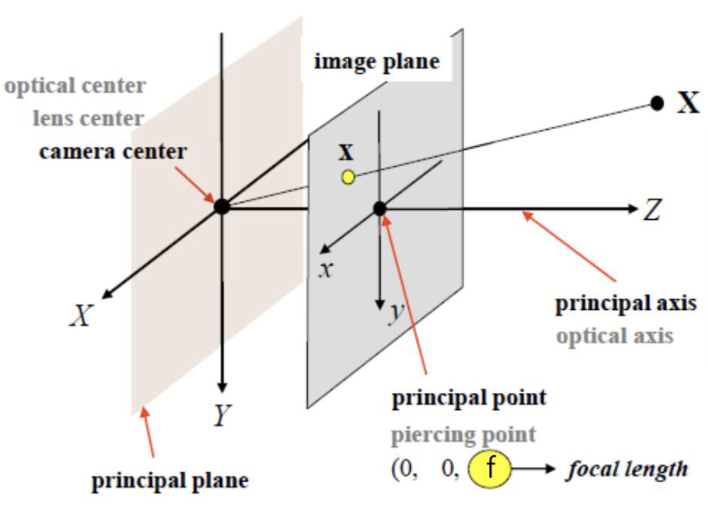
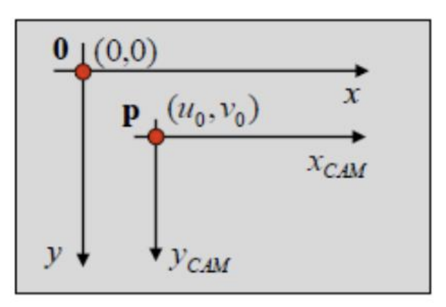
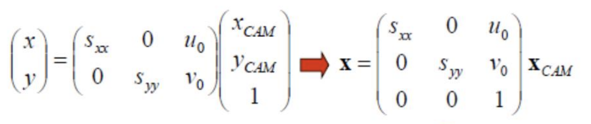
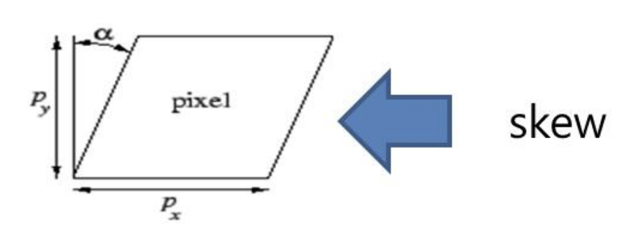
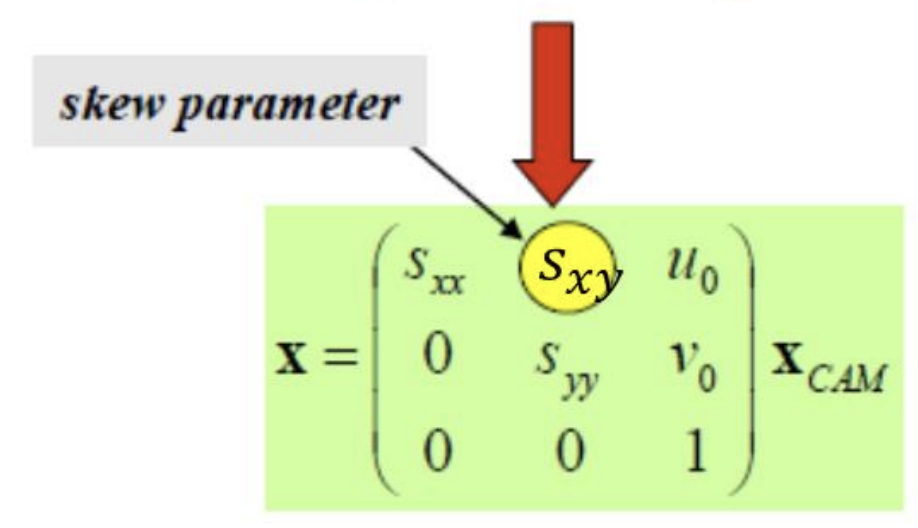
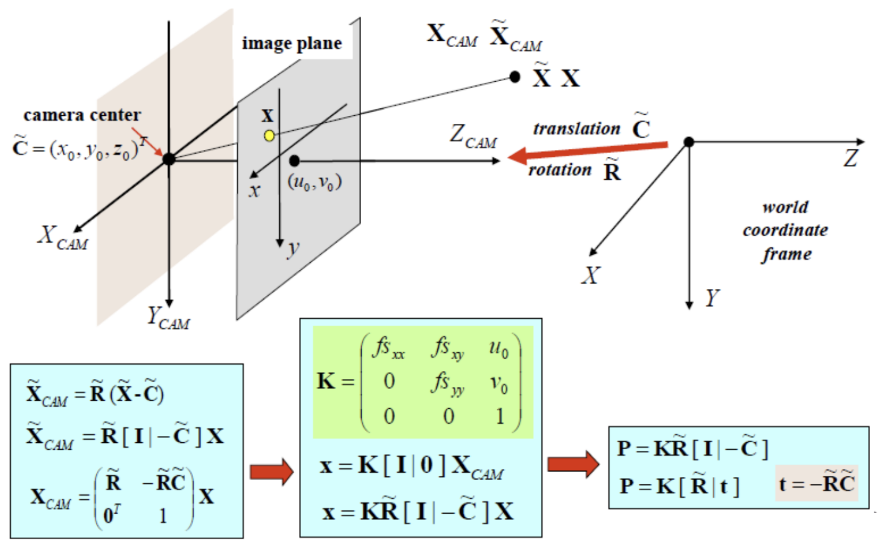
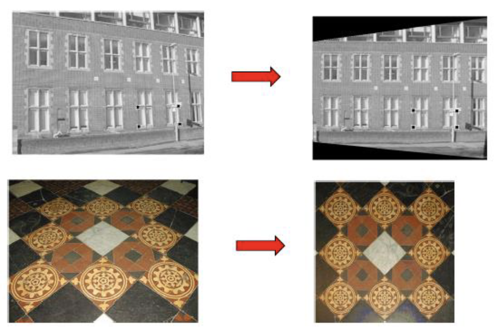
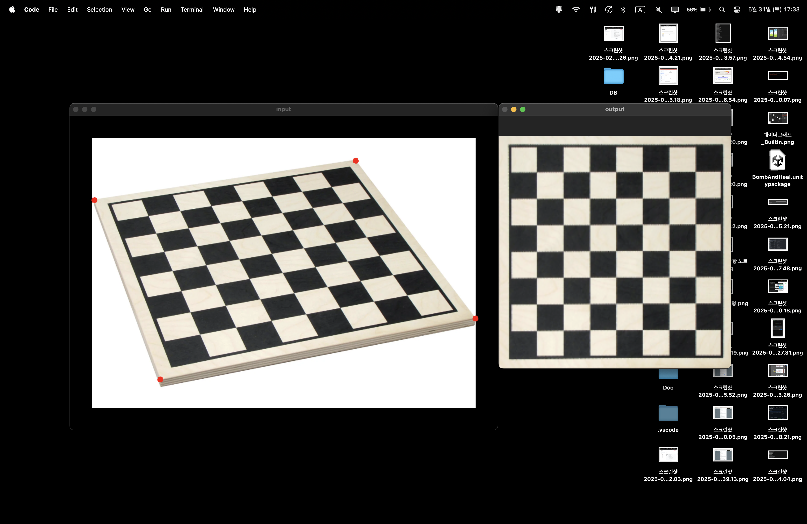

---

## Camera Model And Image Transformation

---

> ### 📄 개요

<div align=center>
    
    <h5>PinHole Camera</h5>
</div>

<div align=center>
    <h4>3D 공간을 2D 이미지 평면으로 투영(매핑) 하는 작업을 시뮬레이팅 해보자.</h4>
</div>

* 이미지 프로세싱 영역에서, 가장 대표적인
"기하학적 이미지 보간"은 Pinhole Camera Model 에 기반한다.


---

> ### 📄 1. 사전 지식


#### [1). 벡터를 통한 3차원 공간에서 직선의 방정식](./extra/6_EquationsOfLinesAndPlanes.md)

1. 임의의 점 $P(x, y, z)$
2. 직선 위에 분명히 존재하는 구체적인 점 $P_0(x_0, y_0, z_0)$
3. 방향 벡터 $\vec{v}(a, b, c)$

##### ① Vector Equation

$$
\vec{P_0P} = t \cdot \vec{v}
$$

##### ② symmetric equation ($t$ 에 대해 정리하면)

$$
\frac{x}{a} = \frac{y}{b} = \frac{z}{c}
$$

---

#### [2). 법선 벡터를 통한 공간에서 평면의 방정식](./extra/6_EquationsOfLinesAndPlanes.md)

1. 평면위 임의의 점 $P(x, y, z)$
2. 평면위에 분명히 존재하는 구체적인 점 $ P_0(x_0, y_0, z_0)$
3. 법선 벡터 $\vec{n}(a,b,c)$
4. 원점으로 부터 거리 $d$

##### ① Vector Equation

법선벡터와 평면위의 직선은 내적이 0이다.

$$
\vec{n} \cdot \vec{P_0P} = 0
$$

##### ② linear equation

$$
ax + by + cz + d = 0
$$


---

> ### 📄 2. 카메라 모델

<div align=center>
    
    <h5></h5>
</div>


---

#### 3). Perspective Projection

##### 전제

1. Camera Coordinate 에서 계산 할 것,
따라서 카메라 공간의 기준점인 카메라가 중심 $origin\ (0,0,0)$ 으로 위치하는 점 사용
2. 투영될 이미지의 법선 벡터는 $\vec{n}(0,0,1)$ 투영한 이미지의 거리는 focal length : $f$
3. Ray 벡터 $(X, Y, Z)$ 이고 Ray에 의해 교점하는 투영된 좌표 $(x, y)$

##### ① 투영 변환 일반화

1. 투영한 이미지의 평변 방정식의 구하기

$$
0\cdot x + 0\cdot y + 1\cdot z = f \\
\therefore 투영될\ 평면\ 방정식은 \ z = f
$$

2. Ray의 직선의 방정식
$$
\frac{x - 0}{X} = \frac{y - 0}{Y} = \frac{z - 0}{Z}
$$

3. 평면의 방정식과 직선의 방정식의 교점
$$
\frac{x}{X} = \frac{f}{Z} \ , \frac{y}{Y} = \frac{f}{Z} \\
x = \frac{f\cdot X}{Z} \,  y = \frac{f\cdot Y}{Z}
$$


4. 따라서.. 투영 변환
$$
\begin{pmatrix}
X \\
Y \\
Z \\
\end{pmatrix}
\rArr
\begin{pmatrix}
x \\
y \\
\end{pmatrix} =
\begin{pmatrix}
\frac{f\cdot X}{Z} \\
\frac{f\cdot Y}{Z} \\
\end{pmatrix}
$$

##### ② 닮음으로 유도하기

$$
Z : X = f : x \ , Z : Y = f : y \\
$$

$$
x = \frac{f \cdot X}{Z} \ , y = \frac{f \cdot Y}{Z}
$$

---

#### 4). 카메라 투영행렬 유도


* 그래서.. 위와 같은 변환을 **단 하나의** 행렬로 표현하고 싶은데
* 카티시안 데카르트 좌표계 에서는 불가능 하다
* 하지만 **동자 좌표계를 사용한다면 가능** 하다.
  * $X$와 $x$ 각각을 동차 좌표계로 해석하도록 한다.

* 카메라 공간 -> 픽셀 공간으로 투영행렬 유추해 보기
   * 동차 좌표계로 생각해 보자.

$$
\begin{pmatrix}
f &  0  & 0 &  0\\
0 &  f  & 0 &  0\\
0 &  0  & 1 &  0\\
\end{pmatrix}_{P} \cdot
\begin{pmatrix}
X \\
Y \\
Z \\
1 \\
\end{pmatrix} =
\begin{pmatrix}
f\cdot X \\
f\cdot Y \\
Z \\
\end{pmatrix}
$$

* equal up to scale에 의해

$$
\begin{pmatrix}
f\cdot X \\
f\cdot Y \\
Z \\
\end{pmatrix} =
\begin{pmatrix}
\frac{f\cdot X}{Z} \\
\frac{f\cdot Y}{Z} \\
1 \\
\end{pmatrix}
$$

<div align=center>
    
    <h5></h5>
</div>

* $X_{CAM} = \begin{pmatrix} x_{CAM} \\ y_{CAM} \\ 1 \end{pmatrix}$ 카메라 좌표계에서의 임의의 점을 표시한 것.
* $s_{xx}$와 $s_{yy}$ 각각은 "x방향 픽셀 크기(Scale)" "y방향 픽셀 크기(Scale)"
  * 정확히는.. 1x1 픽셀이였던 것이 $1\times s_{xx}$ 로 변환되었을때
  * 마찬가지로, 1x1 픽셀이였던 것이 $s_{yy}\times 1$ 로 변환되었을때
* $u_0, v_0$은 각각 카메라 중심 Ray로부터 발사되어 이미지에 투영되었을때 좌표인데
그 좌표의 관점은 World Coordinate가 아니라 "이미지 2D 평면에서의 광학 중심의 투영점"을 의미한다. 즉 공간 자체를 이미지 공간 좌표로 봤을때, 찍히는 점.

<div align=center>
    
    <h5></h5>
</div>

$$
x =
\begin{pmatrix}
s_{xx} & 0 & u_0 \\
0 & s_{yy} & v_0 \\
\end{pmatrix} \cdot
\begin{pmatrix}
x_{CAM} \\
y_{CAM} \\
1 \\
\end{pmatrix}
\rArr
\begin{pmatrix}
s_{xx} & 0 & u_0 \\
0 & s_{yy} & v_0 \\
0 & 0 & 1 \\
\end{pmatrix} \cdot
X_{CAM}
$$

* 이처럼 2개의 행렬로 표현했어야 했던것을 하나의 행렬로 표현할 수 있게 되었다.

---

#### 5). Camera calibration matrix 분리해석

$$
P = K[I|0]
$$

<div align=center>
    
    
    <h5></h5>
</div>

* $K$ 행렬의 형태
  * $s_{xy}$ 는 Skew Parameter
      $$
      K =
      \begin{pmatrix}
      s_{xx} & s_{xy} & u_0 \\
      0 & s_{yy} & v_0 \\
      0 & 0 & 1 \\
      \end{pmatrix} \cdot
      \begin{pmatrix}
      f & 0 & 0 \\
      0 & f & 0 \\
      0 & 0 & 1 \\
      \end{pmatrix} =
      \begin{pmatrix}
      fs_{xx} & fs_{xy} & u_0 \\
      0 & fs_{yy} & v_0 \\
      0 & 0 & 1 \\
      \end{pmatrix}
      $$
  * 첨가행렬(Augmented Matrix) $[I|0]$ 행렬의 형태
    $$
    [I|0] =
    \begin{pmatrix}
    1 & 0 & 0 & | & 0\\
    0 & 1 & 0 & | & 0\\
    0 & 0 & 1 & | & 0\\
    \end{pmatrix}
    $$


---

#### 6). 만약 CameraCenter가 World Coordinate에서 원점이 아니라면?
* 아까 분리해석할 행렬과 거희 비슷한데. $\tilde{R}$ Rotation, $\tilde{C}$ CameraCenter 를 알면 된다.

<div align=center>
    
    <h5></h5>
</div>

* 변환 행렬

$$
P = K\tilde{R}[I|\tilde{C}] \\
\tilde{R} = \begin{pmatrix} \cos{\theta} & -\sin{\theta} & 0 \\ \sin{\theta} & \cos{\theta} & 0 \\ 0 & 0 & 1 \end{pmatrix},
\tilde{C} = \begin{pmatrix} x_0 \\ y_0 \\ z_0\end{pmatrix}
$$

---

> ### 3. 변환


#### 1). Similarity Transformation

* 이미지의 형태는 유지되며, R(회전), S(확대) 변환만 허용

---

#### 2). Affine Transformation

* 이미지의 평행선은 유지되는 한 변환이 허용됨 Shear (납작, 홀쭉), T(평행 이동)

---

#### 3). Projection Transformation

* 평행한 직선이 소실점에서 만난다는 가정하에 적용되는 변환

---

> ### 4. Homogeneous Coordinates와 변환 행렬

1. [Coordinate System](./extra/3_Coordinate_System.md)
2. [Homogeneous Coordinate](./extra/4_HomogeneousCoordinate.md)
3. [Transformation](./extra/5_Transformation.md)

---

> ### 5. Projection Transformation

<div align=center>
    
    <h5></h5>
</div>

* 투영 변환을 적용하기 위해서는
두개의 이미지 사이에 관계를 표현할 수 있는 변환 행렬이 계산되야 한다.
  * Homogeneous 좌표계에서 2차원 이미지의 투영 변환을 위해서는 3 X 3 행렬이 필요하다.
  * 각 이미지 마다 4개의 좌표가 필요하고, 각각 좌표는 한 쌍이 되어져야 한다.


<div align=center>
    
    <h5>마우스 클릭을 통한 예제.</h5>
</div>

#### 1). `copyMakeBorder`

* 이 코드를 사용하면 이미지 원본을 유지하며, Border을 추가할 수 있다.
    ```cpp
    Mat input = imread("./resources/board7.png");
    Mat input_with_margin;
    int top = 50, bottom = 50, left = 50, right = 50;
    copyMakeBorder(input, input_with_margin, top, bottom, left, right, BORDER_CONSTANT);
    imshow(chapter20::INPUT_WINDOW, input_with_margin);
    ```
