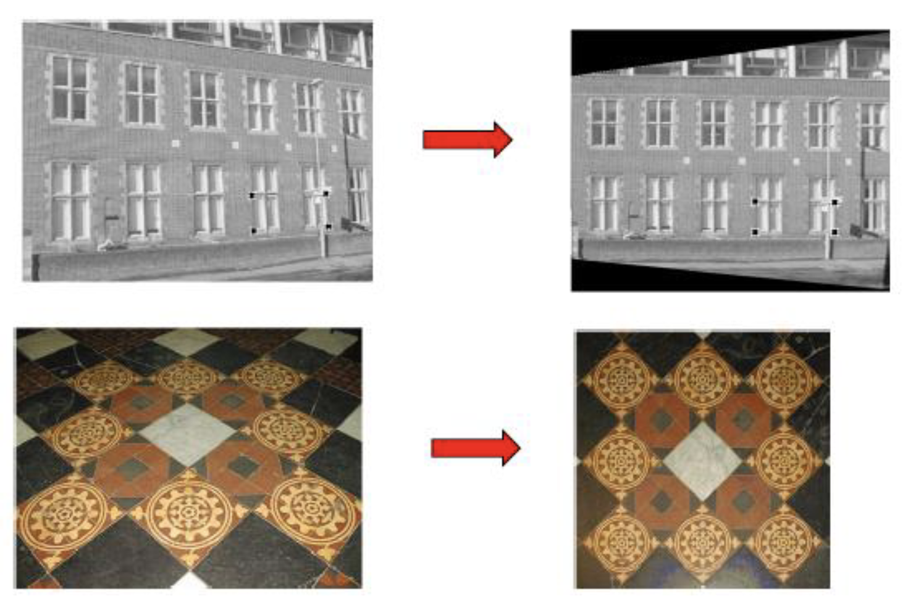

## Image Transformation

> ### 1. 변환

#### 1). Similarity Transformation

* 이미지의 형태는 유지되며, R(회전), S(확대) 변환만 허용

#### 2). Affine Transformation

* 이미지의 평행선은 유지되는 한 변환이 허용됨 Shear (납작, 홀쭉), T(평행 이동)

#### 3). Projection Transformation

* 평행한 직선이 소실점에서 만난다는 가정하에 적용되는 변환

> ### 2. Homogeneous Coordinates와 변환 행렬

1. [Coordinate System](./extra/3_Coordinate_System.md)
2. [Homogeneous Coordinate](./extra/4_HomogeneousCoordinate.md)

> ### 3. Projection Transformation

    
    <h5></h5>

* 투영 변환을 적용하기 위해서는
두개의 이미지 사이에 관계를 표현할 수 있는 변환 행렬이 계산되야 한다.
  * Homogeneous 좌표계에서 2차원 이미지의 투영 변환을 위해서는 3 X 3 행렬이 필요하다.
  * 각 이미지 마다 4개의 좌표가 필요하고, 각각 좌표는 한 쌍이 되어져야 한다.
