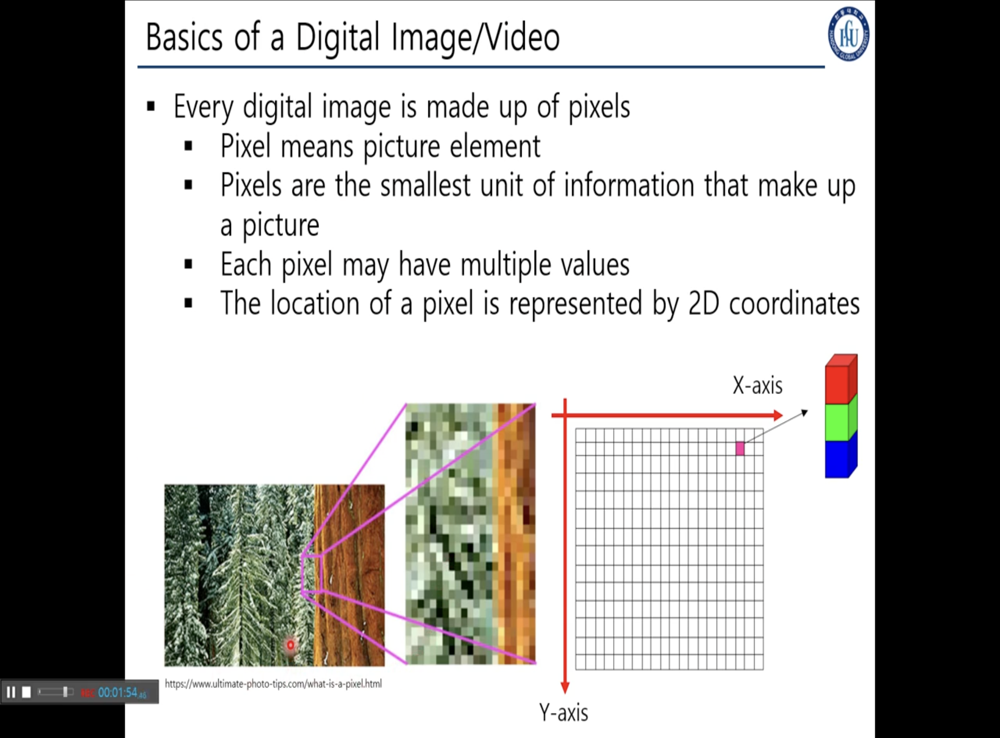
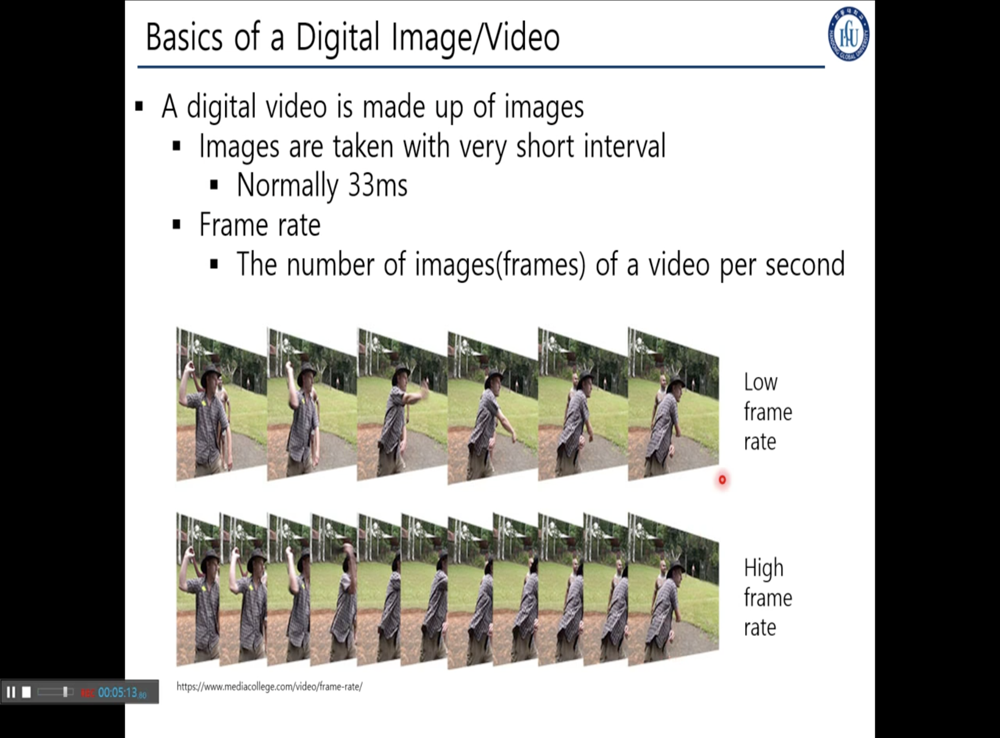
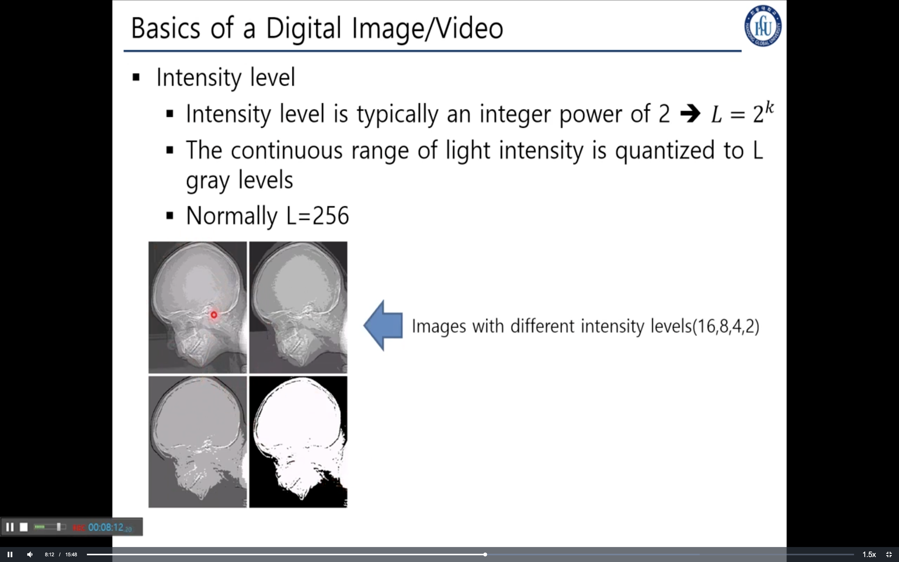
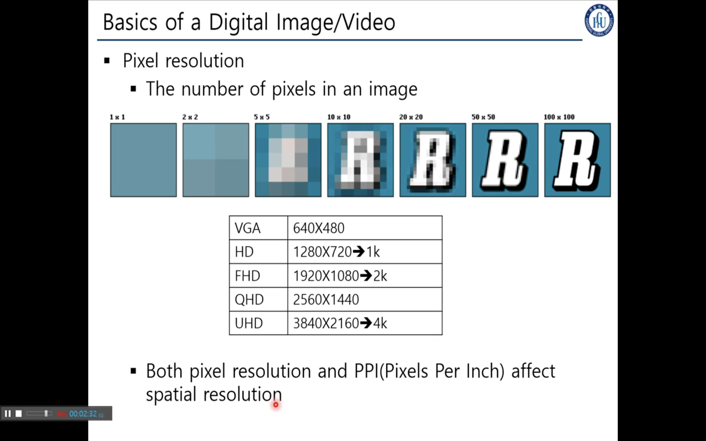
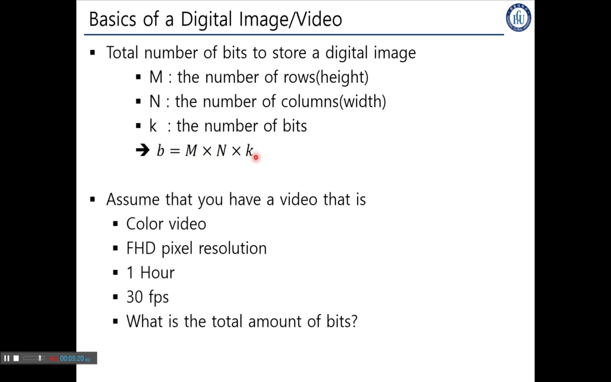

## 2 Basics of a Digital Image And Video

---

> ### 📄 디지털 이미지와 영상 기초

---

#### Pixel : 모든 디지털 이미지는 픽셀들로 이뤄져 있다.

    
    <h5></h5>

* 픽셀이란?
  * 이미지와 비디오를 구성하는 가장 작은 단위의 정보를 저장하는 요소임.
  * 2차원 좌표애 Color 구조체 RGB를 담는다.
  * 픽셀의 좌표는 "좌상" -> "우하" 순서로 x, y가 커진다.
  * 행렬의 컴퓨터상 좌표 표현은 `MAT(row_y, col_x)`

---

#### Frame Rate : Frame per Second간 촬영된 이미지 수

    
    <h5></h5>

---

#### Intensity Level : 밝기와 디테일

    
    <h5></h5>

* Intensity Level이란?
    * 하나의 픽셀이 가질 수 있는 값의 Range 값의 개수, 값이 변할 수 있는 범위
    * 이 수치가 더 높다면 디테일을 더 정교하게 촬영이 가능하다
    * $(L = 2^{k}, 0 \le k \le 8)$

---

#### Pixel Resolution : 일명 해상도라 불리는 것이고, 한 이미지를 구성하는 픽셀 수를 의미함

    
    <h5></h5>

---

#### Total number of bits to store digital image : 하나의 영상을 구성하는데 필요한 비트수

    
    <h5></h5>

---

#### 정리

##### ① Pixel : 2차원 좌표애 Color 구조체 RGB를 담음으로 가장 단위의 시각정보를 저장하는 요소
##### ② Frame Rate : Frame per Second간 촬영된 이미지 수
##### ③ Intensity Level : 하나의 픽셀이 가질 수 있는 값의 Range 값의 개수 $2^{0}$~$2^{8}$
##### ④ Resolution : 한 이미지를 구성하는 픽셀 수를 의미함

---

#### 숙제

* 컬러 비디오이기 때문에 rgba 값을 가질것이고 : 8x8x8x8 인텐시티도 있겠고 그건 8bit가 필요하다 초당 30 * 3600 * 1920 * 1080 * 8x8x8x8
* 1frame에 소요되는 데이터 8,493,465,600 /  30fps 1시간 영상 30 * 3600 : 108,000
