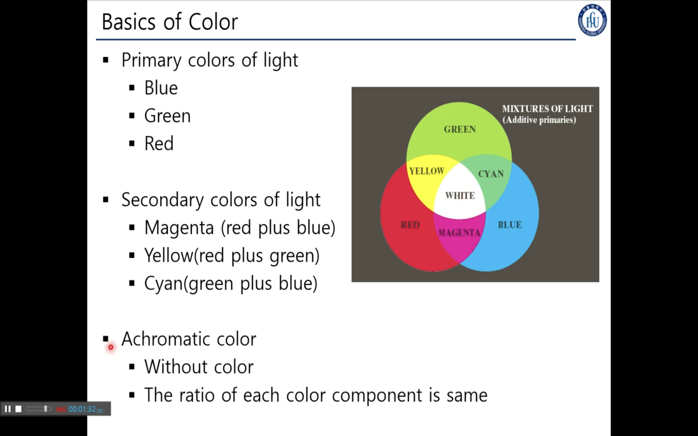
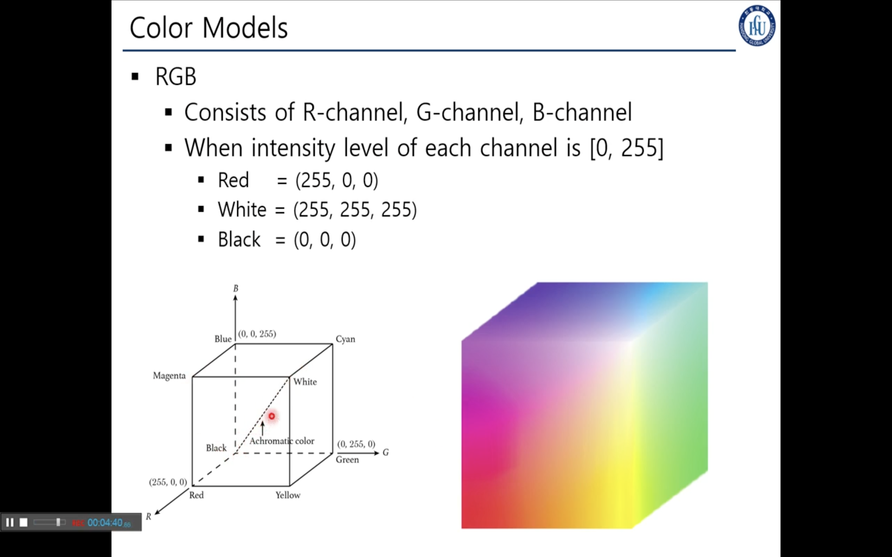
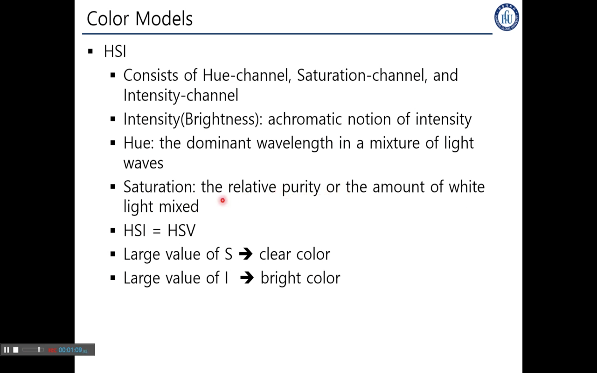
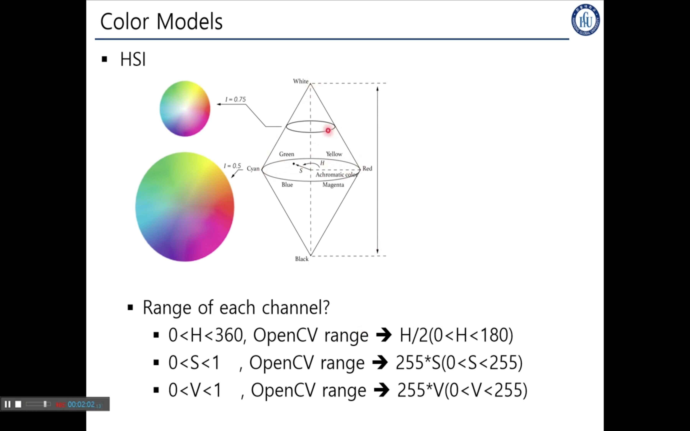
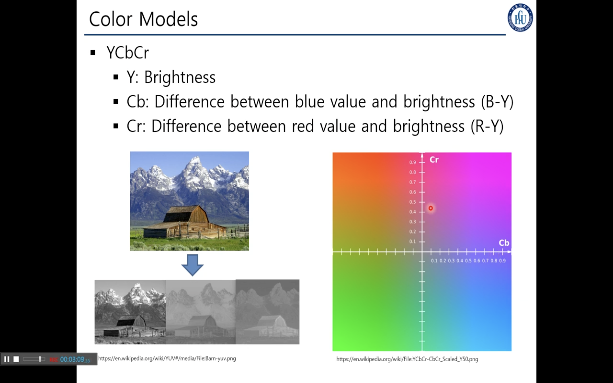
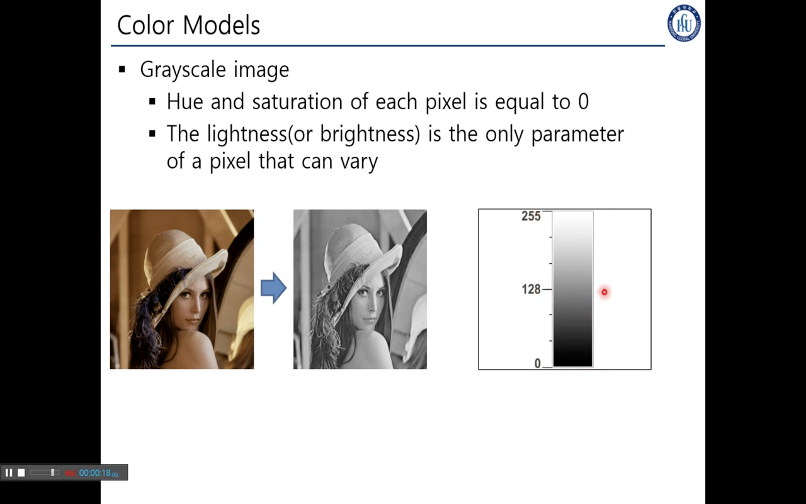

## 3. Basics of Color

> ### 📄 빛의 3원색

    
    <h5></h5>

##### ① Primary Colors of Light
* Red
* Green
* Blue

##### ② Secondary Colors of Light
* Magenta
* Yellow
* Cyan

##### ③ Achromatic Color
* 무채색 : 색상정보가 없는 컬러??
* rgb의 비율이 같다면 무채색

> ### 📄 컬러 모델

#### 1). RGB

    
    <h5></h5>

#### 2). HSI

    
    <h5></h5>

    
    <h5></h5>

##### ① Hue (색조): waveLength 
  * $0 \lt Hue \lt 360$, OpenCV range -> $0 \lt \frac{Hue}{2} \lt 180$
  * 길면 빨강, 짧으면 보라
##### ② Saturation (체도): 
  * 세츄레이션 색상의 순도, 하얀값이 얼마나 포함되나. 새츄레이션이 크다 = 순수함
  * $0 \lt S \lt 1$, 원뿔을 I높이만큼 잘랐을떄, 원의 중심으로부터 거리가 멀수록 채도가 높고, 가운데가 무채색임.
##### ③ Intensity (밝기): 가 크다 밝기가 높다
  * 높이가 인텐시티
  * $0 \lt V \lt 1$, 

#### 3). YCbCr

    
    <h5>다음 경치 이미지는 Y, Cb, Cr별로 Chennel을 나눈 모습이다.</h5>

#### 4). Grayscale Image

    
    <h5>각각의 픽셀은 밝기만 표현하는 이미지.</h5>

