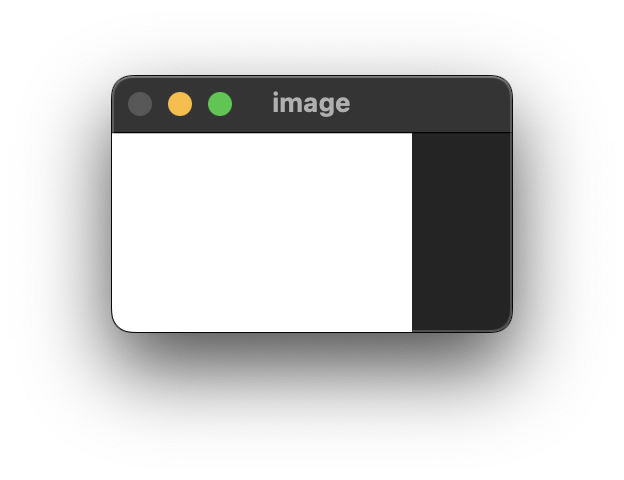
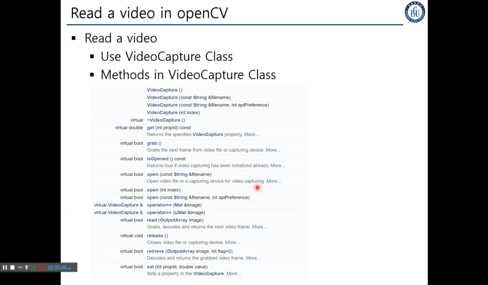
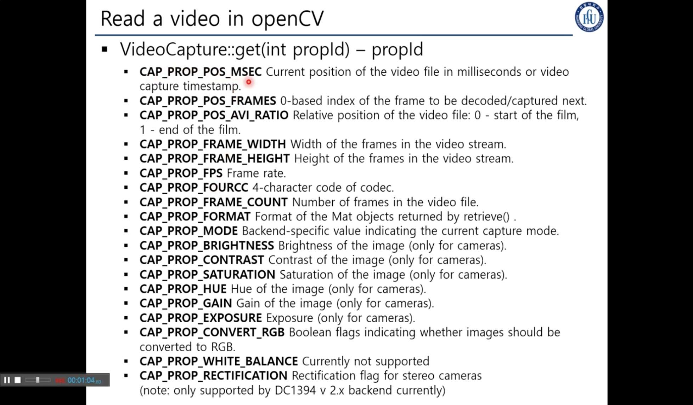
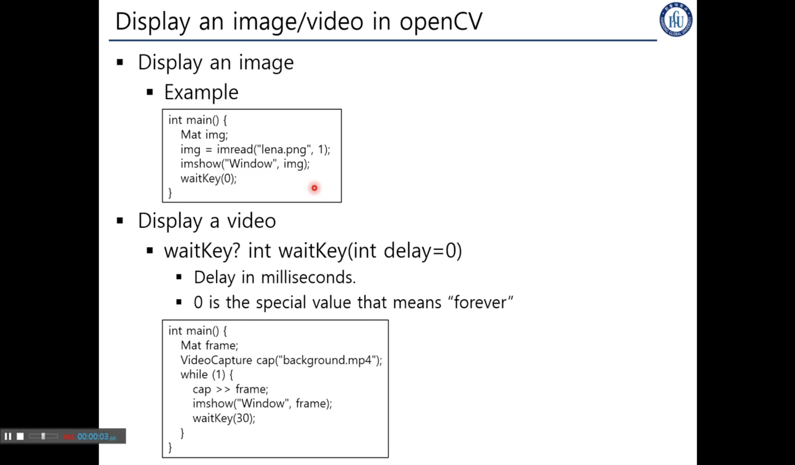

## 4. BasicsOfOpenCV
> ### 📄 1. Mat

#### 1). OpenCV에서 이미지를 표현하기 위한 기본 데이터 타입
* Mat은 행렬의 약어로, 영상은 픽셀의 2차원 배열로 생각할 수 있다.
    ```cpp
    // 행의 개수, 가로의 길이, 각각의 픽셀의 타입설정
    Mat(int rows, int cols, int pixelType);

    // 사이즈와 픽셀의 타입설정 OpenCV에 선언된 Size 타입
    Mat(Size size, int pixelType);

    // 이미 선언된 매트릭스의 데이터를 받아오는 방법
    Mat(const Mat& m);

    // 사이즈와 픽셀의 타입, 각각픽셀의 특정한 값을 설정
    sMat(Size size, int pixelType, const Scalar& s);
    ```


#### 2). 픽셀의 타입

* Single-channel : 채널이 1개일떄 Intensity만 존재
  전처리, Edge 검출에 따라 다른거 사용 가능.
    * `CV_8U`: 8-bit unsigned integer: uchar ( 0~255 )
    * `CV_8S`: 8-bit signed integer: schar (-128~127 )
    * `CV_16U`: 16-bit unsigned integer: ushort (0~65535)
    * `CV_16S`: 16-bit signed integer: short (-32768~32767)
    * `CV_32S`: 32-bit signed integer: int (-2147483648~2147483647)
    * `CV_32F`: 32-bit floating-point number: float (-FLT_MAX~FLT_MAX, INF, NAN)
    * `CV_64F`: 64-bit floating-point number: double (-DBL_MAX~ DBL_MAX, INF, NAN)
* Multi-channel array: 채널이 3개 이상인 픽셀 타입 즉 RGBA
    `CV_8UC3`, `CV_8U(3)`, `CV_64FC4`, `CV_64FC(4)`

#### 3). 매트릭스 설정 예제
```cpp
// Make a 3x3 floating-point matrix
Mat mtx(3,3, CV_32F);
// Make a 10x1 2-channel floating-point matrix
Mat cmtx(10,1, CV_64FC2);
// Make a width x height 3-channel unsigned int matrix !조심할 것은 가로 세로 반대!
Mat img(height,width, CV_8UC3);
// Make a 1920x1080 3-channel unsigned int matrix
Mat img(Size(1920, 1080), CV_8UC3);
```

> ### 📄 2. Mat을 사용한 예제들

#### 1). Baisic Data Structure In OpenCV

<div align=center>
    
    <h5></h5>
</div>

```cpp
int BaisicDataStructureInOpenCV() {
    int w = 150, h = 100;
    // 만약 pixelType 이 3 channel이라면 Scaler(double, double, double) 형태이다.
    // 🚸 Scalar(255,0,0); 는 RGB 순서일 것 같지만.. 사실 BGR 순서로 거꾸로다! 🚸
    Mat image(h, w, CV_8UC1, Scalar(255));

    cout << "Szie: " << image.size().height << "," << image.size().width << endl;
    // imgshow : 해당 매트릭스에 해당하는 이미지를 보여준다.
    imshow("image", image);

    waitKey(0);
    return 0;
}
```

#### 2). Read An Image In OpenCV

<div align=center>
    
    <h5></h5>
</div>

```cpp
int ReadAnImageInOpenCV() {
    Mat gray_image, color_image;

    // 두번쨰 파라미터의 0이 들어가 있다.
    // 이것이 뜻하는 바는 이미지를 GrayScale 로 읽겠다는 것 이다.
    gray_image = imread("./data/lena.png", 0);

    // 두번쨰 파라미터에 1이 들어가 있거나
    // 아무 값도 작성하지 않는 다면 Color로 읽겠다는 것 이다.
    color_image = imread("./data/lena.png", 0);

    imshow("gray image", gray_image);
    imshow("color image", color_image);

    waitKey(0);
    return 0;
}
```

> ### 📄 Video Capture

<div align=center>
    
    <h5>VideoCaputre Class</h5>
</div>

1. ##### `bool grap()`
    * 현재 존재하는 프레임의 그 다음 프레임을 가져오기 위한 함수
    * *grappass와 연관이 있어 보인다.*
2. ##### `bool open(const string &fileName)`
    * 파일을 읽어오기 위함 삽입 연산자도 오버라이드 되어 있다.
3. ##### `operator >> (Mat &image)`
4. ##### `release()`
   * 비디오를 해제한다.


<div align=center>
    
    <h5>VideoCaputre Class</h5>
</div>

* ##### `get(int propid)`
  * 지금 비디오 캡쳐 클래스가 가진 상세한 정보를 알 수 있다. propid는 매크로로 작성됨

* `int waitKey(int delay = 0)`
    * milliseconds 만큼 딜레이가 생긴다.
    * 그리고 0 값을 넣는다는 것은 영원히 어떤 이벤트가 오기 전까지는 멈춘다는 뜻
    * 현재 fps를 통해 딜레이를 계산하고, WaitKey()에 fps에 해당하는 대기 시간을 넣어 주는 기법도 가능
    * 이 함수가 없다면 우리가 눈치채기도 전에 쭉~ 아주 빠르게 프레임을 재생하고 꺼질 것 이다.
    그래서 33ms를 기다리도록 할 수 있다.

#### 1). Read a Video from a File

```cpp
int ReadAVideoFromAFile() {
    Mat frame;
    // 비디오를 읽으려먼 `VideoCapture`를 반드시 써야한다.
    VideoCapture cap;

    // check if file exists. if none program ends
    if(cap.open("background.mp4") == 0) {
        cout << "no such file!" << endl;
        waitKey(0);
    }

    while(1) {
        cap >> frame;
        if(frame.empty()) {
            cout << "end of video" << endl;
            break;
        }
        imshow("video", frame);

        // `waitKey(33) //ms` 이 함수가 없다면
        // 우리가 눈치채기도 전에 쭉~ 아주 빠르게 프레임을 재생하고 꺼질 것 이다.
        // 그래서 33ms를 기다리도록 할 수 있다.
        waitKey(33);
    }
}
```

#### 2). Read a Video from a webcam

```cpp
int ReadAVideoFromAWebcam() {
    Mat frame;
    // 웹캠에서 캡쳐를 가져오는 함수,
    // `VideoCapture(0)`을 사용하면 웹캠을 가져올 수 있다. 단,
    // 꼭 각 컴퓨터마다 인덱스가 0이 아닐 순 있는데 대부분 0이다.
    // 만약 웹캠이 안되면 두가지중 하나다
    // 1. 막아놨거나
    // 2. 인덱스가 0이 아니거나.
    VideoCapture cap(0);

    while(1) {
        cap >> frame;

        imshow("web cam", frame);
        // `waitKey(16) //ms`를 기다리도록 한다.
        waitKey(16);
    }
}
```

#### 3). Play With VideoCapture
```cpp
int PlayWithVideoCapture() {
    Mat frame;
    VideoCapture cap;

    if(cap.open("background.mp4") == false) return -1;
    double fps = cap.get(CAP_PROP_FPS);
    double time_in_msec = 0;
    int curr_frame = 0;
    int total_frames = cap.get(CAP_PROP_FRAME_COUNT);

    while(time_in_msec < 3000) {
        cap >> frame;
        if(frame.empty()) break;
        time_in_msec = cap.get(CAP_PROP_POS_MSEC);
        curr_frame = cap.get(CAP_PROP_POS_FRAMES);
        // 현재 프레임을 하나하나 씩 출력하며 전체 프레임 을 리턴한다
        cout << "frames: " << curr_frame << "/" << total_frames << endl;
        imshow("video", frame);

        // 현재 fps를 통해 딜레이를 계산하고, WaitKey()에 fps에 해당하는 대기 시간을 넣어 준다.
        waitKey(1000 / fps);
    }

    waitKey(0);
    return 0;
}
```

1. ##### `CAP_PROP_POS_MSEC`
   * 비디오 캡쳐의 timestamp를 가져오거나, 현재 상태의 milliseconds로서의 위치를 알 수 있다.
2. ##### `CAP_PROP_POS_FRAMES`
   * 제로 베이스 0으로 시작하는 인덱스를 리턴하고, 다음에 디코드, 렌더링 될 프레임을 리턴한다.
3. ##### `CAP_PROP_FPS`
   * Frame Rate
4. ##### `CAP_PROP_FRAME_COUNT`
   * 비디오 파일의 총 프레임 수



