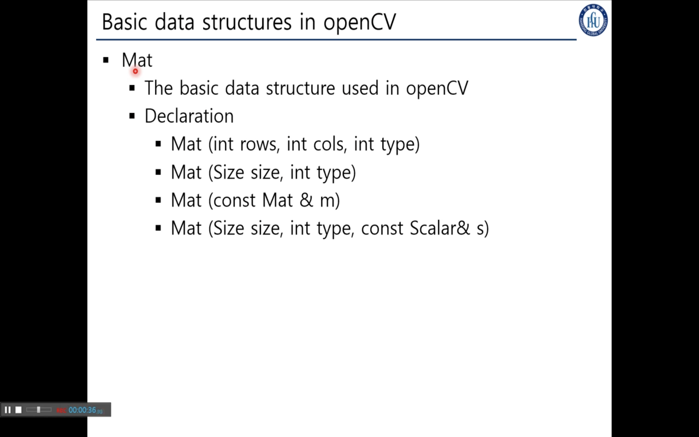
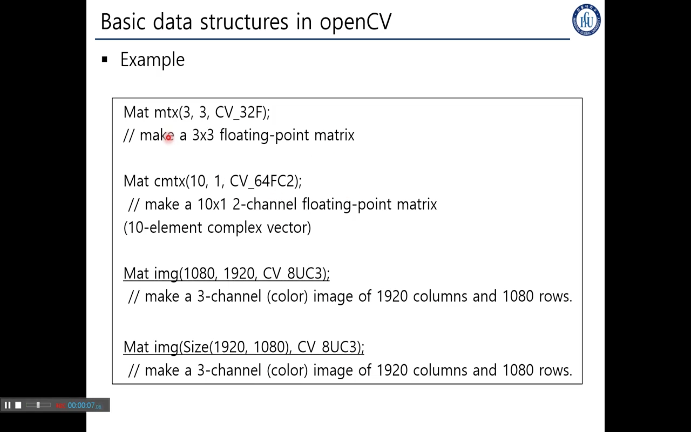
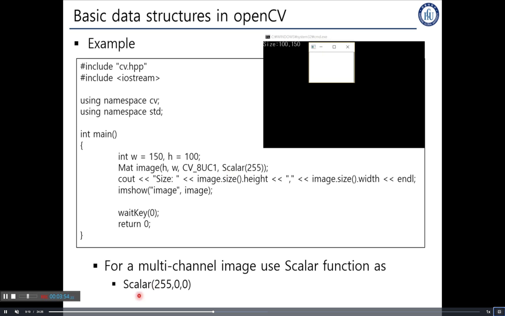
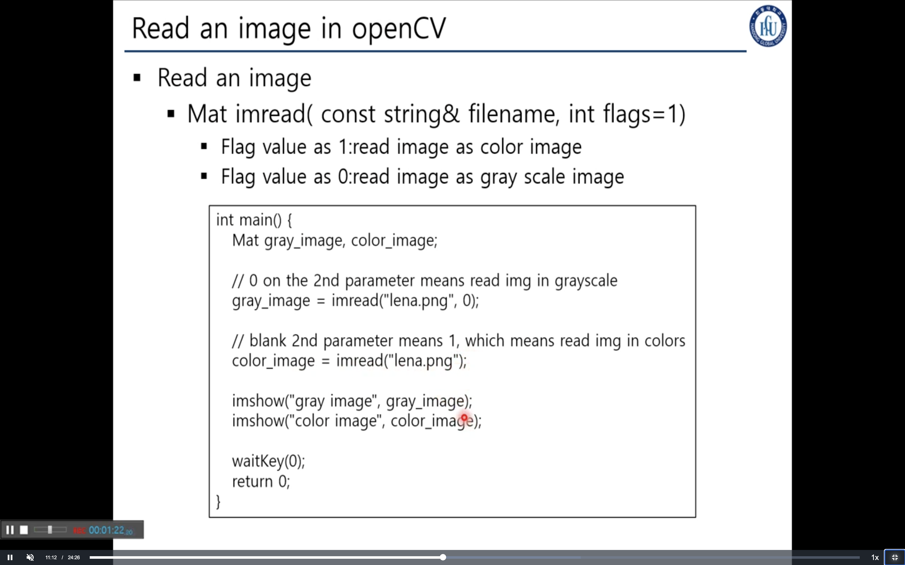
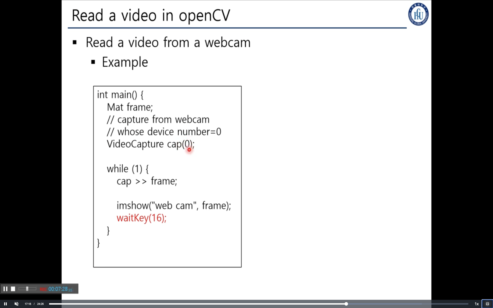
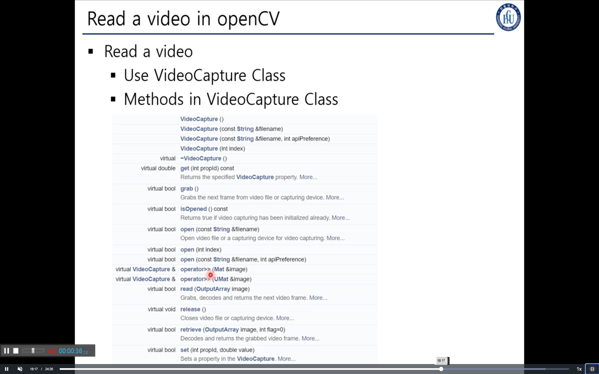
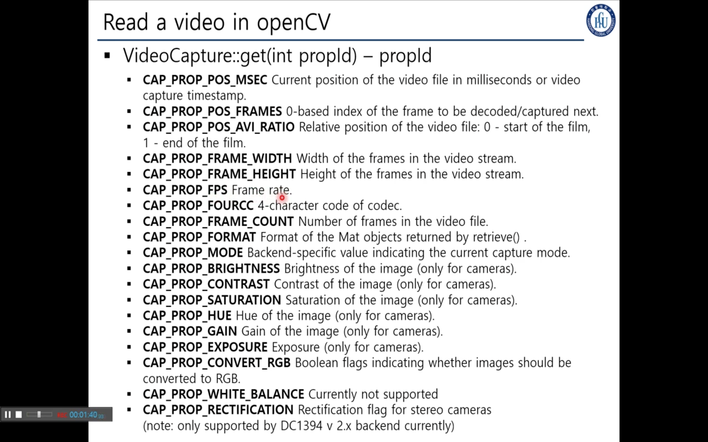
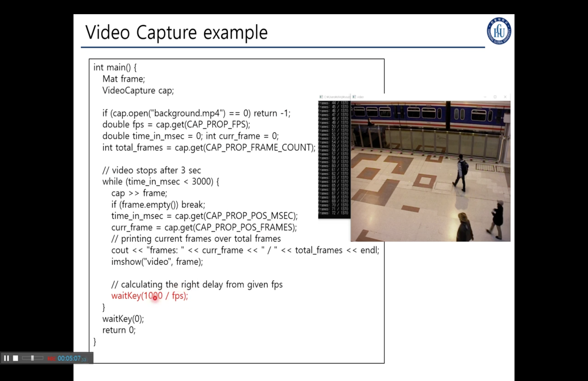
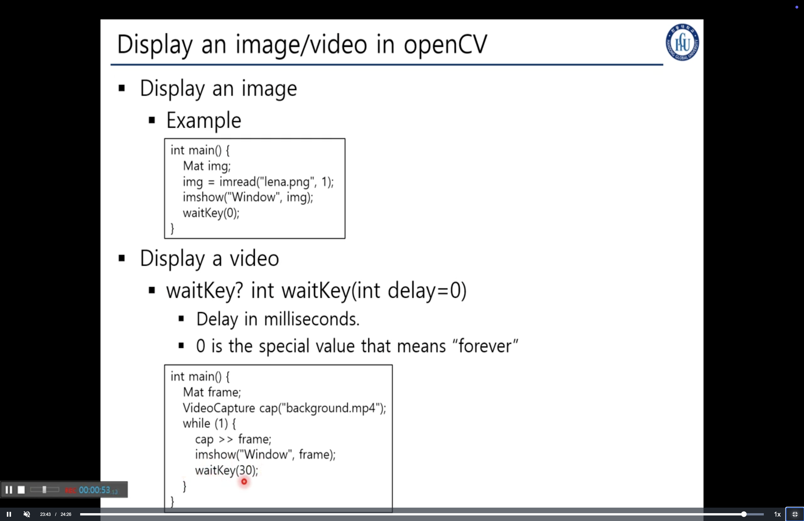

## 4. Mat
> ### 📄 Mat

기본 데이터 타입
행렬의 약어, 영상은 픽셀의 2차원 배열

1. 행의 개수, 가로의 길이, 각각의 픽셀의 타입설정
2. 사이즈와 픽셀의 타입설정
3. 이미 선언된 매트릭스의 데이터를 받아오는 방법
4. 사이즈와 픽셀의 타입, 각각픽셀의 특정한 값을 설정

#### 픽셀의 타입

* CV_8UC3 : 채널이 3개일떄
* CV_8U   : 채널이 1개일떄
*  전처리, Edge 검출에 따라 다른거 사용 가능.

매트릭스 설정

