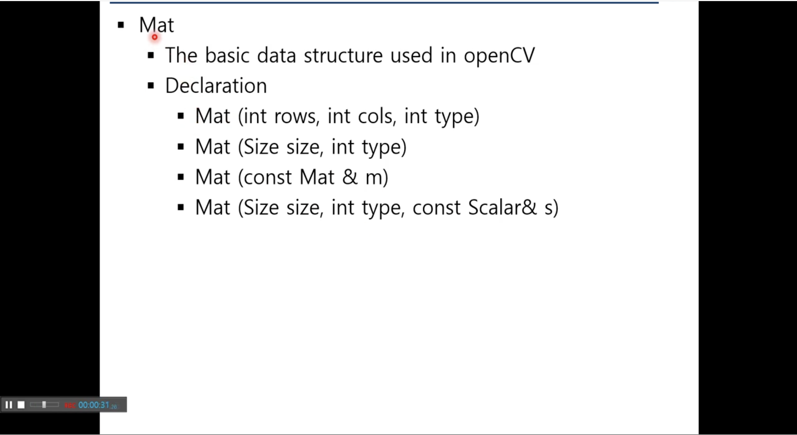
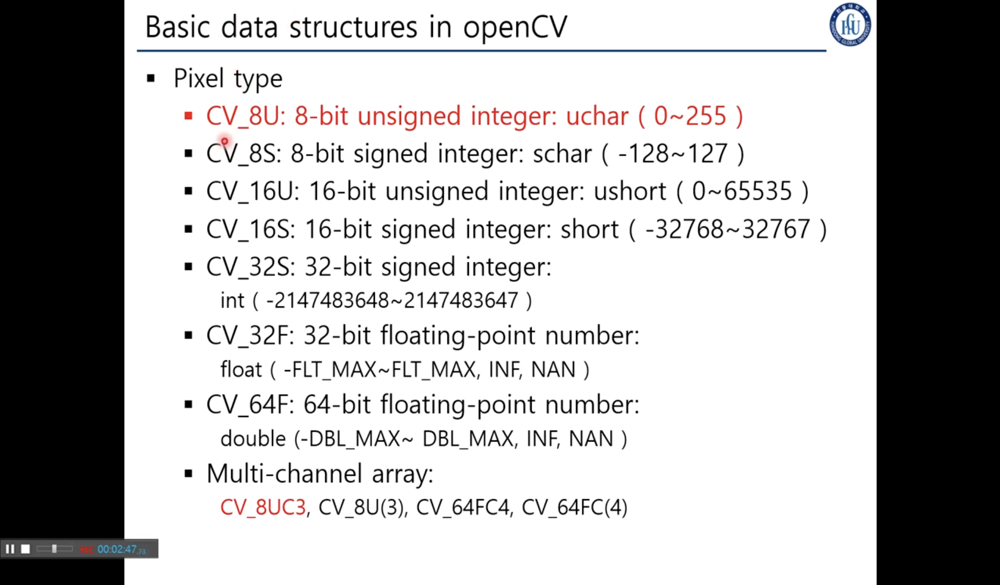
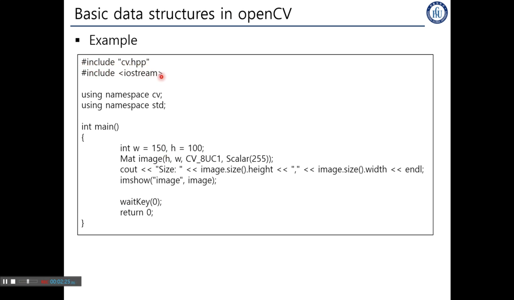
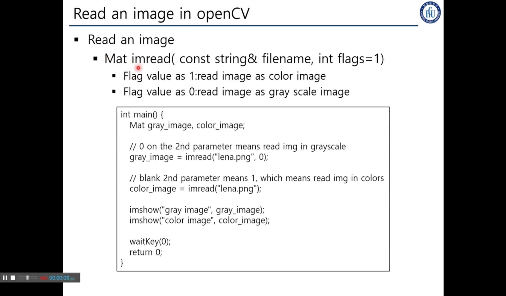
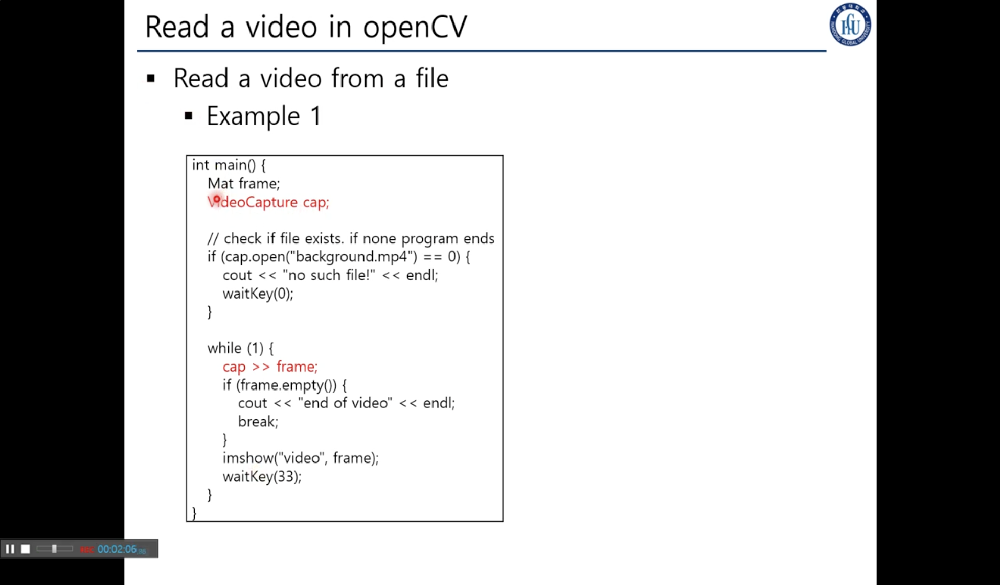
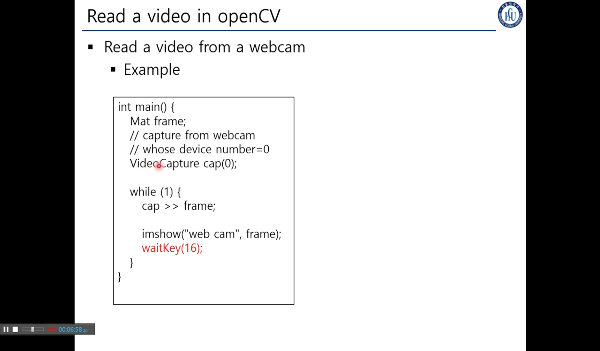
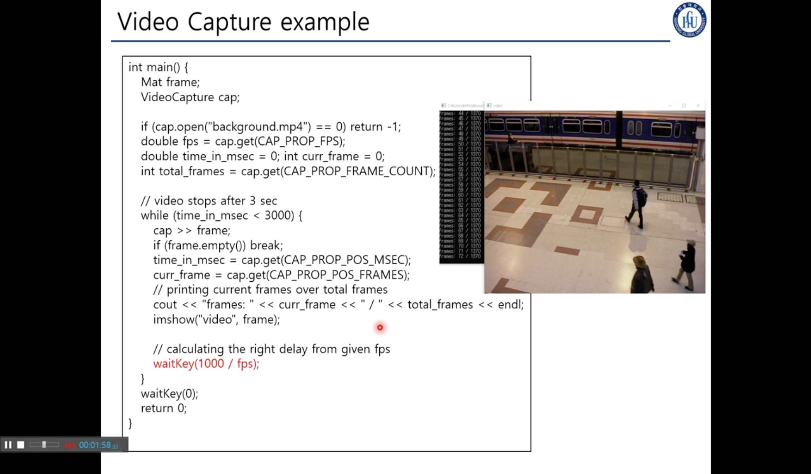

## 4. Mat
> ### 📄 Mat

OpenCV에서 이미지를 표현하기 위한 기본 데이터 타입 
행렬의 약어, 
영상은 픽셀의 2차원 배열로 생각할 수 있다.



1. 행의 개수, 가로의 길이, 각각의 픽셀의 타입설정
   * 픽셀의 타입은 다음시간에..
2. 사이즈와 픽셀의 타입설정
   * OpenCV에 선언된 Size 타입
3. 이미 선언된 매트릭스의 데이터를 받아오는 방법
4. 사이즈와 픽셀의 타입, 각각픽셀의 특정한 값을 설정

#### 픽셀의 타입



* CV_8UC3 : 채널이 3개일떄 즉 RGB
* CV_8U   : 채널이 1개일떄 Intencity만 존재
  전처리, Edge 검출에 따라 다른거 사용 가능.

#### 매트릭스 설정 예제
```cpp
Mat mtx(3,3, CV_32F);
// Make a 3x3 floating-point matrix
Mat cmtx(10,1, CV_64FC2);
// Make a 10x1 2-channel floating-point matrix
Mat img(height,width, CV_8UC3);
// Make a width x height 3-channel unsigned int matrix !조심할 것은 가로 세로 반대!
Mat img(Size(1920, 1080), CV_8UC3);
// Make a 1920x1080 3-channel unsigned int matrix
```



imgshow : 해당 매트릭스에 해당하는 이미즈를 보여준다.
만약 3channel 이면 `Scalar(255,0,0) // BGR`;


이미지 읽기
flags = 1 이면 GrayScale 


비디오를 읽으려먼 `VideoCapture`를 반드시 써야한다.

`waitKey(33) //ms` 이 함수가 없다면 우리가 눈치채기도 전에 쭉~ 아주 빠르게 프레임을 재생하고 꺼질 것 이다.
그래서 33ms를 기다리도록 할 수 있다.


`VideoCapture(0)`을 사용하면 웹캠을 가져올 수 있다. 단, 꼭 각 컴퓨터마다 인덱스가 0이 아닐 순 있는데 대부분 0이다.
만약 웹캠이 안되면 두가지중 하나다
1. 막아놨거나
2. 인덱스가 0이 아니거나.

`waitKey(16) //ms`를 기다리도록 한다.


`grap()` : 현재 존재하는 프레임의 그 다음 프레임을 가져오기 위한 함수
`open()` : 파일을 읽어오기 위함
삽입 연산자도 오버라이드 되어 있다.


`get(int propid)` : 지금 비디오 캡쳐 클래스가 가진 상세한 정보를 알 수 있다.
propid는 매크로로 작성됨




