## 5. Matrix Operator

---

#### OpenCV에서 제공하는 Mat의 기본 연산자.

---

> ### 📄 사전 정보


#### 1). `cv::Mat` VS `cv::Mat_`

##### OpenCV에서 `cv::Mat`과 `cv::Mat_`은 모두 행렬을 표현하는 클래스 지만.

##### ① `cv::Mat` – 범용 행렬 클래스

* **유연성**: 다양한 데이터 타입과 채널 수를 지원하며, 이미지 처리에서 가장 널리 사용.
* **데이터 타입 지정**: 생성 시 `CV_8UC3`, `CV_32FC1` 등의 상수를 사용하여 데이터 타입과 채널 수를 지정할 수 있음
* **예시**:
    ```cpp
    cv::Mat img = cv::imread("image.jpg", cv::IMREAD_COLOR); // 컬러 이미지 로드
    ```

##### ② `cv::Mat_<_Tp>` – 템플릿 기반 행렬 클래스

- **템플릿 클래스**: 특정 데이터 타입을 컴파일 타임에 명시할 수 있어 타입 안정성이 높습니다.
- **편리한 요소 접근**: `at<T>()` 대신 `()` 연산자를 사용하여 코드가 간결해집니다.
- **예시**:
    ```cpp
    cv::Mat_<float> mat(2, 2); // 2x2 float 행렬 생성
    mat(0, 0) = 1.0f;
    mat(0, 1) = 2.0f;
    mat(1, 0) = 3.0f;
    mat(1, 1) = 4.0f;
    ```

| 항목             | `cv::Mat`                            | `cv::Mat_<_Tp>`                          |
|------------------|--------------------------------------|------------------------------------------|
| 타입 지정 방식   | 런타임에 상수로 지정 (`CV_8UC3` 등) | 컴파일 타임에 템플릿으로 지정 (`float` 등) |
| 요소 접근 방식   | `at<T>(y, x)`                        | `(y, x)` 연산자 사용                     |
| 사용 용도        | 다양한 데이터 타입과 채널 수 지원    | 특정 데이터 타입에 대해 간결한 코드 작성 |
| 변환 가능 여부   | `cv::Mat_`으로 변환 가능             | `cv::Mat`으로 변환 가능                  |

---

#### 2). `cv::Mat` Construct

##### ① `Mat::zeros()`
* 새로운 행렬을 생성할 때 모든 원소 값을 0으로 초기화하는 경우에 사용된다. 파라미터로 행과 열 또는 size, 그리고 type이 들어간다.

##### ② `Mat::ones()`
* 모든 원소가 1로 초기화된 행렬을 생성하는 경우에 사용된다.

##### ③ `Mat::eye()`
* 단위 행렬을 생성할때 사용된다.

---

#### 3). Algebric Matrix Basic Operation

##### ① `Mat::mul()`
* 같은 위치에 있는 원소끼리 곱셈 연산을 할때 사용한다.

##### ② `Mat::inv()`
* 행렬의 역행렬을 구할 때 사용한다.

##### ③ `Mat::t()`
* 행과 열을 뒤집는 전치행렬을 구할 때 사용한다.
* 동의어로는 transpose, swapaxes 가 있다.

##### ④ `Mat::reshape`

* 배열의 모양만 변경, 데이터 순서는 그대로.
* 데이터 순서를 그대로 유지하면서 지정된 모양으로 배열을 재구성합니다.
```cpp
cv::Mat original = (cv::Mat_<int>(2, 3) << 1, 2, 3, 4, 5, 6);
```

##### ⑤ `Mat::inversed` `Mat::operator~`
* 반전 처리

---

#### 4). [Matrix Concatination](https://www.geeksforgeeks.org/concatenate-images-using-opencv-in-python/)

##### ① `Mat::vconcat`
* 수직으로 이어붙이기 (카톡 이어붙이기)

##### ② `Mat::hconcat`
* 수평으로 이어붙이기 (파노라마 이어붙이기)

##### ③ `Mat::concat_vh`
* 그리드로 반복하기

---

#### 5). Matrix Boolean

##### ① `Mat::empty()`

* Returns true if the array has no elements.

##### ② `Mat:countNonZero`

```cpp
return cv::countNonZero(mat) == mat.total();
```

##### ③ `Mat::total()`

```cpp
bool areAllPixelsTrueCustom(const cv::Mat& mat) {
    const uchar* data = mat.ptr<uchar>();
    for (size_t i = 0; i < mat.total(); ++i) {
        if (data[i] == 0) { // False condition
            return false;
        }
    }
    return true;
}
```

##### ④ `Mat::compare()`

```cpp
bool areAllPixels255(const cv::Mat& mat) {
    cv::Mat compareResult;
    cv::compare(mat, 255, compareResult, cv::CMP_EQ);
    return cv::countNonZero(compareResult) == mat.total();
}
```

##### ⑤ Bitwise `bitwise_and` `bitwise_or` `bitwise_xor` `bitwise_not`
```cpp
bitwise_and(img, img_mask, res);     imshow("AND", res);
bitwise_or(img, img_mask, res);      imshow("OR", res);
bitwise_xor(img, img_mask, res);     imshow("XOR", res);
bitwise_not(img, res);               imshow("NOT", res);
```

---

#### 5). [Mat::MatExpr](https://docs.opencv.org/4.x/d1/d10/classcv_1_1MatExpr.html)

* 행렬 연산을 지연(Lazy) 평가하는 데 사용되는 클래스로,
이 클래스는 cv::Mat 객체와 밀접하게 관련되며, 행렬 연산 결과를 효율적으로 표현하고 처리하는 데 중요한 역할을함

* **장점**
  1. **Lazy Evaluation**
  `cv::MatExpr`는 행렬 연산의 결과를 즉시 계산하지 않고, 계산에 필요한 정보를 저장함.
  필요할 때만 계산을 수행하여 메모리 사용량을 줄이고 계산을 최적화함.

  2. **연산 체인 최적화**
  여러 연산이 연속적으로 연결된 경우(A + B - C 등), 중간 결과를 저장하지 않고 한 번에 계산함.
  불필요한 메모리 할당과 복사를 줄임.

  3. **효율적 표현**
  행렬 연산의 결과를 `cv::Mat`로 변환하지 않고, 연산 자체를 표현하는 객체로 유지함.

  4. **연산자 오버로딩**
     * Mat에 암시적 변환을 허용하고 `MatExpr::explicit MatExpr(const Mat& m);`
        * 산술 연산 오버로딩 : `+`, `-`, `*`, `/`cvt
        * 비트 연산 오버로딩 : `&`, `|`, `^`, `~`
            ```cpp
            Mat image = imread("./resources/lena.jpg");
            Mat imageInverted = ~(image.clone());
            ```

---

> ### 📄 Color Space Conversion


#### 1). `cvtColor(Mat src, Mat dst, int code, int dstCn = 0)`
* 색공간(Color Model) (RGB, HSI, YCrCb, Gray, Lab)으로 컨버팅 해주는 함수.
  * 컬러 모델은 `int code`를 통해 기입하면 된다.
    (COLOR_RGB2GRAY, COLOR_RGB2HSV, COLOR_RGB2YCrCb, COLOR_RGB2Lab, COLOR_RGB2YUV, 등...)
    *CV_RGB2Gay 였는데 현대적인 OpenCV 버젼에서는 네임이 조금씩 다르다.*
* `Mat src`는 원본 매트릭스이고, `Mat dst`는 결과 매트릭스를 기입한다.
* `Mat dstCn`은 결과 매트릭스의 채널의 수를 기입하고,
    디폴트 인자 '0'을 가진다면, 알아서 채널을 결정해 준다.
    <span style="color : #B0F"> 예시 필요 <span>

```cpp
int main() {
    int w = 512, h = 512;
    Mat imageOrigin = imread("./resources/lena.jpg", IMREAD_COLOR);
    resize(imageOrigin, imageOrigin, Size(w, h), INTER_LINEAR);
    Mat GaryImage, HSVImage, YCrCvImage, LabIamge, YUVImage;
    cvtColor(imageOrigin, GaryImage, COLOR_BGR2GRAY);
    cvtColor(imageOrigin, HSVImage, COLOR_BGR2HSV);
    cvtColor(imageOrigin, YCrCvImage, COLOR_BGR2YCrCb);
    cvtColor(imageOrigin, LabIamge, COLOR_BGR2Lab);
    cvtColor(imageOrigin, YUVImage, COLOR_BGR2YUV);

    imshow("RGB image", imageOrigin);
    imshow("Gary Image", GaryImage);
    imshow("HSV Image", HSVImage);
    imshow("YCrCv Image", YCrCvImage);
    imshow("Lab Image", LabIamge);
    imshow("YUV Image", YUVImage);

    waitKey(0);
    return 0;
}
```

<div align=center>
    
    <h5></h5>
</div>


---

#### 2). `split(Mat src, Mat* mv)`

* 입력은 Multi-channel (3컬러 같은) 매트릭스를
single-channel 매트릭스로 분리해주는함수.
* 아웃풋은 Mat 배열로, 각각의 단일 채널을 가지는 매트릭스를 반환한다.

---

#### 3). `merge(Mat* mv, Mat dest)`
* split과 정확히 반대의 행동을 하고, 여러 단일 채널의 매트릭스를 하나의 매트릭스로 합치는 함수.
* mv 는 반드시 size와 동일한 depth를 가지고 있어야 한다.
* 아웃풋은 인풋으로 들어간 매트릭스와 동일한 size, depth를 가진다. 일명`mv[0]`

---

#### 4). 왜 split하고, merge했는데 다른 색이 나오지?

```cpp
int main() {
    int w = 384, h = 384;
    Mat image, image_YUV, dst;
    vector<Mat> yuv_channels(3);

    image = imread("./resources/lena.jpg");
    resize(image, image, Size(w, h), IMREAD_COLOR);

    cvtColor(image, image_YUV, COLOR_BGR2YUV);

    split(image_YUV, yuv_channels);
    merge(yuv_channels, dst);

    imshow("input image", image);
    imshow("Y", yuv_channels[0]);
    imshow("U", yuv_channels[1]);
    imshow("V", yuv_channels[2]);
    imshow("YUV image", dst);

    waitKey(0);
    return 1;
}
```


<div align=center>
    
    <h5>심령사진처럼 나온다. </h5>
</div>

* 이러한 이유는 YUV를 RGB로 읽으려고 시도했기 때문이다.
    > `imshow()` thinks, the Matrix is in BGR order. Converting the image to HSV just converts the RGB values to HSV channel values.
* 따라서 imshow 하는 이미지의 컬러모델을 또 바꾸면 된다.

---

> ### 📄 Region of Interest

* 입력 영상중, 관심이 있는 이미지의 서브 영역을 설정할 수 있다.
* 이렇게 함으로 특정한 영역에서만 연산을 수행하면 되니, 시간을 아낄 수 있다.
* 하지만, ROI를 변화 시키면 원본 이미지가 변조될 수 있다,
즉, 레퍼런싱을 수행하는 연산이다.

---

#### `Mat ROI` VS `Mat Mask`?

* 둘다 이미지의 일부만 다루기 위해 사용되는데
  * ROI는 원본 이미지에서 가로, 세로 길이를 딱 **이미지를 잘라내는 관점** 이고
  * Mask는 흑, 백으로 이뤄진 이진 이미지로, **어디를 처리할지를 지정하는 관점**
    | 개념 | Region of Interest (ROI) | Mask |
    |------|---------------------------|------|
    | **정의** | 이미지의 “일부 영역”을 `Mat` 객체로 잘라낸 서브이미지 | 원본 이미지와 동일한 크기의 **이진 이미지**, 픽셀 선택 여부를 표현 |
    | **데이터** | 실제 이미지 데이터의 일부 | 픽셀 위치를 기준으로 처리할지 말지를 0/255로 나타냄 |
    | **용도** | 이미지의 특정 영역만 작업하고 싶을 때 (`cv::Rect`로 잘라내기) | 연산 결과를 **특정 위치에만 적용**하고 싶을 때 (`bitwise_and`, `copyTo`, `findContours` 등에서 사용) |
    | **형태** | 이미지의 부분 (sub-matrix) | 흑백 이진 이미지 (`CV_8UC1`) |
    | **예시** | 얼굴만 잘라서 저장 | 동그란 영역만 복사하고 싶을 때 |


#### 1). By `Rect` : 사각형을 사용한 마스크

```cpp
int main() {
    Mat image, rect_roi;
    Rect rect(100, 30, 250, 300);

    image = imread("./resources/lena.jpg");
    rect_roi = image(rect);

    imshow("rect ROI image", rect_roi);
    waitKey(0);
    return 1;
}
```

---

#### 2). By `Polygon` : 사각형이 아닌 폴리곤을 사용한 마스크

```cpp
int main() {
    Mat image, poly_roi, poly_mask;
    image = imread("./resources/lena.jpg");
    Point polys[1][4] = {
        Point(255, 100), Point(286, 100), Point(316, 300), Point(196, 300)
    };

    const Point* ppt[1] = {polys[0]}; // InputArrayOfArray
    int npt[] = {4}; // npts
    poly_mask = Mat::zeros(image.size(), image.type());

    // CV_EXPORTS void fillPoly(InputOutputArray img, const Point** pts,
    //                          const int* npts, int ncontours,
    //                          const Scalar& color, int lineType = LINE_8, int shift = 0,
    //                          Point offset = Point() );
    fillPoly(poly_mask, ppt, npt, 1, Scalar(255,255,255), 8);

    // inline void GpuMat::copyTo(OutputArray dst, InputArray mask) const
    // {
    //     copyTo(dst, mask, Stream::Null());
    // }
    image.copyTo(poly_roi, poly_mask);
    imshow("poly ROI image", poly_roi);

    waitKey(0);
    return 1;
}
```

<div align=center>
    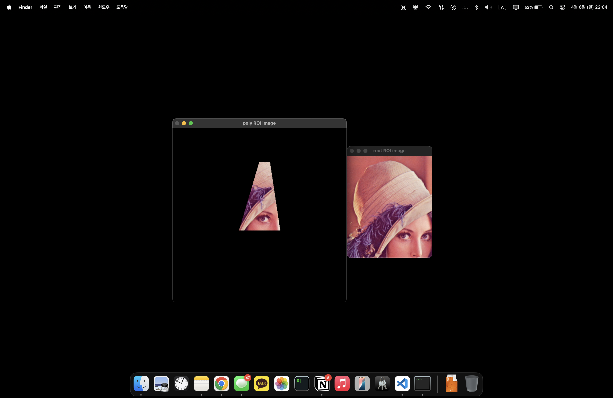
    <h5>좌 : 폴리곤 roi, 우 : 사각형 roi</h5>
</div>


---

#### 3). `InputArrayOfArray`
* C 배열, `std::vector`를 묶는 하나의 공통 인터페이스

---

#### 4). fillPoly 함수의 파라미터와 Scalar, npt의 역할

* `pts (InputArrayOfArrays)`:
  다각형의 꼭짓점 좌표 배열을 받는다.
  다각형은 오직 하나만 있는게 아니라, 따로따로 떨어진 여러개의 다각형을 pts로 기입할 수 있다.

* `npts (const int\*)`:
  각 컨투어(다각형)가 몇 개의 점으로 이루어져 있는지를 나타내는 배열을 말한다.
  여러 개의 컨투어가 있을 경우, 각 컨투어마다 점의 개수가 다를 수 있기 때문에 이 정보가 필요함!
  각 컨투어가 몇 개의 점을 갖는지 알아야 올바른 다각형을 그릴 수 있기 때문이라서 그렇다.
  만약 이게 없으면, 여러 다각형을 한 번에 그릴 때 각 다각형의 끝 지점을 구분할 수 없게되어 어떻게 채울지 모르기 때문.

* `ncontours (int)`:
  pts 배열에 들어있는 컨투어(다각형)의 총 개수.

* `color (const Scalar&)`:
  채워 넣을 색상을 지정하는데 사용됨 보통 BGR 순서로 각 채널의 값을 지정한다.
  * 예를 들어, `Scalar(255, 255, 255)`는 흰색을 의미하며, 이 색으로 다각형 내부를 채우게 된다.

* `lineType, shift, offset 등`:
  선의 종류, 좌표값의 비트 쉬프트, 오프셋 조정 등 추가적인 옵션으로,
  다각형 그리기 시의 세부 스타일을 결정하는 역할


---

#### 5. 왜 Mask를 만들어서 ROI에 copyTo를 하는가?

* 왜 처음부터 ROI를 만들지 않고, Mask를 만든 다음에 ROI를 만드는 파이브라인이 왜 하나 더 있는걸까?
  * **ROI (Region of Interest)** 보통 단순히 이미지의 **사각형** 영역을 지정할 수 밖에 없음
하지만,  **Mask**는 임의의 모양(예: 다각형, 원 등)으로 지정한 영역만 선택할 수 있다.
    또한 이미지 전체 크기를 유지하면서, 특정 픽셀들만 선택적으로 연산(예: 복사, 필터 적용 등)을 진행할 수 있게 해준다.
    그래서 먼저 원본 이미지 크기의 mask를 만들고, 원하는 영역에만 값을 255(활성)로 채워서,
  그 영역에 한정된 연산(copyTo 등)을 수행하게 되는 것 이다.
* 따라서, 비정형 영역(예: 다각형)의 경우 먼저 전체 이미지 크기의 mask를 만들고, 그 mask를 이용해 원하는 영역만 선택적으로 복사하는 절차가 있는것이다.


---

> ### 📄 Addition & Subtraction


#### 1). `add(Mat src1, Mat src2, Mat dst, Mat mast=noArray(), int dtype = -1)`

* **공식**
    ```cpp
    if(mask(<Intensity>) != 0) {
        dst(<Intensity>) = saturate(src1(<Intensity>)+src2(<Intensity>))
    }
    ```
  * `saturate(<Intensity)`는 인텐시티가 INF를 가지더라도,
    0~255 사이의 값을 나오도록 하는 함수임을 의미하고, `add()`함수가 실제로 수행하는 공식이다.
    조심해야 할 것은, 입력 영상의 픽셀 중 밝기 n을 더해 255보다 큰 값이 된 픽셀은
    오히려 픽셀값이 0에 가까운 어두운 픽셀로 바뀜
  * `dst`는 src1, src2 각각을 행렬 합을 한 뒤의 결과물이다.
  * `mask` : 싱글 채널 매트릭스를 입력으로 받고, 이 입력은 ROI Mask Image를 말한다.
  * `dtype` : 인텐시티 레벨이다. 0~255의 값을 가지는, 약 -1이라면, 인텐시티 레벨을 이전과 동일하게 하겠다는 의미다.

---

#### 2). `sacleAdd(Mat src1, double scale, Mat src2, Mat dst)`

* **공식**
    ```cpp
    dst(<Intensity>) = scale * src1(<Intensity>) + src2(<Intensity>);
    ```
  * 각각의 Mat에 스케일을 곱하고 더한다.

---

#### 3). `absdiff(Mat src1, Mat src2, Mat dst)`
* **공식**
    ```cpp
    dst(<Intensity>) = saturate(| src1(<Intensity>) - src2(<Intensity>)|);
    ```
  * 각각의 Mat의 차를 구하고, 절댓값을 취한다.


---

#### 4). `subtract(Mat src1, Mat src2, Mat dst, Mat mask = noArray(), int dtype -1)`
* **공식**
    ```cpp
    dst(<Intensity>) = saturate( src1(<Intensity>) - src2(<Intensity>))` if `mask(<Intensity>) != 0
    ```
  * 각각의 Mat의 차를 구하고 절갯값을 취하지 않는다.

<div align=center>
    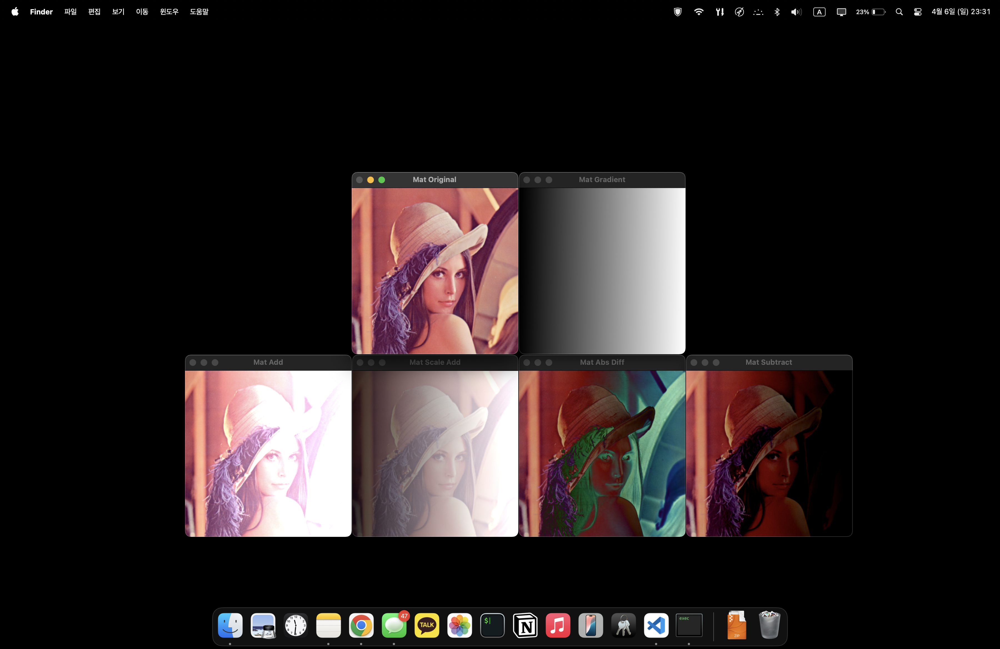
    <h5></h5>
</div>

---

> ### 📄 Threshold

---

#### 일명 영상의 "이진화"에서 사용되는 연산으로, 굉장히 중요한 연산이다!
* 입력 영상이 있고, 각각`[N][N]`의 픽셀 값이 특정 스레숄드 이상이면, 다른 값으로 치환한다는 의미다.
* 주로, grayscale의 인풋으로 부터 이진화 된 데이터를 얻기 위해 사용된다.
  임계치를 기준으로 충족하면 흑(0), 미달되면 백(1)으로 이진화 시키는 동작을 한다.
  *주로, 흑이 배경, 백이 객체 로 구분한다.*

* 스레숄딩의 타입도 여러가지 있다. 그리고 각 타입에 따라 이미지의 결과가 매우 달라진다.

<div align=center>
    
    
    <h5></h5>
</div>


#### 1). `double threshold(Mat src, Mat dst, double thresh, double maxval, int type)`

* **maxval** 이 공식에 적용되는 형태
  ```cpp
  // THRESH_BINARY
  dst(<Intensity>) = src(<Intensity>) > thresh ? maxval  : 0
  ```
* Type : 스레숄드 타입을 말한다.
  * `THRESH_BINARY, THRESH_BINARY_INV, THRESH_TRUNC, THRESH_TOZERO, THRESH_TOZERO_INV`

    ```cpp
    int main() {
        Mat image = imread("./resources/lena.jpg");
        cvtColor(image, image, CV_BGR2GRAY);
        Mat dst;
        threshold(image, dst, 100, 255, THREASH_BINARY);
        imshow("original image", image);
        imshow("threshed image", dst);
        waitKey(0);
        return 0;
    }
    ```

<div align=center>
    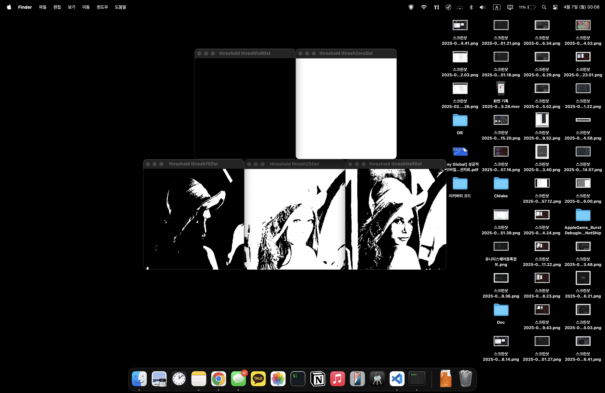
    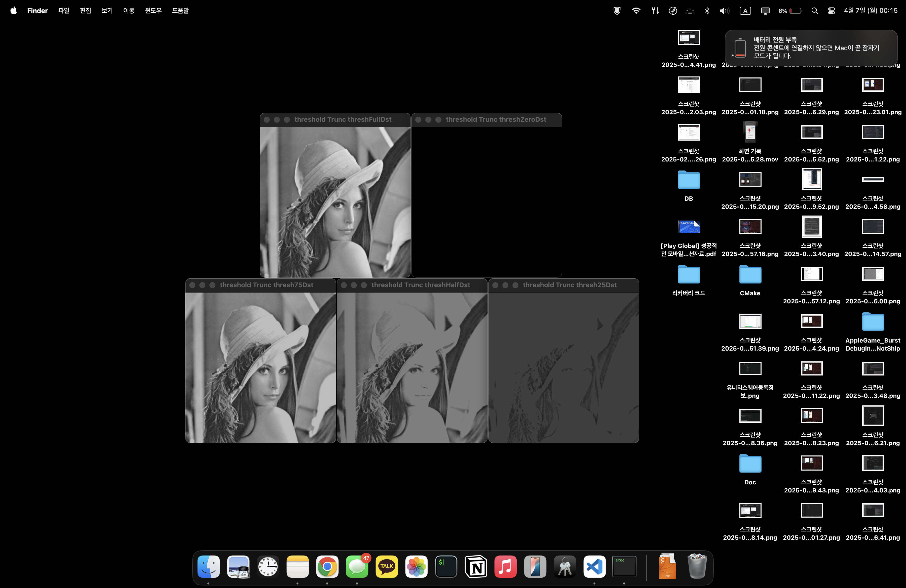
    <h5>상 : BINARY, 하 : TRUNC</h5>
</div>

---

#### 2). `adaptiveThreshold(Mat src, Mat dst, double maxval, int adaptiveMethod, int thresholdType, int blockSize, double C)`

* 모든 픽셀에 동일한 픽셀값을 주었던것과 다르게,
Adaptive는 각 주변 픽셀들 값에 따라 적응형으로 스레숄딩을 다르게 줄 수 있다.
* `int adaptiveMethod`
  1. `ADAPTIVE_THRESH_MEAN_C` : 주변 픽셀의 평균을 사용할 수도 있고
  2. `ADAPTIVE_THRESH_GAUSSIAN_C` : 가우시간 가중치 평균을 줄 수도 있다.

* `int thresholdType`
  1. `THRESH_BINARY`
  2. `THRESH_BINARY_INV`

* `int blockSize`
  * 이웃된 한 픽셀 기준 상하좌우대각선 픽셀들의 범위
  즉, (3, 5, 7.. 홀수단위)의 블럭 사이즈다. 얼마다 스레숄딩을 적용할지 범위를 나타내기도 한다.

* `double C`
  * blockSize에 적용된 필셀들의 결과에 적용할 상수 오프셋

* **공식**
    ```cpp
    dst(x, y) {
        if(ADAPTIVE_THRESH_MEAN_C) {
            return MEAN(blockSize * blockSize) - C
        }
        else if(ADAPTIVE_THRESH_GAUSSIAN_C) {
            return GAUSSIAN(blockSize * blockSize) - C
        }
    }
    ```

* **예제**
    ```cpp
    int main() {
        Mat image = imread("lena.jpg");
        cvtColor(image, image, CV_BGR2GRAY);
        Mat dst;
        adaptiveThreshold(image, dst, 255, ADAPTIVE_THRESH_MEAN_C, THRESH_BINARY, 7, 10);
        imshow("threshed image", dst);
        imshow("original image", image);
        waitKey(0);
        return 0;
    }
    ```

<div align=center>
    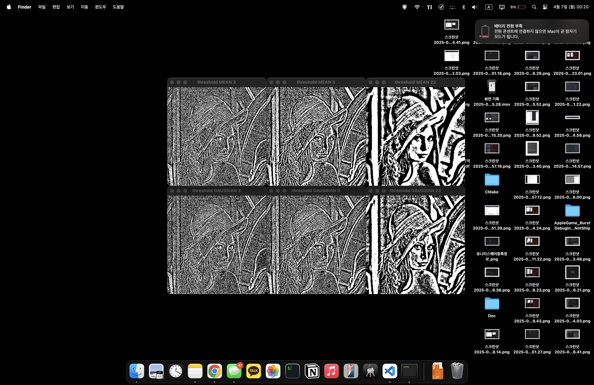
    <h5></h5>
</div>

---

#### 3). `inRange(Mat* src, InputArray lowerb, InputArray upperb, OutputArray dst)`

* Threshold와, adaptiveThreshold는 특정한 기준 이상이면 백, 이하면 흑, 이렇게 이진화 시킨다면
* InRange는 이러한 기준 경계값을 두가지로 사용할 수 있다는 것이다,
"흑, 백, 중립 등등.." 이렇게 세가지 이상으로 설정할 수 있다.

* `src` : 원본 이미지
* `Lowerb` : lower boundary 스칼라 또는 배열
* `Upperb` : upper boundary 스칼라 또는 배열
* `Dst` : 결과 이미지 단, `CV_8U`인 1채널을 리턴한다.
  ```cpp
  int main() {
      Mat image = imread("hand.jpg");
      cvtColor(image, image, CV_BGR2YCrCb);
      inRange(image, Scaler(0, 133, 77), Scalar(255, 173, 127), image);

      imshow("inRange", image);
      waitKey(0);
      return 0;
  }
  ```

<div align=center>
    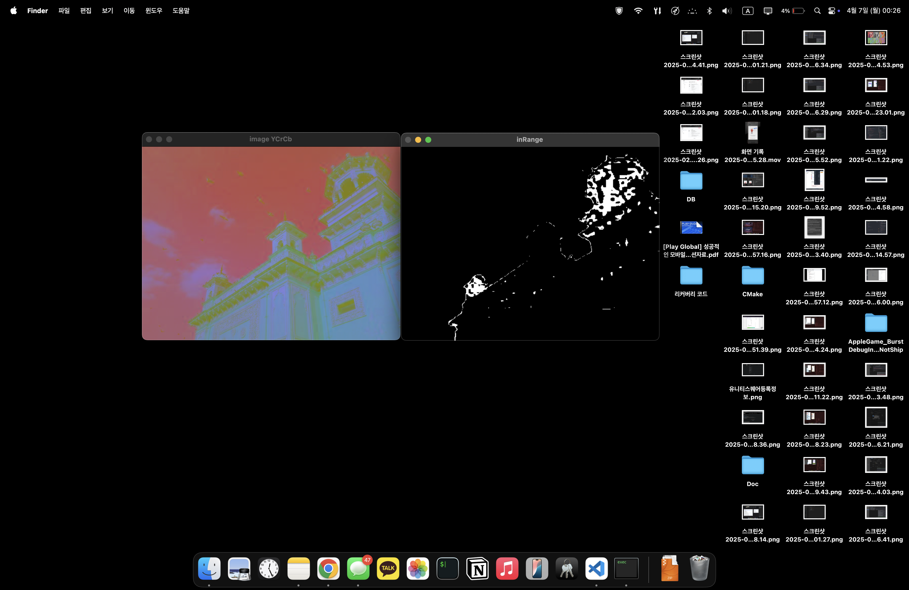
    <h5></h5>
</div>

---

> ### 📄 Others

#### 1). `convertTo(OutputArray m, int rtype, double alpha=1, double=beta=0)`

* **공식**
```cpp
m(x, y) = saturate_case<rType> (alpha * (*this)(x, y) + beta);
```

---

#### 2). `setTo(InputArray value, InputArray mask=noArray())`

* 두번째 파라미터로 ROI Mask Image를 사용할 수 있다.
* ROI 경계를 지정하고, 특정 값으로 Set 한다.

---

#### 3). `convertScaleAbs(InputArray src, OutputArray dst, double alpha, double beta = 0)`

* 인풋 이미지를 넣고, 인풋의 픽셀을 특정 값으로 스케일 곱을 한다음, 오프셋 수치를 더한다.
* 명도 조정을 하는데 사용되고, 대비를 높이고, 밝기를 조절하는 과정으로 진행된다.

* **공식**
    ```cpp
    Dst(<Intensity>) = saturate_case<uchar>(|src(<Intensity>)| * alpha + beta)
    ```

---

#### 4). 코드
```cpp
int main() {
    Mat image = imread("lena.png");
    Mat after_convertTo, after_convertScaleAbs;
    imshow("original", image);
    image.convertTo("after convertTo", CV_16SC1);
    imshow("after convertTo", after_convertTo);
    convertScaleAbs(image, after_convertScaleAbs, 2, 3);
    imshow("after convertScaleAbs", after_convertScaleAbs);
    image.setTo(Scalar(0));
    imshow("after setTo", image);
    waitKey(0);
}
```

---

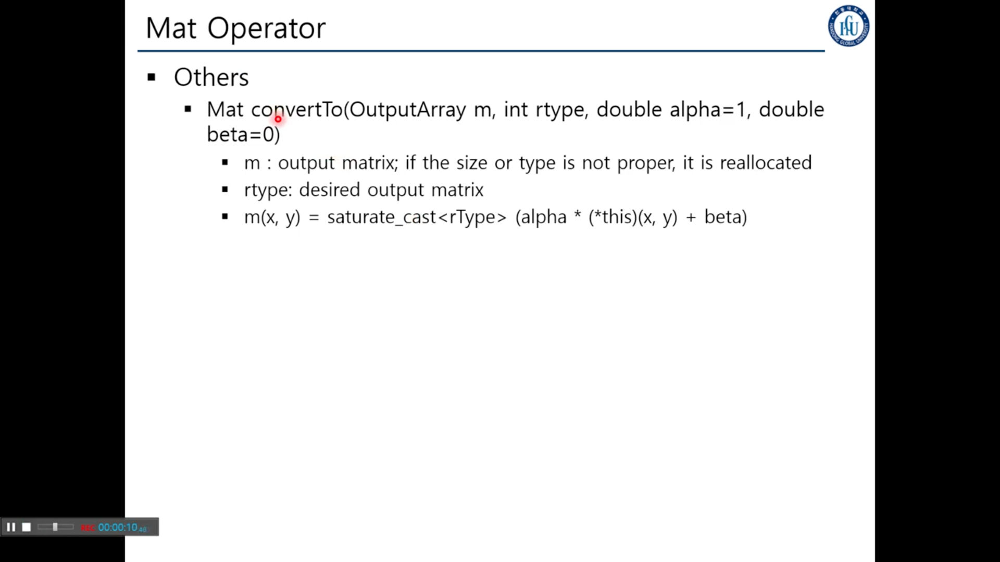
두번째 파라미터로 ROI를 사용할 수 있다.

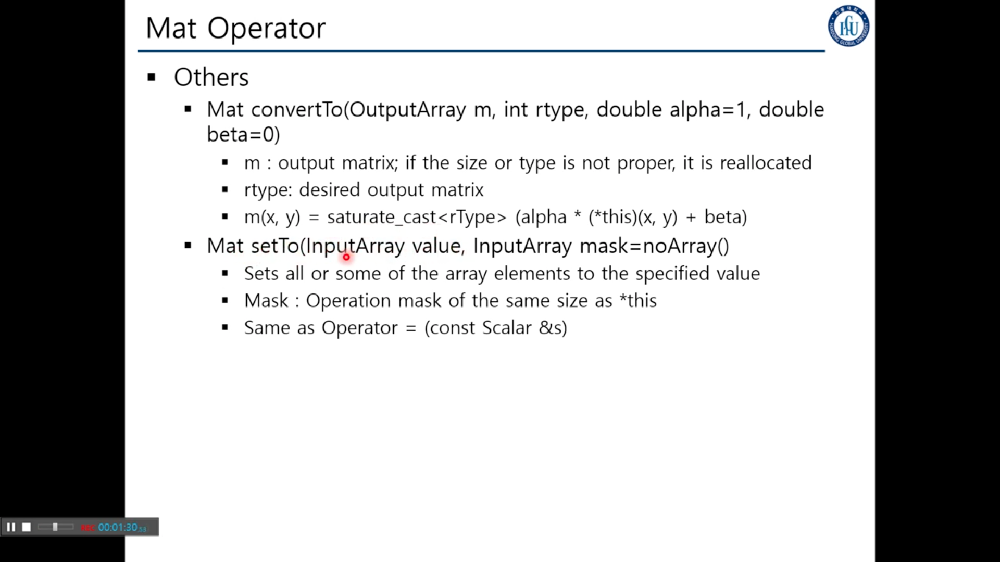

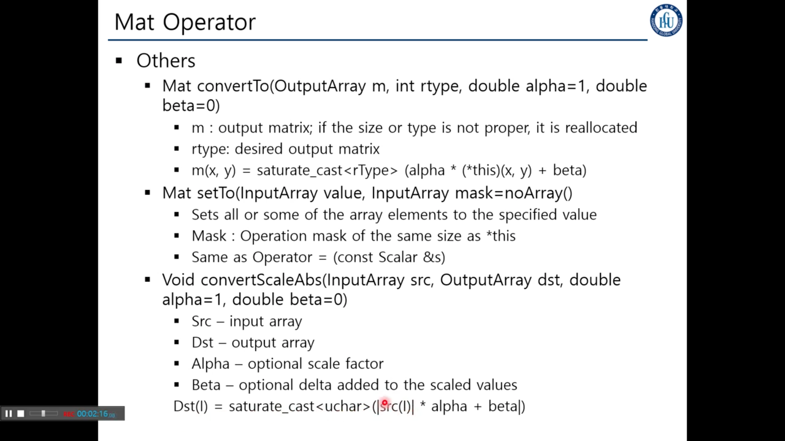

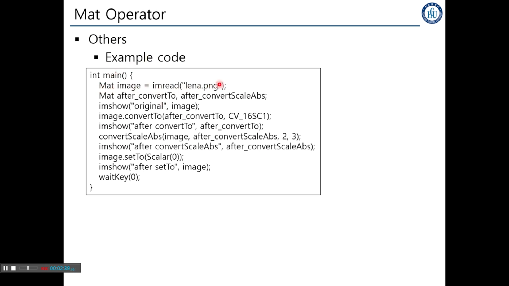

회색조가 나온 이유는 8비트 1채널을 사용했다고 해서
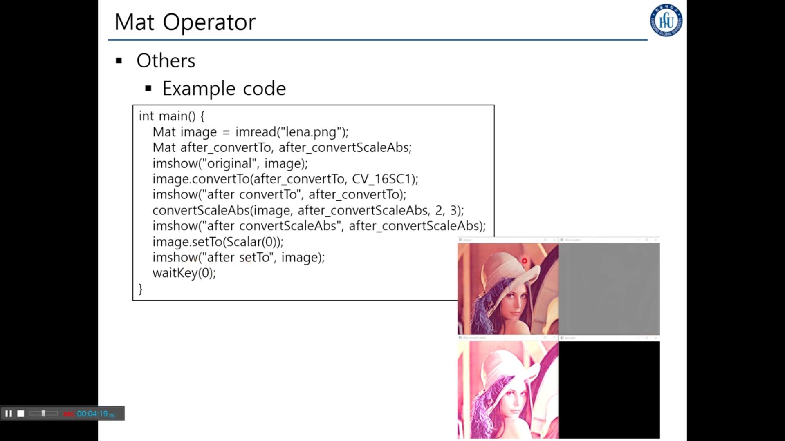
