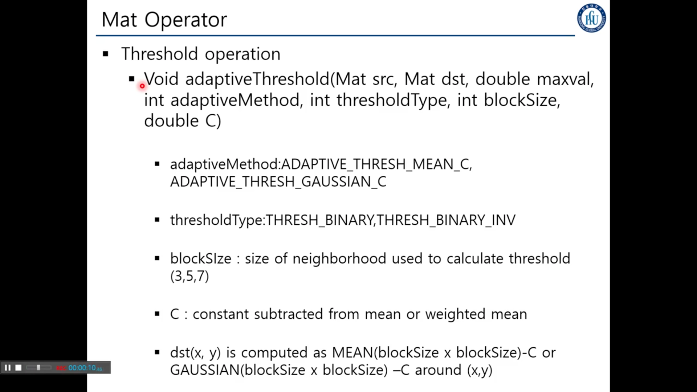
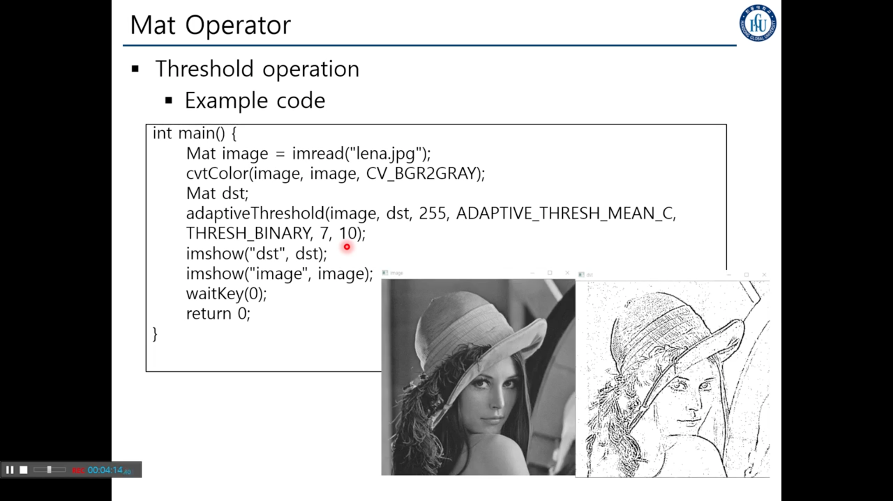

## 5. Matrix Operator

색공간 Conversion
각각의 색 타입을 다른 타입으로 변경시켜줌.

원본 매트릭스
결과 매트릭스
색공간
결과 매트릭스의 채널

멀티 체널 매트릭스, 각각의 채널로 분리
입력 3채널, 아웃풋 어레이 3이상의 것으로

원 채널의 영상을 합쳐

왜.. 머지하는데 색이 다르지?
YUB를 그냥 합치면 안된다 그러면 심령 영상처럼 나온다.
RGB가 디폴트라

입력 영상중 관심이 있는 부분만 리턴
해상도가 너무 커서 복잡한것이 큼
근데 만약 특정한 영역에서만 작업을 하기만 하면 시간을 아낄 수 있고
그래서 ROI를 설정할 수 있다.

하지만, 이미지는 대부분 레퍼런스 처리이므로
어떤 처리릃하면 원본도 바뀐다.

Rect : 사각형에 대한 구조

굳이 꼭 사각형이 아니여도 된다.
하지만.. 폴리곤을 커스텀 해야한다.

행렬합

특정한 ROI 부분에서만 연산을 수행하겠다는.. Mat Mast
dtype = 인텐시티 레벨이라고 보시면 된다.
만약 -1이라면 인텐시티 레벨을 동일하게 하겠다는 의미.
depthtype 에 따라
saturate는 인텐시티가 303030 해도  0~255의 사이의 값을 나오도록 해주는 함수다.

위는 스케일 Add, 각각의 Mat에 스케일을 곱하고 더한다.
중간은 뺸것의 절댓값을 사용한다.
섭트랙트는 차를 구하고 절댓값을 취하지 않는다

굉장히 중요한 연산!!
입력 영상이 있고 & 각각의 픽셀의 값이 특정 스레숄더 이상이면 다른 값으로 치환한다는 의미다.
사실,, 어떤 임계치 double을 0, 1로 이진화를 시켜준다. 흑 아니면 백,
스레숄딩의 타입도 있다. 5개의 타입이 있다.
각 타입에 따라 결과가 매우 달라진다.

모든 픽셀에 동일한 픽셀값을 주었던과 다르게
Adaptive는 각 주변 픽셀들 값으로 스레숄딩을 다르게 줄 수 있따.
주변 픽셀들의 평균을 사용할 수도 있고, 가우시안 가중치 평균를 줄 수 있기도 하다.

C : contsnt는 결과에 뺄 오프셋 값같은거

InRange : Adaptive는 특정한 기준을 넘으면 A 넘지 않으면 B 그래서 경계 값을 하나밖에 못썻는데
low, upper을 사용해서 경계값을 두가지 값을 사용 사용할 수 있다.중간 값을 설정할 수 있다는 것.

두번쨰 파라미터로 ROI를 사용할 수 있다.

회색조가 나온 이유는 8비트 1채널을 사용했다고 해서

