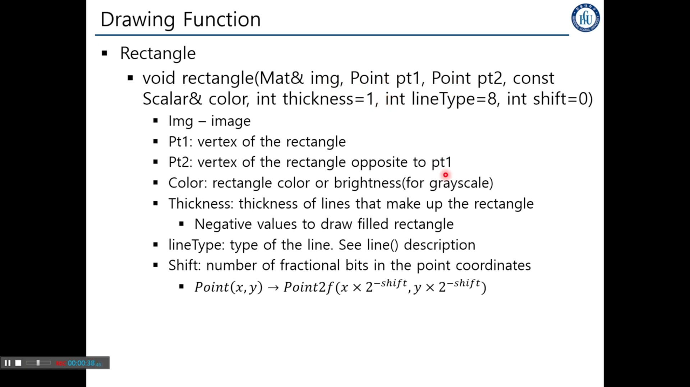
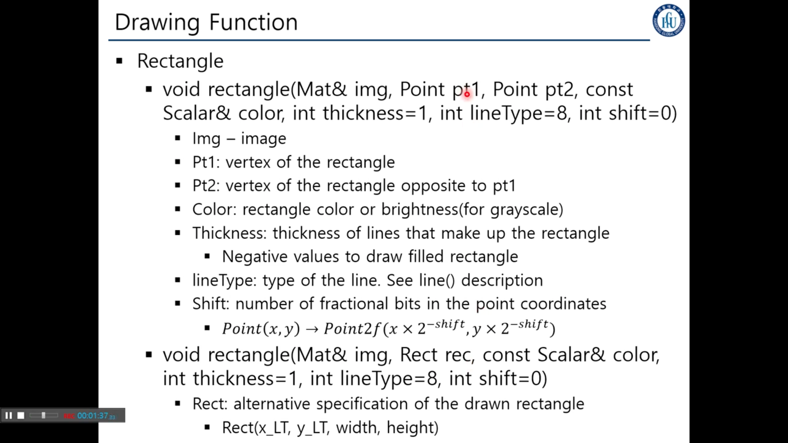
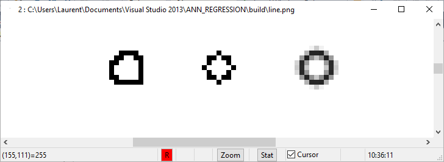
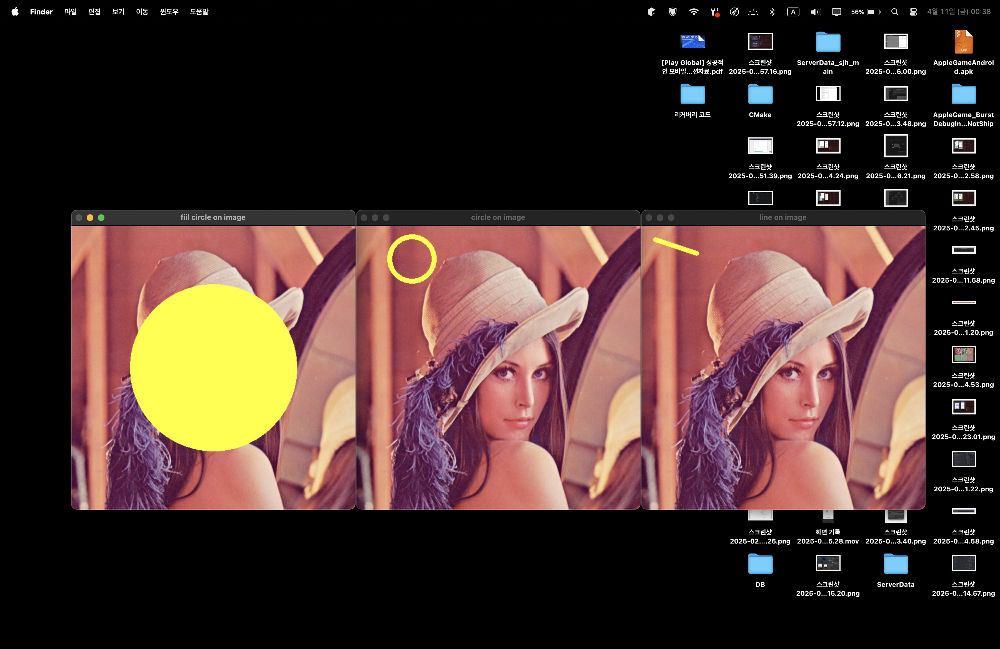
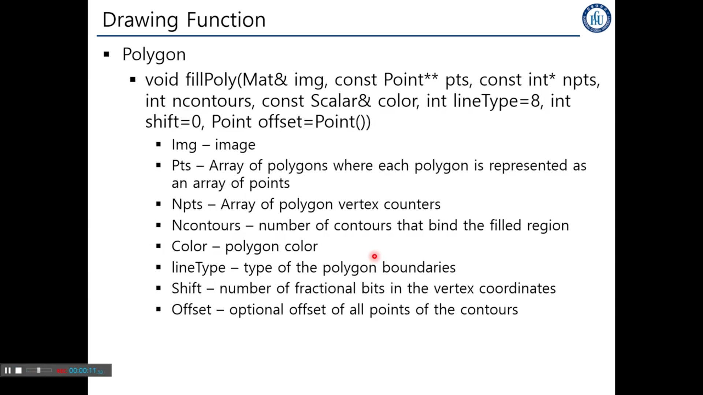
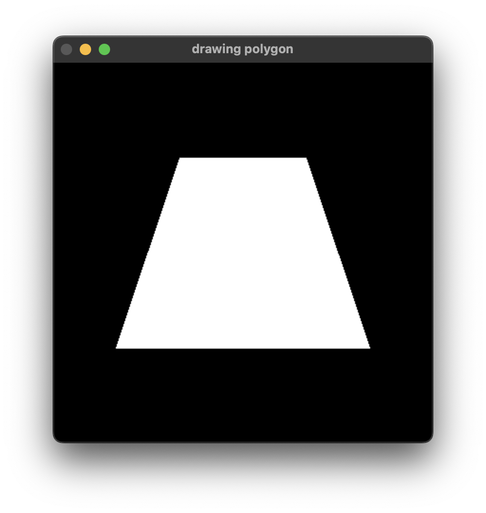
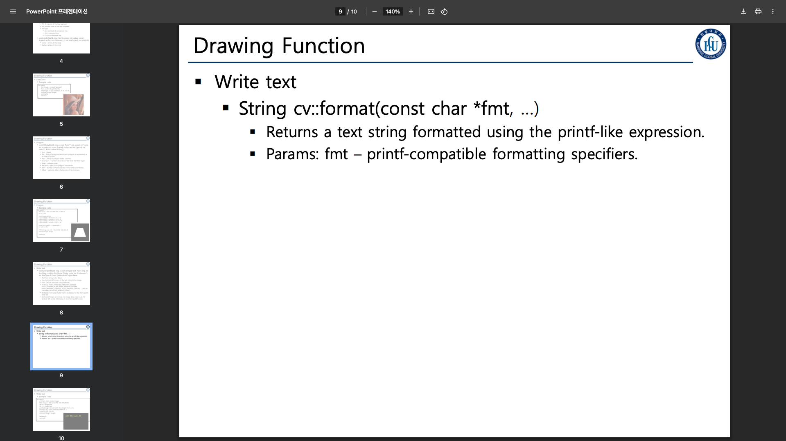
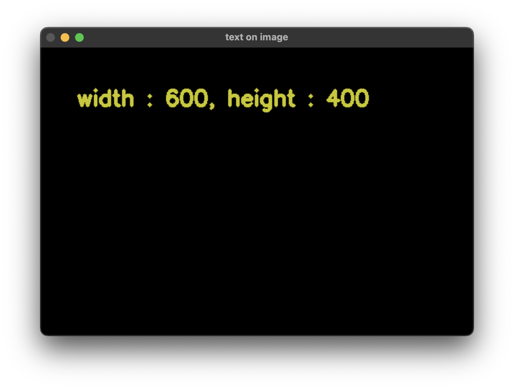

## 6. OpenCV Drawing Function


> ### 📄 4각형을 그리는 함수





#### 1). `void rectangle(Mat& img, <represent_rectangle>, const Scalar& color, int thickness, int linetype, int shift = 0)`

##### 공통 패러미터.
1. `Mat& img` : 4각형을 그릴 이미지(캔버스)의 레퍼런스
2. ***사각형을 나타내는 자료형***
3. `const Scalar& color` : 상수 컬러를 의미하고, 혹은 GrayScale을 사용하는 brightness를 기입할 수 있다.
4. `int thickness` : 선의 굵기, 양수면 밖으로 그리고, 음수면 내부로 그린다.
1. `int linetype` : 선의 타입
   
   1. LINE_4, LINE_8 파라미터를 전달하면 픽셀이 깨져 보입니다.
      * 8 (Omitted) : 8 connected line
      * 4 : 4 connected line
   2. LINE_AA : 픽셀이 깨져서 발생하는 계단 현상을 최소화하는 연결 선을 그려줍니다.
      * Antialiased line
2. `int shift = 0` : 디폴트는 0, 사각형을 정교하게 그릴 때, 사용한다.

#### 2).`Point`를 사용하는 오버로딩
```cpp
void rectangle( Mat& img,
                Point pt1, Point pt2,
                const Scalar& color,
                int thickness=1,
                int lineType=8, int shift=0
)
```

#### 3). `Rect`를 사용하는 오버로딩
```cpp
void rectangle( Mat& img,
                Rect rec,
                const Scalar& color,
                int thickness=1,
                int lineType=8, int shift=0
)
```

#### 4). 예제 코드

```cpp
int chapter6::DrawingRectangleWithRect() {
    Mat image = imread("./data/lena.jpg");
    Rect rect1 = Rect(10, 10, 100, 100);
    Rect rect2 = Rect(200, 10, 100, 100);
    Rect rect3 = Rect(10, 200, 100, 100);
    rectangle(image, rect1, Scalar(255,0,0), 4, LINE_4, 0);
    rectangle(image, rect2, Scalar(0,255,0), 4, LINE_8, 0);
    rectangle(image, rect3, Scalar(0,0,255), 4, LINE_AA, 0);
    imshow("DrawingRectangleWithRect", image);
    waitKey(0);
    return 1;
}

int chapter6::DrawingRectangleWithPoints() {
    Mat image = imread("./data/lena.jpg");
    Point points1[1][2] = {Point(10, 10), Point(100, 100)};
    Point points2[1][2] = {Point(200, 10), Point(100, 100)};
    Point points3[1][2] = {Point(10, 200), Point(100, 100)};
    rectangle(image, points1[0][0], points1[0][1], Scalar(255,0,0), 4, LINE_4, 0);
    rectangle(image, points2[0][0], points2[0][1], Scalar(0,255,0), 4, LINE_8, 0);
    rectangle(image, points3[0][0], points3[0][1], Scalar(0,0,255), 4, LINE_AA, 0);
    imshow("DrawingRectangleWithPoints", image);
    waitKey(0);
    return 1;
}

int chapter6::FillRectangleWithRect() {
    Mat image = imread("./data/lena.jpg");
    Point points1[1][2] = {Point(10, 10), Point(100, 100)};
    Point points2[1][2] = {Point(200, 10), Point(100, 100)};
    Point points3[1][2] = {Point(10, 200), Point(100, 100)};
    rectangle(image, points1[0][0], points1[0][1], Scalar(255,0,0), -1, LINE_4);
    rectangle(image, points2[0][0], points2[0][1], Scalar(0,255,0), -1, LINE_8);
    rectangle(image, points3[0][0], points3[0][1], Scalar(0,0,255), -1, LINE_AA);
    imshow("FillRectangleWithPoints", image);
    waitKey(0);
    return 1;
}

```


---


> ### 📄 선과 원을 그리는 함수

#### 1). `void line(Mat& img, Point p1, Point pt2, const Scalar& color, int thickness=1, int lineType =8, int shift=0)`

1. `Mat& img` : 선을 그릴 이미지(캔버스)의 레퍼런스
2. `Point p1, Point p2` : 선의 양 끝점 1, 2
3. `const Scalar& color` : 선의 색상
4. `int thickness=1` : 선의 두께
5. `int lineType=8` : 선의 타입
6. `int shift=0` : 정교한 선을 그리기 위한 시프트

#### 2). `void Circle(Mat* img, Point center, int radius, const Scaler& color, int thickness=1, int lineType=8, int shift = 0)`
1. `Mat& img` : 원을 그릴 이미지(캔버스)의 레퍼런스
2. `Point center` : 원의 중심 위치
3. `int radius` : 원의 반지름.
4. 나머지는 이하 동일...

#### 3). 예제 코드

##### p1, p2를 사용해서 선분의 시작점, 끝점 정의
  ```cpp
   int chapter6::DrawingLine() {
       Mat image = imread("./data/lena.jpg");

       Point p1(25,25), p2(100, 50);
       line(image, p1, p2, Scalar(0,255,255), 8, 4, 0);
       imshow("line on image", image);
       waitKey(0);
       return 0;
   }
  ```

##### center와, radious를 사용해 원을 그리고, 채움
   ```cpp
   int chapter6::DrawingCircle() {
       Mat image = imread("./data/lena.jpg");

       Point center(100,60);
       int radius = 40;
       circle(image, center, radius, Scalar(0,255,255), 8, 4, 0);
       imshow("circle on image", image);
       waitKey(0);
       return 0;
   }

   int chapter6::FillCircle() {
       Mat image = imread("./data/lena.jpg");

       Point center(image.size().width / 2, image.size().height / 2);
       int radius = 150;
       circle(image, center, radius, Scalar(0,255,255), -1, 4, 0);
       imshow("fiil circle on image", image);
       waitKey(0);
       return 0;
   }
   ```




---

> ### 📄 다각형을 그리고, 다각형 내부를 채우자.



#### 1). `void fillPoly(Mat& img, const Point** pts, const int* npts, int ncountours, const Scalar& color, int lineType=8, int shift=0, Point offset=Point())`

1. `Mat& img` : 다각형을 그릴 이미지(캔버스)의 레퍼런스
2. `const Point** pts` : 다각형의 꼭짓점을 포함하고 있는 어레이
    * `[N][M]` : N은 다각형 그 자체, M은 다각형을 이루는 꼿짓점
    * npt 각각의 꼭짓점이 몇개가 있는지 표시
3. `const int* npts` : 컨투어의 개수 즉 다각형 도형의 갯수를 나타냄, vertex counters
4. `int ncountours`
    * 컨투어란 둘레의 개수, 당연히 궤적이 하나인거 아닌가 싶지만,
    사실 필폴리는 하나의 다각형을 그리는 뿐만 아니라.
    여려개의 다각형을 그리는데 사용된다.
5. `const Scalar& color` : 다각형의 색상
6. `int lineType=8` : 선의 타입,
7. `int shift=0` `Point offset=Point()` : 정교하게 그리기 위한 옵션 시프트와, 오프셋


#### 2). 코드 예제

* 트레파 조이드 2차원 어레이 = 각각의 어레이 위치에 Point를 넣는다.
* `const Point* ppt[1] = trapezoid[0]` = 0 세로 인덱스는 하나의 도형을 의미한다.
그리고 npt를 통해 꼭짓점이 몇개 있는지 의미.
  ```cpp
  int chapter6::DrawingPolygon() {
      Mat image = Mat::zeros(400,400, CV_8UC3);
      int w = 400, h = 400;
      Point trapezoid[1][4] = {
          Point(w*2/6, w/4),
          Point(w*4/6, w/4),
          Point(w*5/6, w*3/4),
          Point(w/6,   w*3/4),
      };

      const Point* ppt[1] = {trapezoid[0]};
      int npt[] = {4};
      fillPoly(image, ppt, npt, 1, Scalar(255,255,255), 8);
      imshow("drawing polygon", image);
      waitKey(0);
      return 0;
  }
  ```



* 이 코드를 응용해서 2개 이상의 도형을 그릴 수 있습니다.


---

> ### 📄 글자를 작성하자.

#### 1). `void putText(Mat& img, const string& txt, Point org, int fontFace, double fontScale, Scalar color, int thickness=1, int lineType= 8, bool bottomLeftOrigin=false)`

1. `Mat& img` : 텍스트를 그릴 이미지 혹은 영상
2. `const string& text` : 어떠한 텍스트를 쓸 지 작성
3. `Point org` : 좌 하단의 위치, 텍스트 스트링이 위치할 포인트
4. `int fontFace` 폰트
5. `double fontScale` 글자의 크기
6. `Scalar color` : 컬러
7. `int thickness=1` : 선의 굵기
8. `int lineType= 8` : 선의 타입
9. `bool bottomLeftOrigin=false`

#### 2). `string cv::format(const char *fmt, ...)`

* 매 프레임마다 다른 텍스트를 그리고 싶을때, 스트링 포매팅에 사용되는 함수
* printf랑 유사하게 포매팅 된 스트링을 리턴합니다.

<!-- 
 -->

#### 3). 예제 코드
```cpp
int chapter6::DrawingText() {
    Mat image = Mat::zeros(400, 600, CV_8UC3);

    int w = image.cols, h = image.rows;
    putText(image, format("width : %d, height : %d", w, h), Point(50, 80),
        FONT_HERSHEY_SIMPLEX, 1, Scalar(0, 200,200), 4
    );

    imshow("text on image", image);
    waitKey(0);
    return 0;
}
```


