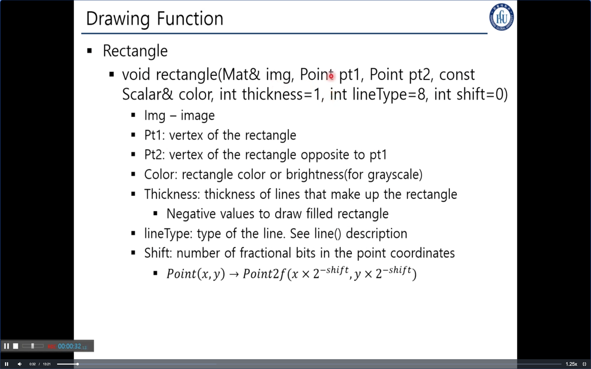
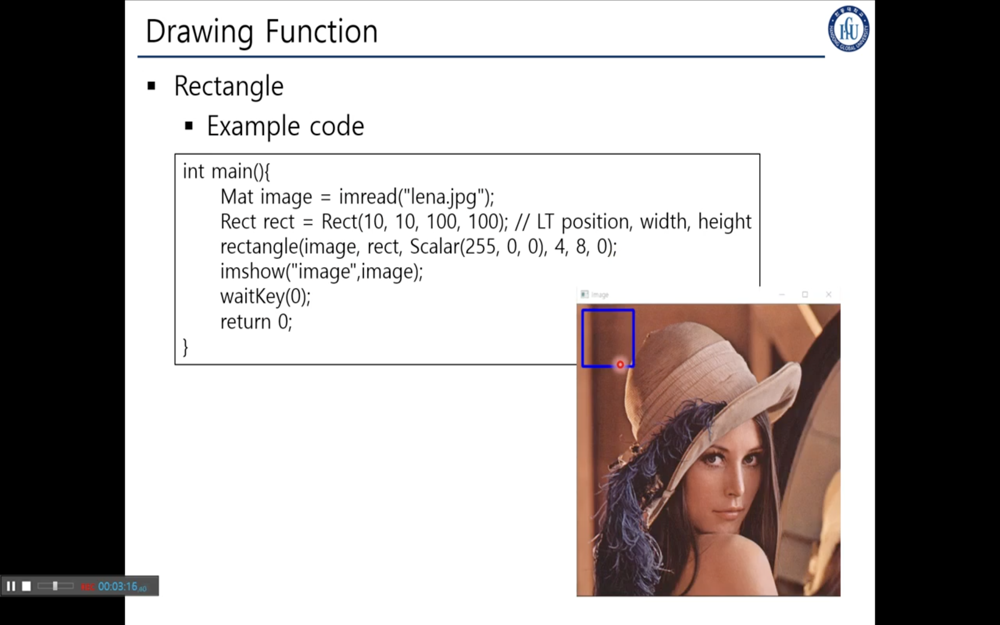

## 6. OpenCV Drawing Function

> ### 📄 4각형을 그리는 함수


```cpp
void rectangle( Mat& img,
                Point pt1, Point pt2,
                const Scalar& color,
                int thickness=1,
                int lineType=8, int shift=0
);

void rectangle( Mat& img,
                Rect rec,
                const Scalar& color,
                int thickness=1,
                int lineType=8, int shift=0
);
```

* Img : 4각형을 그릴 영상
* 사각형을 구성하는 좌표 Rect `Rect(xLT, yLT, width, height)`
    * Pt1: vertex of the rectangle
    * Pt2: vertex of the rectangle opposite to pt1
* Color: rectangle color or brightness(for grayscale)
* Thickness: thickness of lines that make up the rectangle
* Negative values to draw filled rectangle
* lineType: type of the line. See line) description
* Shift: number of fractional bits in the point coordinates

#### 예제 코드


* Scalar BGR 순서로 기입한다.

---

### 📄 선과 원을 그리는 함수
