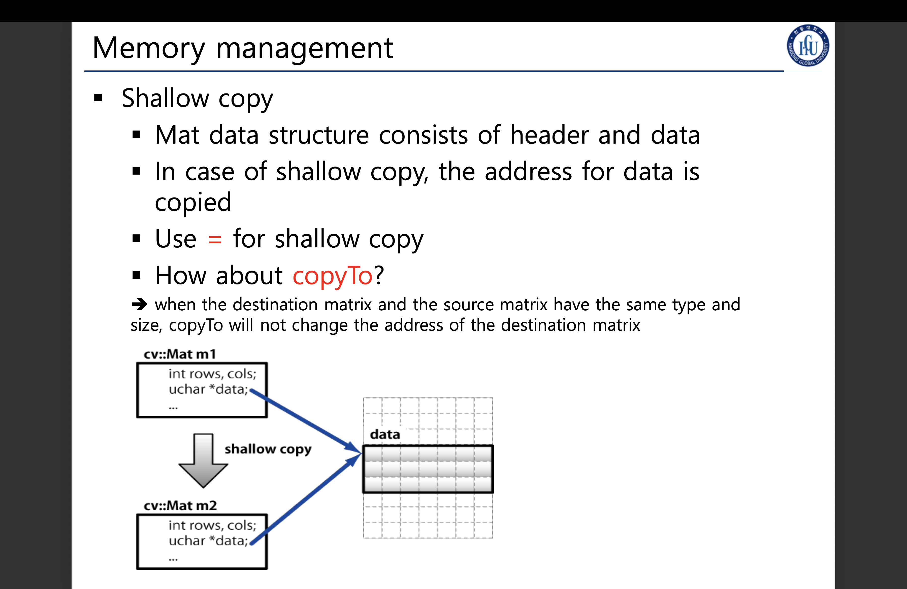
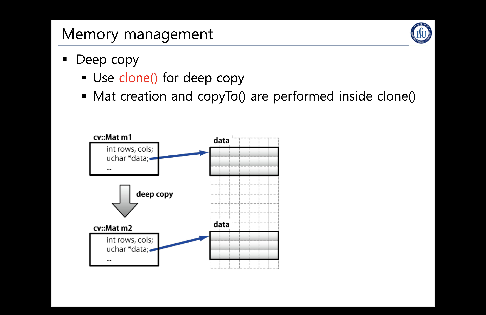
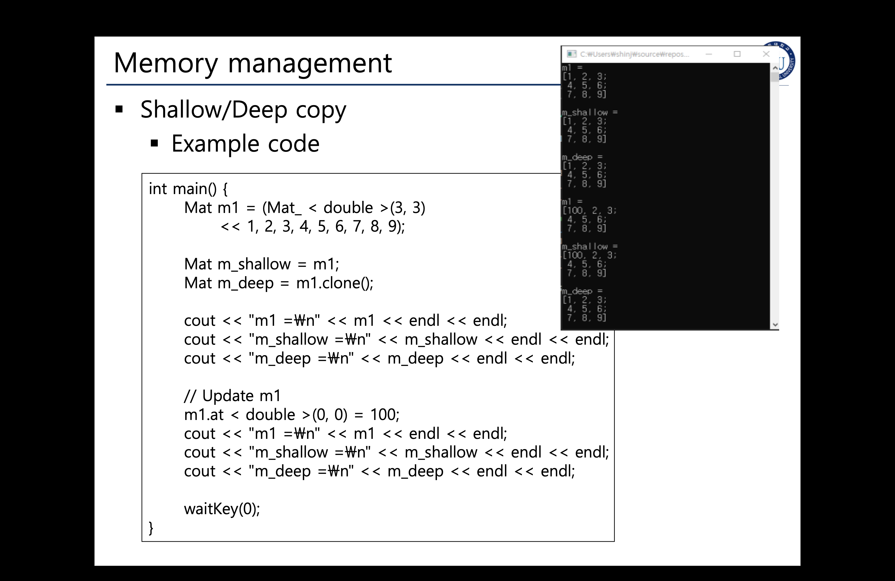
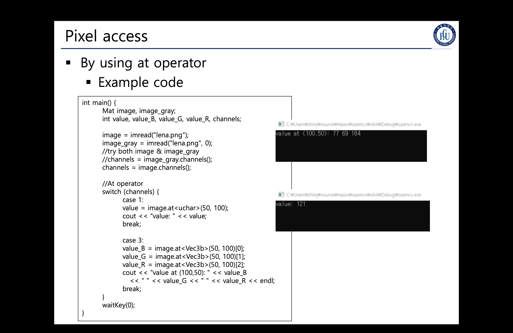
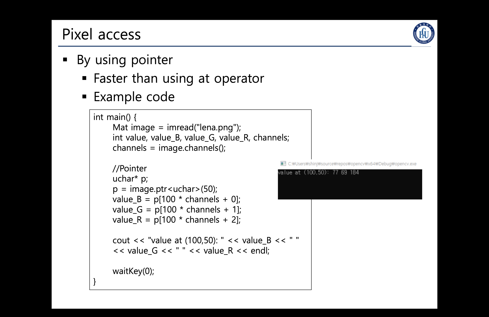
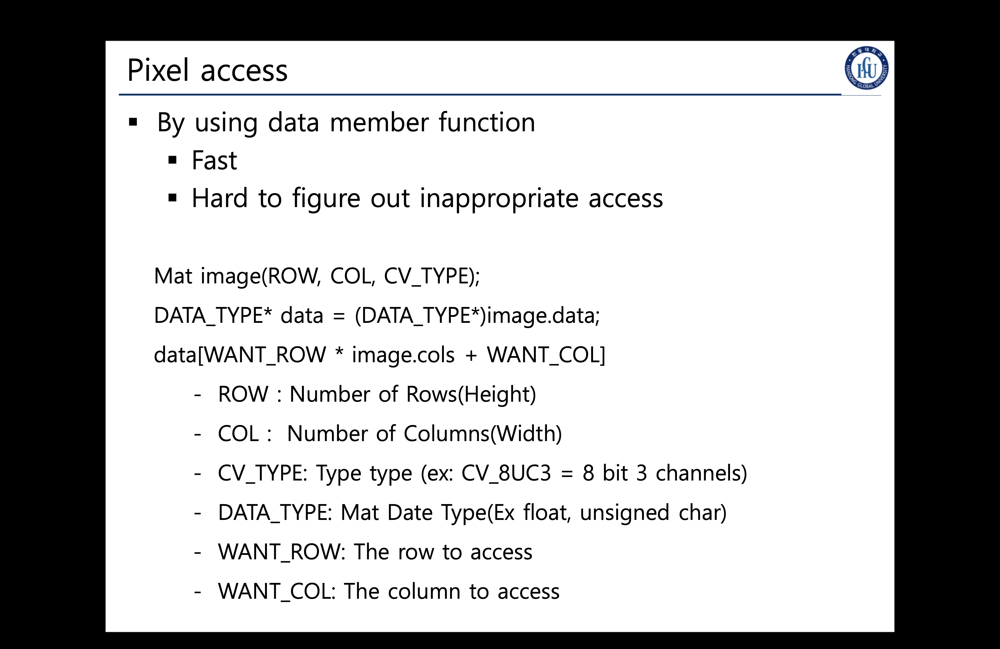
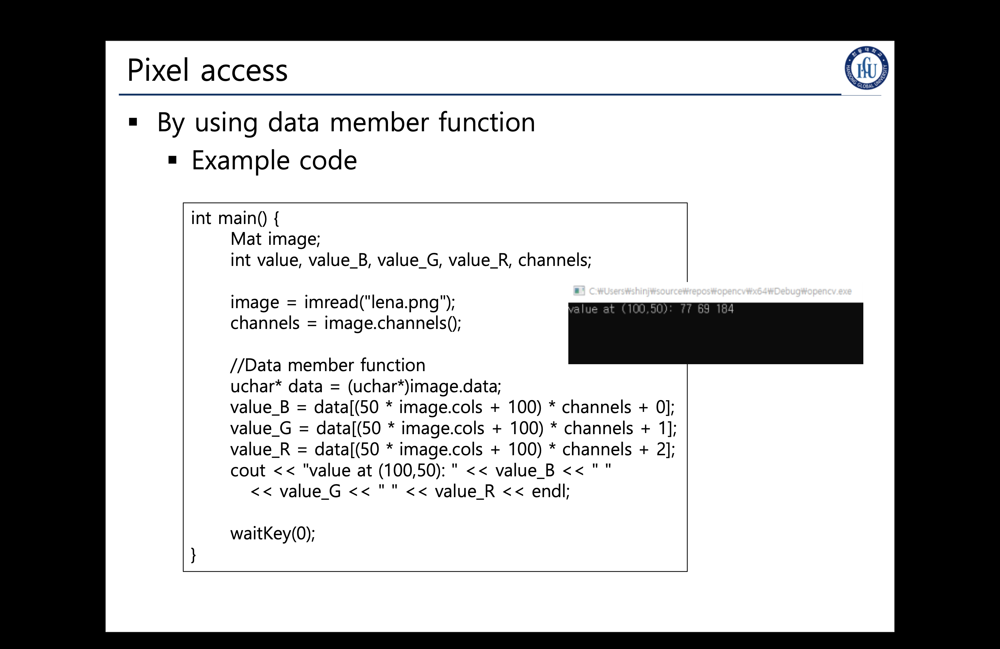
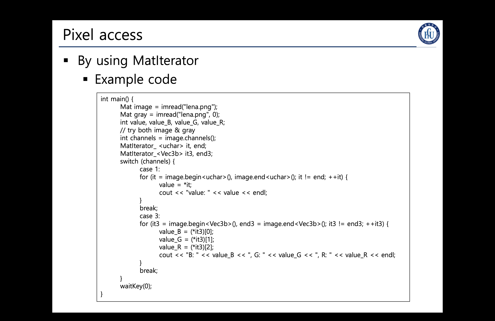

## Memory Management And Pixel Access

> ### 📄 1. 얕은 복사 VS 깊은 복사

#### 1). Shellow copy

    
    <h5></h5>

* `Mat` 데이터 구조는 header와, 실제 픽셀을 담는 data로 이뤄져 있다.
* Shellow Copy 방식의 복사는 address의 복사이다.
따라서 그냥 Mat을 대입`=`하고, 사용하는 것은 얕은 복사인 것이다.

*  .. 엥 cpp은 무조건 new 된 객체만 포인터연산을 수행하는게 아닌가?
   * 따라서 대입 연산자는 디폴트가 deepcopy이여야 할 텐데..
   * 혹시 `operator=`의 연산자 오버라이딩이 적용되서, 디폴트 대입 연산자로 deepcopy 기능을 오버라이딩해서
   address 대입으로 한 건가?
* `copyTo()`를 조심해야한다 어떨때는 Deep, Shallow가 된다.
  * 입력 매트릭스와, 결과 매트릭스 데이터타입과, 크기가 같은경우, ShallowCopy가 일어난다.

#### 2). Deep copy

    
    <h5></h5>

  * `clone()` 함수를 사용하면 깊은 복사 즉, data들이 전부 복사된다.
  * Mat 생성과, copyTo()는 대표적인 딥카피 연산이라 할 수 있다.

#### 3). 비교

    
    <h5></h5>

* 이걸 구별하는 의의..
  * A를 변경하면 B도 변경되는가? : Shellow Copy
  * A를 변경하든 말든 B는 변경에 상관없나? : Deep Copy

> ### 📄 2. Pixel Access

#### 1). `image.at<T>(YIndex, XIndex)`

    
    <h5></h5>

* `<T>`는 Mat 데이터 타입의 템플릿 자료
  * 가로, 세로는 Mat 템플릿의 가로 세로 배열 길이
  * `at<T>(y, x)`는 접근과 추가로, validity check를 하기 때문에 조금 느리지만, 안전하다.

#### 2). `Pixel Pointer`

    
    <h5></h5>

    
    <h5></h5>

    
    <h5></h5>

* 포인터를 사용하는 기법도 있다, 포인터는 8byte 크기의 주소라고 했지? `0xFFFF`
  * 실제로 이런 크기의 자료형을 제공해 주는데. `ull* p`이 가능하지 않겠어?
    다~만, Mat의 각 원소별 포인트 크기는 바로 `CV_8UC3`이다, 즉 unsigned char* 임.
* 따라서 Mat의 픽셀 포인터는 바로 `uchar*`을 사용한다.
* 포인터를 쓰면 좋은점, 진~~짜 검증도 안하고 바로 접근하겠지 그러다보니
안전하지 않아서 (오류가 안떠서) 잘못 코딩할 가능성이 매~우 높음

#### 3). `MatIterator_<T> begin, end`

    
    <h5></h5>

* 주로 특정 픽셀을 접근하는게 아니라, 이미지 전체를 가장 빠르게 다루기 위해서 사용되는 명령이다.
