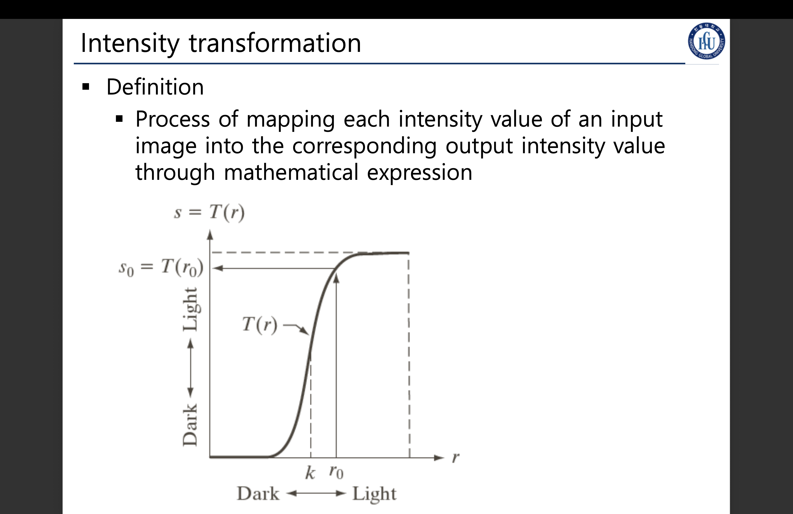
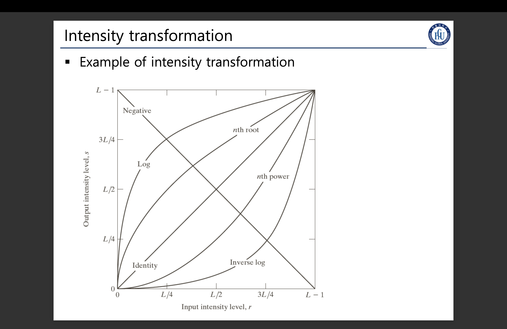
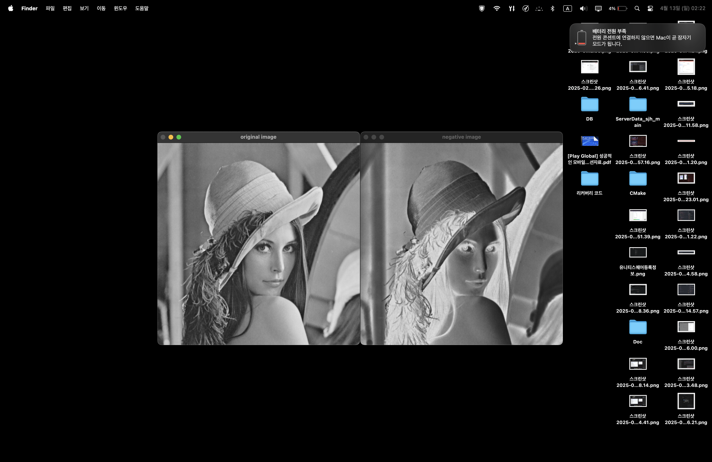
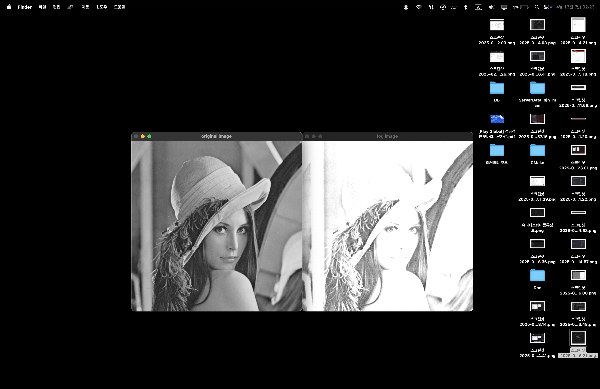
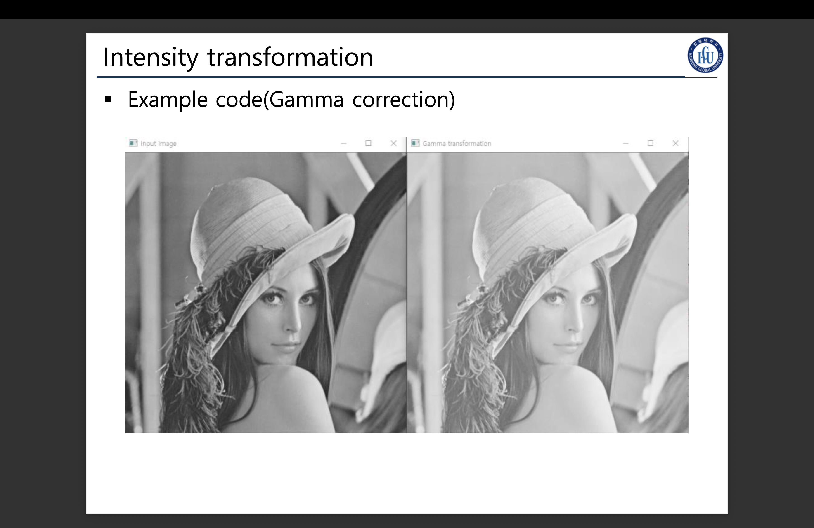
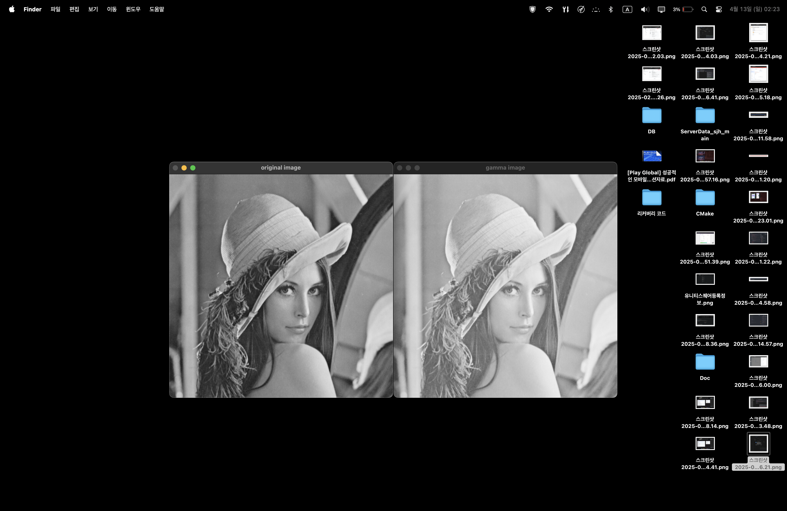
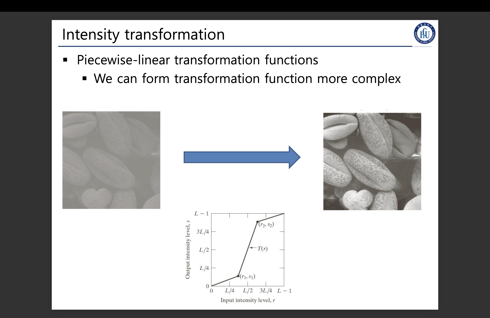
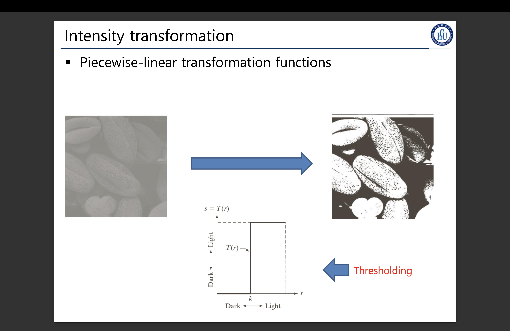

## 밝기값 변환

> ### 📄 1.  정의

<div align=center>
    
    <h5></h5>
</div>

* X축은 입력 영상들의 각 픽셀이 가질 수 있는 값,
* Y축은 출력 영상들이 각 픽셀들이 변하게 되는 값
* Mat 형식의 자료를 구성하는 픽셀 의 intensity가 r(input)이 되어,
s(output)이 다른 intensity값으로 리턴 되는데.
* 그, 변환은 수학 공식을 통해 반환된다

<div align=center>
    
    <h5></h5>
</div>

* 어떤 매핑함수를 사용하냐에 따라 각각 다른 결과물이 나오는데 이번에
다룰것은, "로그, 네거티브, 지수" 이렇게 되겠다.

> ### 📄 2.  네거티브
* 인텐시티 레벨 범위가 다음과 같고 $[0, L-1]$
* 이 밝기값 변환은 하양, 회색 부분의 강조를 위해 사용될 수 있다.
어두운 영역에 디테일이 숨겨져 있을 때, 그것을 잘 확인하기 위해 사용한다 보면 된다.

```cpp
int INTENSITY_MAX = L-1
NegTransform(r) {return INTENSITY_MAX - r;}
s = NegTransform(r);
```

```cpp
void NegTransformation(uchar& r) {r = 255 - r;}

int main() {
    Mat image = imread("./resources/lena.jpg", 0); // 마지막 패러미터가 0이면 GRAYSCALE로 읽기.
    Mat negative_img = image.clone();
    for(auto& pixel : negative_img.begin<uchar>()) {
        NegTransformation(pixel);
    }

    imshow("input image", image);
    imshow("output(negative) image", negative_img);

    waitKey(0);
}
```

<div align=center>
    
    <h5></h5>
</div>

> ### 📄 3.  로그 변환

* 협소한 부분의 밝기값을 더 넓게 할 때 사용한다. r은 입력, s는 출력값, c는 상수값

* 로그 변환은 낮은 인텐시티 값들의 범위가 굉장히 좁을때, 이것을 넓혀준다
어두운 영역의 숨어있는 디테일, 대비(각각 인접한 픽셀들의 차이)를 더 선명하게 만들어 준다.
하지만, 밝은 영역의 디테일은 낮아지므로, 밝은 이미지에 적용하는것은 적합하지 않다.

* 왜 1 + r에 대해서 로그를 취할까? 그 이유는
$log(0) = -\inf$ 이므로.. 정의될 수 없다.

```cpp
LogTransform(c, r) {return c * log(1+r);}
s = LogTransform(c, r);
```

```cpp
#include <cmath>
void LogTransform(double c, uchar& r) {r = c * log(1+r);}

int main() {
    Mat image = imread("./resources/lena.jpg", 0); // 마지막 패러미터가 0이면 GRAYSCALE로 읽기.
    Mat float_image, log_image;
    // 로그 변환에서 사용할 수 있으려면, Float형의 데이터 타입을 써야 하므로 그렇다.
    image.convertTo(float_image, CV_32F); // DeepCopy인듯.
    float_image = abs(float_image) + 1;
    // 0~ 255같은 정수 범위가 아니라, 실수 변환이 되므로 그렇다.
    log(float_image, float_image);
    // 실수 로그 변환 된것을 다시 0~255사이로 존재하도록 정구화 시켜준다.
    normalize(float_image, float_image, 0, 255, NORM_MINMAX);
    convertScaleAbs(float_image, log_image, C);

    imshow("original image", image);
    imshow("log image", log_image);

    waitKey(0);
}
```

<div align=center>
    
    <h5></h5>
</div>

> ### 📄 4.  지수(감마) 변환
<div align=center>
    
    <h5></h5>
</div>
<div align=center>
    
    <h5></h5>
</div>
<div align=center>
    
    <h5></h5>
</div>

```cpp
GammaTransform(c, r) {return c * pow(r, γ);}
```

* 새츄레이트 캐스트란.. 0~255 범위에 대응될 수학 그래프를 그린다고 생각하면 될 듯?
* 하지만 saturate란 함수가 본래 범위를 초과하는 값을 0~255 사이의 값으로 매핑해주는 함수라 사용한듯.

```cpp
int main() {
    Mat image = imread("./resources/lena.jpg", 0);
    Mat gamma_image;
    MatIterator_<uchar> it, end;
    const float gamma = 0.5;
    uchar pix[256]; // 일명 룩업 테이블 픽셀 Intencity에 대응되는 값을 매핑해 주는 함수를 제작하는것이다.
    for(int i = 0; i < 256; i++) {
        // i는 0~255사이의 범위를 가진다.
        // 그리고 이걸 0~1사이의 값을 가지도록 하고 감마 제곱을 시킨다.
            // 만약 이걸 0~1사이 값을 안하게 되면, 존~~~ 매우 큰 값을 가지게 되므로 그렇다.
            // 그렇게 되면 그냥 하얀 이미지만 나올 것이 분명하다.
        pix[i] = saturate_cast<uchar>(
            pow((float)(i/255.0), gamma) * 255.0f
        );
    }
    gamma_image = image.clone();

    for(it = gamma_image.begin<uchar>(); it != gamma_image.end<uchar>(); ++it) {
        *it = pix[*it];
    }

    imshow("original image", image);
    imshow("gamma image", gamma_image);
    waitKey(0);
    return 1;
}
```

* 감마 지수값에 따라
    * 값이 작으면 어두운 픽셀 디테일을 강조 (어지간히 어둡지 않으면 계속 밝게)
    * 값이 크면 밝게 픽셀의 디테일을 강조 (어지간히 밝지 않으면 계속 어둡게)

<div align=center>
    
    <h5></h5>
</div>

> ### 📄 5.  Piecewise 선형 변환
* Point를 여러개 두어 그래프를 생성,
<div align=center>
    
    <h5></h5>
</div>

* 즉, 위 그래프같은 경우는, 중간 밝기를 더 넓은 영역으로 매핑해 준다.
즉, 결과는 Contrast가 살아난다.
좋은 매핑함수를 적용하는 것은 바로 오밀 조밀 뭉쳐져 있는 (다만, 명도가 낮은) 그래프를
펼쳐주기 위해 사용할 수 있다.

<div align=center>
    
    <h5></h5>
</div>
* 이 쪼개진 영역을 어떻게 정하느냐에 따라 Thresholding과 다를바가 없어진다.
즉, 스레숄딩도 특수한 인텐시티 트랜스포메이션이라고 불일 수 있다는 것 이다.
