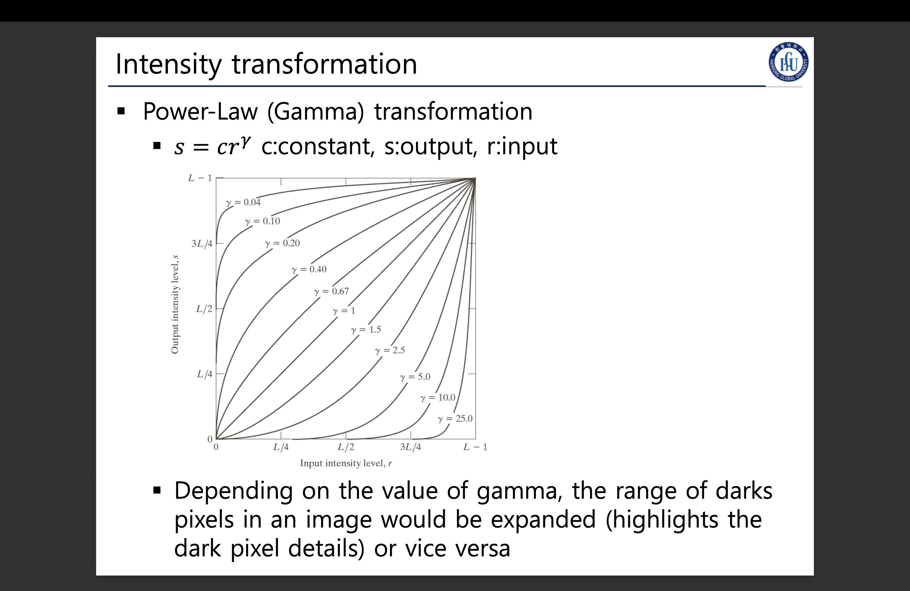

### 밝기값 변환
#### 정의


* Mat 형식의 자료를 구성하는 픽셀 의 intensity가 r(input)이 되어,
s(output)이 다른 intensity값으로 리턴 되는데.
그, 변환은 수학 공식을 통해 반환된다

#### 네거티브
인텐시티 레벨 범위가 다음과 같고 $[0, L-1]$
이 밝기값 변환은 하양, 회색 부분의 강조를 위해 사용될 수 있다.
```cpp
int INTENSITY_MAX = L-1
NegTransform(r) {return INTENSITY_MAX - r;}
```

```cpp
void NegTransformation(uchar& r) {r = 255 - r;}

int main() {
    Mat image = imread("./data/lena.jpg", 0); // 마지막 패러미터가 0이면 GRAYSCALE로 읽기.
    Mat negative_img = image.clone();
    for(auto& pixel : negative_img.begin<uchar>()) {
        NegTransformation(pixel);
    }

    imshow("input image", image);
    imshow("output(negative) image", negative_img);

    waitKey(0);
}
```


#### 로그 변환

협소한 부분의 밝기값을 더 넓게 할 떄 사용한다.
이말은 즉, "어두운 영역" VS "회색조, 혹은 아주 약간 하얀 영역"의 대비를 높여
흑백의 경계를 더 명확하게 나누는데 사용한다.
```cpp
LogTransform(c, r) {return c * log(1+r);}
```

```cpp
#include <cmath>
void LogTransform(double c, uchar& r) {r = c * log(1+r);}

int main() {
    Mat image = imread("./data/lena.jpg", 0); // 마지막 패러미터가 0이면 GRAYSCALE로 읽기.
    Mat float_img, log_img;
    const double c = 1.5f;
    image.convertTo(float_img, CV_32F); // DeepCopy인듯.
    float_img = abs(float_img) + 1;
    log(float_img, float_img);
    normalize(float_img, float_img, 0, 255, NORM_MINMAX);
    convertScaleAbs(float_img, log_img, c);
    imshow("input image", image);
    imshow("output(log) image", log_img);

    waitKey(0);
}
```


#### 지수(감마) 변환



```cpp
GammaTransform(c, r) {return c * pow(r, γ);}
```

* 새츄레이트 캐스트란.. 0~255 범위에 대응될 수학 그래프를 그린다고 생각하면 될 듯?
* 하지만 saturate란 함수가 본래 범위를 초과하는 값을 0~255 사이의 값으로 매핑해주는 함수라 사용한듯.

```cpp
int main() {
    Mat image = imread("./data/lena.jpg", 0);
    Mat gamma_img;
    MatIterrator_<unchar> it, end;
    flaot gamma = 0.5;
    uchar pix[256];
    for(int i = 0; i < 256; i++) {
        pix[i] = saturate_cast<uchar>(
            pow((float)(i/255.0), gamma) * 255.0f
        );
    }
    gamma_img = image.clone();
    for(it = gamma_img.begin<uchar>(), end = gamma_img.end<uchar>(); it != end; it++) {
        *it = pix[(*it)];
    }

    imshow("input image", image);
    imshow("output(gamma) image", gamma_img);
    waitKey(0);
}
```

감마 지수값에 따라,
* 값이 크면 어두운 픽셀 디테일을 강조 (어지간히 밝지 않으면 계속 어둡게)
* 값이 작으면 밝게 픽셀의 디테일을 강조 (어지간히 어둡지 않으면 계속 밝게)


#### Piecewise 선형 변환


* Point를 여러개 두어 그래프를 생성,
* 이 쪼개진 영역을 어떻게 정하느냐에 따라 Thresholding과 다를바가 없어진다.
