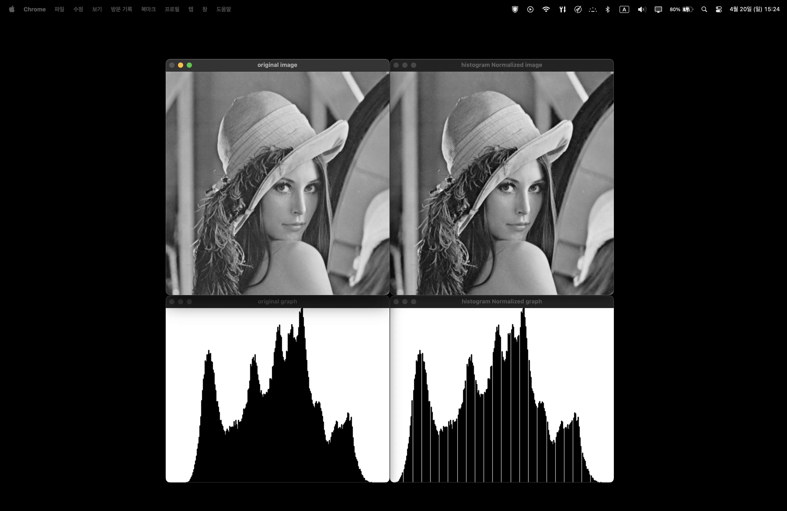
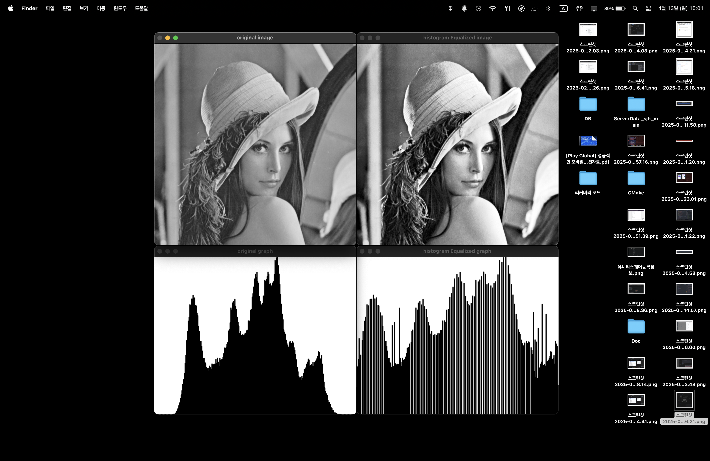

## 히스토그램 평탄화

> ### 📄 1 히스토그램이란.

<div align=center>
    
    <h5></h5>
</div>

#### 1). $h(r_k)$ : 히스토그램 함수는 영상을 막대형 그래프로 표현한 것.

* **가로 축** : 사용중인 이미지가 가지는 $[0, L-1]$ 사이의 인텐시티 범위
    $\{k^{th} | 0 \leq th < 255\}$ : $k^{n}$는  인텐시티가 n인 픽셀
    $r_k$ : $k^{n}$ 인텐시티를 가진 픽셀
* **세로 축** : 사용중인 이미지가 가지는 픽셀별 인텐시티의 정량 개수.
    그 인텐시티에 해당되는 픽셀의 개수말한다.
    $n_k$ : $k^{n}$ 인텐시티를 가진 픽셀의 개수

#### 2). 히스토그램의 Bin
* 막대그래프의 x축에서 각 막대 그래프의 폭, 또는 interval을 bin이라고 부른다.

#### 3). 히스토그램을 보고 알 수 있는 정보.
1. **영상의 밝기** :
   픽셀들이 좌측(어두운쪽)에 치우쳐져 있는지,
   우측(밝은쪽)에 치우쳐져 있다.
2. **명암비** :
   그래프의 분산도가 좁다면 명암비가 낮다,
   하지만, 분산된 형태가 넓은 구간에서 그래프가 나타난다면 명암비가 높다고 할 수 있다.

> ### 📄 2. 히스토그램 정규화

<div align=center>
    
    <h5></h5>
</div>
<div align=center>
    
    <h5></h5>
</div>

* `n번째 인텐시티를 가진 픽셀의 수  / 전체 픽셀의 개수`로 나눈 어떤 수를
  그렇게 되면 각각의 픽셀의 bin이 가질 범위는 $0~1$ 사이 값을 가질 것이다.
* 이것을 확률 함수를 활용할 수 있다.
  영상 내의 특정한값을 픽셀이 존재할 확률이 이 정규화 된 히스토그램으로도 표현될 수 있다는 것이다.
* 굉장히 많이 쓰인다. Bin의 갯수가 너무 많지 않게, 특정한 빈도가 1, 2가 많이 나타나지 않도록
  Bin의 값을 잘 조절하는것이 좋다.


> ### 📄 3. 히스토그램 평탄화.
<div align=center>
    
    <h5>제일 우측이 constrast가 높고, 히스토그램이 상대적으로 골고루 분포되어 있다.. <br> 나머지는 한쪽으로 치우쳐 져 있고, 넓게 분포되지 않다</h5>
</div>
<div align=center>
    
    <h5>1. 입력 영상 을 히스토그램으로 분석, <br>2. 히스토그램을 최대한 평평하게, 평활화 할 수 있게끔 만드는 매핑 함수를 구한다. <br>3. 그 함수를 구했다면 입력 영상에 매핑을 시키면 된다.</h5>
</div>
<div align=center>
    
    <h5></h5>
</div>

#### 1). 평탄화를 하는 이유

* 평탄화(플랫) 하여, 대비(contrast)를 극대화하기 위해 사용합니다.
* 자주 등장하는 픽셀 값 주변의 대비를 키워 “밝은 영역은 더 밝게, 어두운 영역은 더 어둡게” 만들어 줍니다.
* 이미지의 히스토그램을 널리 널리 Skew된것을 퍼뜨리는 작업이다. 다르게 말하면 히스토그램 스트레칭(stretching)을 한다는것이다.


#### 2). `calcHist(images, nimages, channels, mask, hist, dims, histSize, ranges)`

1. `cosnt Mat* images` : 히스토그램으로 분석할 원본 이미지.
2. `int nimages` : 보통 1로, 입력 배열의 개수를 말한다.
3. `const int* channels` : 그레이 스케일인 경우 0, 만약 BGR인 경우 "B = {0}, G = {1}, R = {2}" 이렇게 배열의 인덱스를 넘긴다.
4. `InputArray mask` : ROI, 연산에 집중할 마스크
5. `OutputArray hist` : 히스토그램의 결과 이미지
6. `int dims` : 히스토그램의 차원수 1D = 1, 2D = 2
7. `const int* histSize` : 각 차우너별 Bin 개수를 가르키는 포인터, dims에 따라 달라지지만
    1D이면 &histSize (예: histSize = 256;)
8. `const float** ranges`

#### 3). 예제
```cpp
Mat hist, histImage;

// 히스토그램을 그리기 위한 캔버스 제작하기
int hist_w = 512, hist_h = 400;

// histSize는 bin의 사이즈, Bin의 개수 정해주고,
// Bin의 막대 그래프의 굵기를 캔버스 가로 크기 대비하여 정해준다.
// cvRound? 반올림의 뜻인듯.
int histSize = 256, bin_w = cvRound((double)hist_w / histSize);

// 이미지 입력값의 범위를 정해줌
float range[] = { 0, 256 };
const float* histRange = { range };

/* calcHist (
        &srcImage : 입력 이미지
        1 :  입력영상의 개수 : 여러 영상에 대해서도 그릴 수 있다.
        0 :  영상의 채널의 각 인덱스.
        Mat() : 특정한 부분에 대해 히스토그램을 분석하기 위해 마스크 설정
        hist : 히스토그램이 그려지게 될 캔버스
        1 : 히스토그램의 차원 1차원 2차원
        &histSize :  히스토그램의 크기 Bin의 사이즈
        &histRange : 히스토그램을 그리기 위해 사용될 입력값의 범위
)*/
calcHist(&srcImage, 1, 0, Mat(), hist, 1, &histSize, &histRange);

histImage = Mat(hist_h, hist_w, CV_8UC3, Scalar(255,255,255));

// 히스토그램의 최대 높이를 활용해 Normalize하게 된다.
// 히스토그램 막대기가 뚫고 나가지 않게끔하려고,
normalize(hist, hist, 0, histImage.rows, NORM_MINMAX, -1, Mat());

for(int i = 0; i < histSize; i++) {
    rectangle(histImage,
        Point(bin_w*i, hist_h), Point(bin_w*i, hist_h - cvRound(hist.at<float>(i))),
        Scalar(0,0,0), 2, 8, 0);
}
return histImage;
```

<div align=center>
    
    <h5></h5>
</div>

> ### 📄 5 항상 히스토그램 평탄화가 더 고품질의 이미지를 만드는 것일까?
<div align=center>
    
    <h5></h5>
</div>

* 항상은 그렇지 않은게, 한 인텐시티가 매우매우 대부분을 차지하고 있으면
오히려 평탄화 시키면 washed out된다.
* 위의 예시는 우주의 이미지인데, 어두운 영역이 더 압도적으로 많기 때문에
이게 오히려 흩뜨려지게되면 물빠진 색이 된다.
