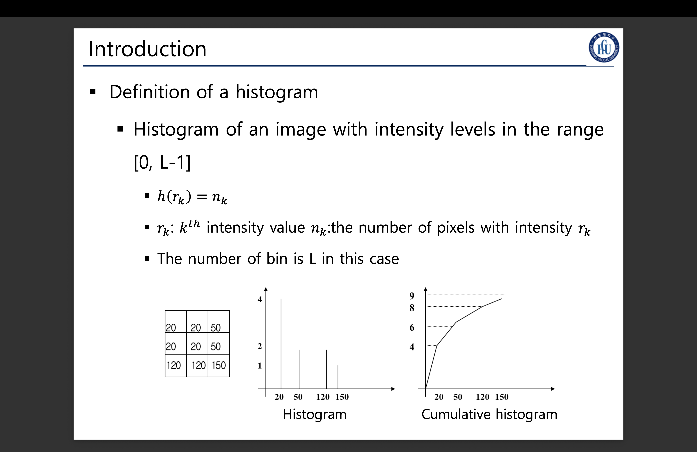
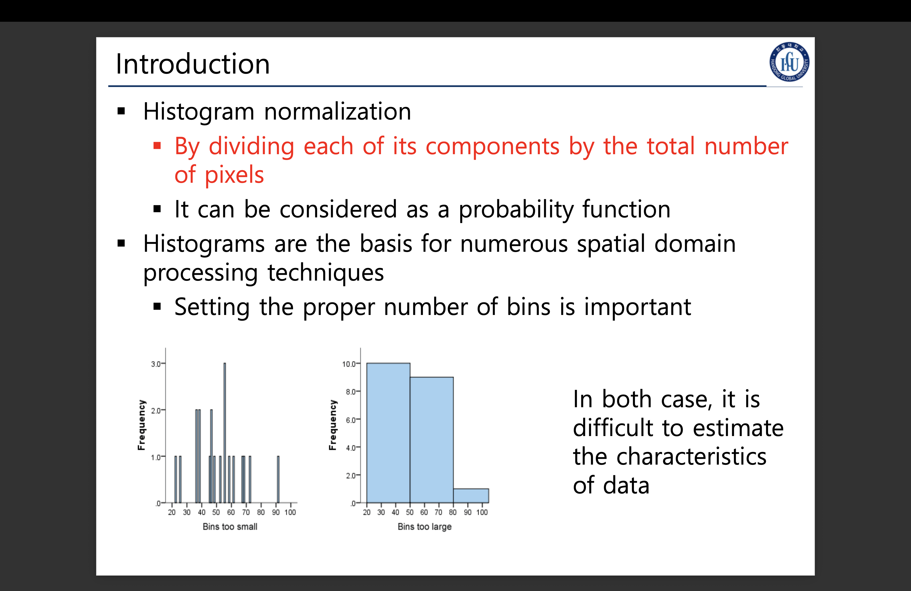
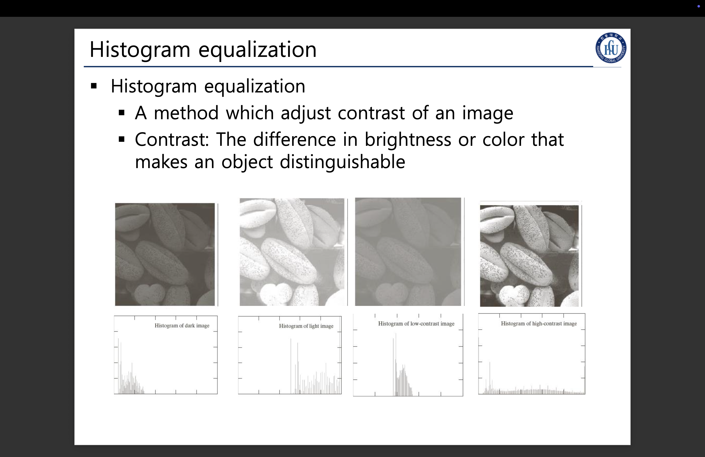
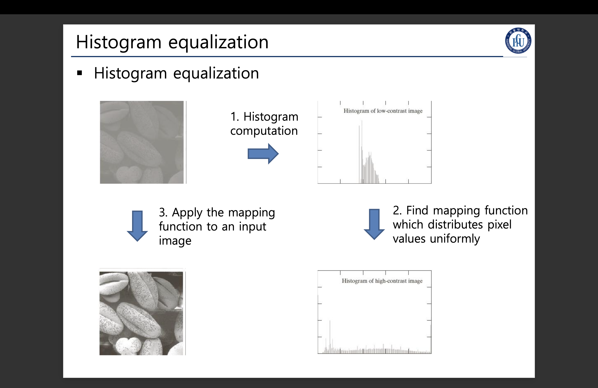
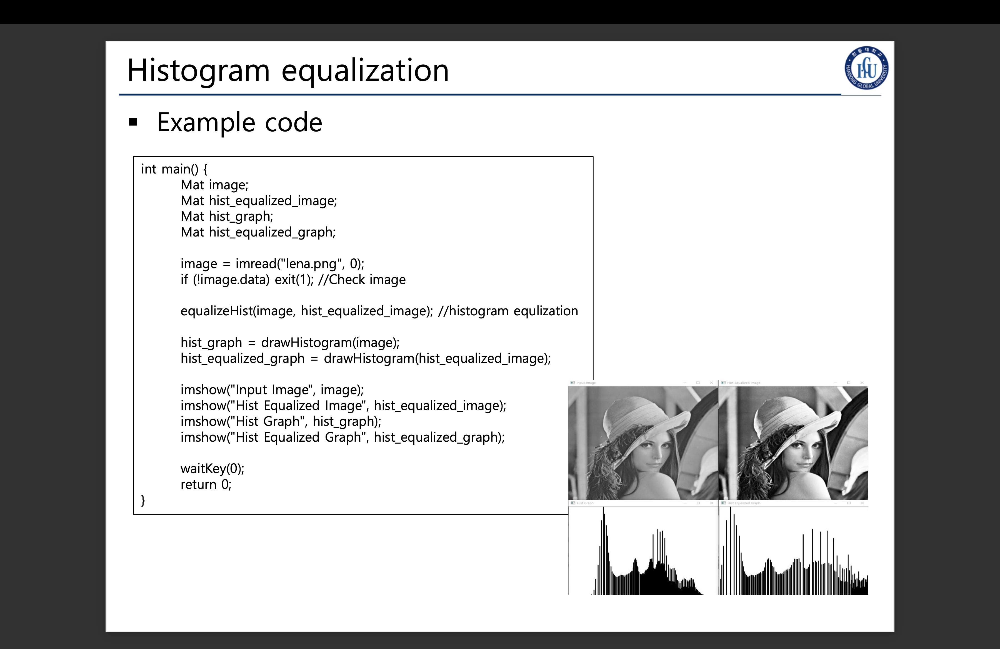
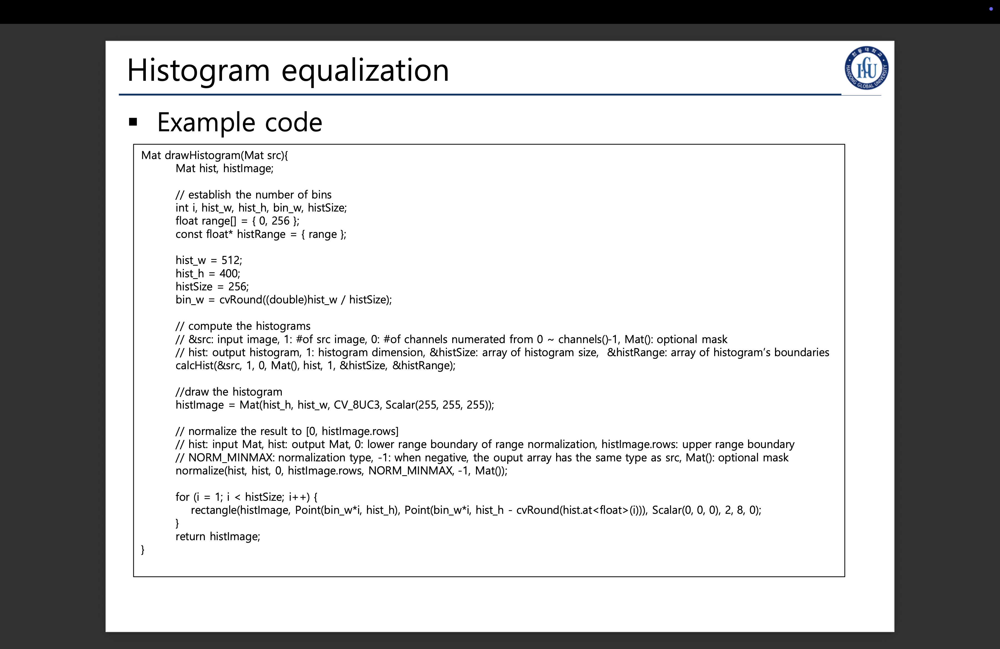
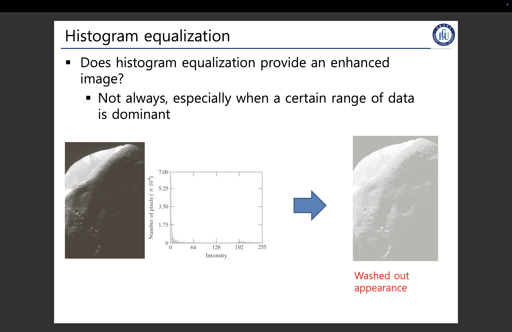

### 히스토그램 평탄화

#### 1). 히스토그램이란.

* $\{k^{th} | 0 \leq th < 255\}$ : $k^{n}$는  인텐시티가 n인 픽셀
* $r_k$ : $k^{n}$ 인텐시티를 가진 픽셀
* $n_k$ : $k^{n}$ 인텐시티를 가진 픽셀의 개수
* $h(r_k)$ : 히스토그램 함수

* 가로 축 : 사용중인 이미지가 가지는 $[0, L-1]$ 사이의 인텐시티 범위
* 세로 축 : 사용중인 이미지가 가지는 픽셀별 인텐시티의 정량 개수.

#### 2) 히스토그램 정규화

* `n번째 인텐시티를 가진 픽셀의 수  / 전체 픽셀의 개수`로 나눈 어떤 수를
n번째 인텐시티를 가진 픽셀에다가 나누면 된다.

#### 3). 히스토그램 평탄화.

* 이미지의 히스토그램을 널리 널리 Skew된것을 퍼뜨리는 작업이다.
* 이는, 흑 백의 대비를 더 뚜렷하게 만든다.

#### 4). 항상 히스토그램 평탄화가 더 고품질의 이미지를 만드는 것일까?

* 항상은 그렇지 않은게, 한 인텐시티가 매우매우 대부분을 차지하고 있으면
오히려 평탄화 시키면 washed out된다.
* 위의 예시는 우주의 이미지인데, 어두운 영역이 더 압도적으로 많기 떄문에
이게 오히려 흩뜨려지게되면 물빠진 색이 된다.
