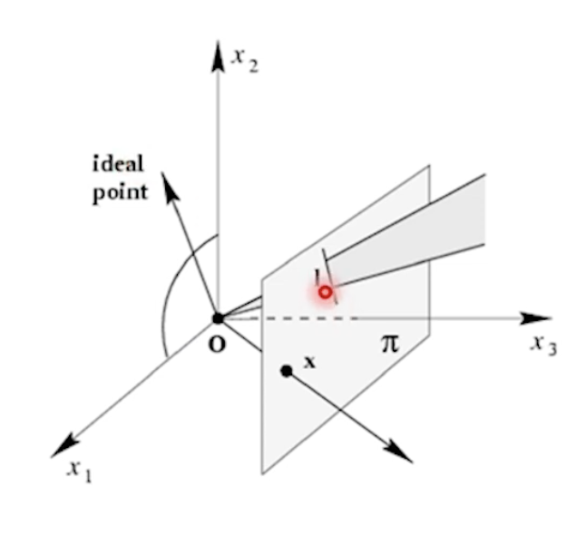

---
## 1. Homogeneous coordinate & 2D Transformation
---

> ### 📄 1. Homogeneous Coordinate

1. 현재는 인 호모지니어스 코디네이트라고 한다
2. 장점
   1. 하나의 행렬
   2. 무한대의 점을 표현하는데 장점

3. 선, 점을 표현가능할 수 있다.
   1. 재미있는 것.
      1. 인 호모지니어스 에서는 2개를 사용하는데
      2. 호모지니어스 에선 2차원인데 투영되는 점은 3개

---

1. 맨 마지막 값으로 w로 나눔.
따라서 w != 0이여야 한다.

2. 무한대 화표를 표현하기 위해서 w=0으로 둘 수 있다.

up to scale라는 말로 표현되어, 2d 이미지에 한 점으로 투영되는 모든 점을 표현 가능
업투_스케일로 같다라는 말로 표현됨

---

포인트와 라인 표현법

다음은 쌍대성
* 선 $l$과 $l'$이 교차하는 점은 외적으로 구할 수 있음
* 선 $x$과 $x'$이 이루는 선은 두 점을 외적으로 할 수 있다.

아이들 포인트, 라인, 무한대에서 만다는 선과, 점을 표현한다. point at infinite

선 $l$과 $l'$이 평행할 떄, 외적은 0

---

$x$ 는 점(원점을 지나는 ray가 평면에 접접하는것)
$l$은 선(원점을 지나는 방사형 평면이 평면에 접하는것)

---

> ### 📄 2. 2D Transformation

---

Projective Transformation
평면간의 변환은 3x3 행렬 $H$ 선형 변환이다.
외곡된 영상을 보정하는데 사용하기도 한다.

---

아이소메트리/유클리디안 트랜스포메이션

회전 변환

---

시뮬러리티 트랜스포메이션

크기 변환

---

아핀 트랜스포메이션

회전화 디폼 대신 평행선은 유지.
$0^{T}$ 가 의미하는 것

---

프로젝티브 트랜스포메이션

마지막 행이 드디어 0 0 1이 아니게 된다.

완전 외곡단, 직선은 직선으로 유지되는것

---

아핀 변환 리커버리

* 평행한 것들로 추정되거나 원래 그랬지만 프로젝티브에 의해 외곡된 것을
다시 평행하도록 변경하게 한다.

* Line at infinity and orthogonality
