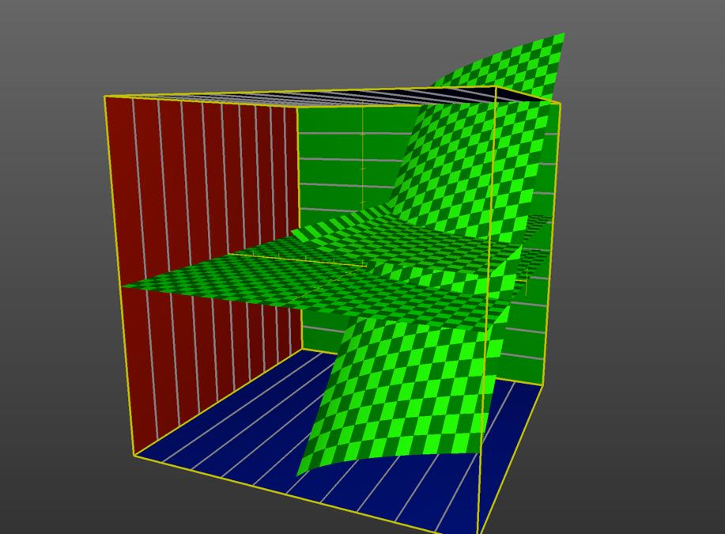
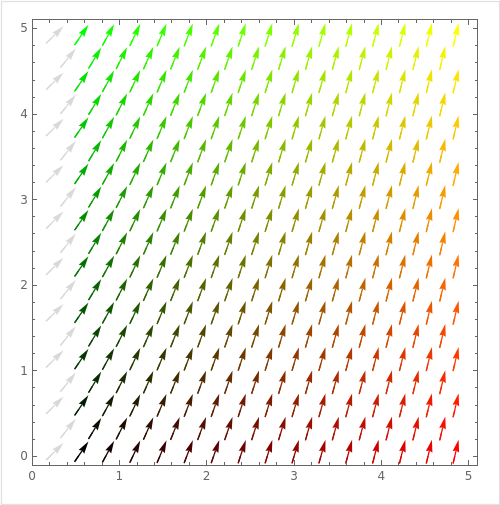
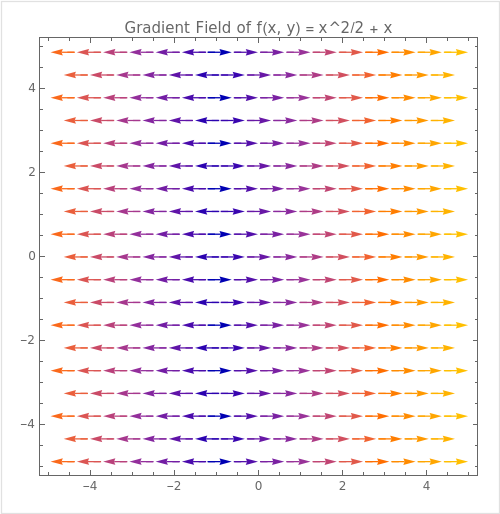

## 행렬 미적분

> ### 📄 1. 공간 필터링과 미분의 관계

* 에지 검출은 Intencity혹은 Color의 변화율을 기준으로 에지를 검출한다
* 변화율은 곧 미분계수 즉 접선의 기울기가 바로 변화율이라 할 수 있다.
* 즉 이 기울기가 가파른 정도에 대해 역치(Threshold) 기준을 정의한다면,
그 기준의 "충족/불충복" 으로 이진화를 시킬수 있지 않겠느냐? *네*

* 이미지는 2차원 배열 데이터 셋이고
N번째 행 $y$, M번째 열 $x$ 를 투입하면
정확히 그 위치의 픽셀 `Mat::at<T>(y, x)`을 얻어낼 수 있는데.
*비록 매끄럽지는 않고, 0~255 정수범위를 가지는 이산적인 함수지만* **$f(x, y)$** 라는 형태의 다변수 함수로 생각해 볼 수 있다.

> ### 📄 2. 이산적인 함수의 미분

* 일반적으로 미분과 적분은 매끄러운 연속적인 함수에 대해 다뤘지만,

* 지금은 계단식으로 나타나는 함수에 대해 미분을 해야한다.
* 이럴때 필요한것이 바로 "차분" 이라는 것 이/다.

* 차분이란, 이산적인 세계(정수)에서의 미분으로 볼 수 있다.

#### 1). 구분구적법과 비슷한데..?
##### ① 구분구적법 (이산적인 적분)
* 정적분을 수치적으로 근사하는 방법입니다.
* 사다리꼴 법칙, 심프슨 법칙 등이 있습니다
* 구간을 나누어 그 사이의 값을 더해 정적분을 구하는 방법입니다

##### ② 차분법 (이산적인 미분)
* 수치적으로(근사적으로) 미분을 구하는 방법입니다
* 전진 차분, 후진 차분, 중앙 차분 등이 있습니다
* 오일러법, 룬게쿠타법 등이 있습니다

#### 2). 유한 차분 3가지 (전진차분, 후진차분, 중앙차분)

##### 당연히 정확한 값을 내주지는 않는다. "근사" 해 지는것이라 오차가 존재한다.
그 오차라는 "절단 오차"라고 불리고, 테일러 급수를 사용하면 얻어볼 수 있다.
그리고 차분법에 따라서 오차의 크기도 각각 다르다.

##### ① 전진차분

* 0에 가까운 극도로 작은 수 $\Delta{x}$만큼 이동한 **$x_{i+1} = x+\Delta{x}$** 라고 할때
* 따지고 보면
    구하고자하는 좌표 **$(x, f(x))$** 와
    쬐금 이동한 **$(x_{i+1}, f(x_{i+1}))$** 좌표 사이에
    선을 딱 긋고, 그 기울기를 구한것 아닌가 싶다.
* 절단 오차는 $O(\Delta{x})$이다.

##### ② 후진차분
* 후진 차분은 위 전진 차분과 반대로, 한칸 쬐금 뒤인 **$(x_{i-1}, f(x_{i-1}))$**
좌표 사이에 선을 딱 긋고 그 기울기를 구한것.
* 절단 오차는 전진과 마찬가지로 $O(\Delta{x})$이다.

##### ③ 중앙차분

* 전진 차분과 중앙 차분은 **"딱 한칸"** 에 대해서 계산한 것이라면
* 중앙 차분은 구하고 싶은 **$(x, f(x))$** 가 있을때,
* 앞 & 뒤로 합해서 **"두칸"** 에 대해 계산한 것이다.
**$(x_{i+1}, f(x_{i+1}))$**,  **$(x_{i-1}, f(x_{i-1}))$** 사이를 선 긋고, 기울기를 구한것이다.
* 따라서 나눠야 하는 수도, 이전에는 $\Delta{x}$ 를 나눠서 탄젠트를 구했겠는데.
* 지금은 **$2 * \Delta{x}$** 로 나눠줘야 겠다.
* 절단 오차는 **$O((\Delta{x})^2)$** 이다. 오차율은 전진, 후진보다 훨씬 줄어들게 된다.
  이 말은 $\Delta{x}$가 $(0.1)^2$, $(0.01)^2$ , $(0.00000001)^2$
  이 작아지면 작아질 수록 점점 차분의 결과가 실제값과 거~~~~희 차이가 없어진다.

> ### 📄 3. 다변수 함수의 편미분

$$f_x(x_0, y_0) = \lim_{h→0} \frac{f(x_0 + h, y_0) - f(x_0, y_0)}{h}$$
$$f_y(x_0, y_0) = \lim_{h→0} \frac{f(x_0, y_0  +h) - f(x_0, y_0)}{h}$$

* 자, 이제 이산적인 데이터 셋에 대해 미분을 하는 방법을 알게 되었다.
* 그렇다면 2차원 배열 데이터 이산 함수에 대해 미분을 하려면 어떻게 해야 하나?
* 이럴때는 다변수 함수의 편미분을 사용하면 된다.
* 커널이란, 3x3, 5x5, NxM (단, N과, M은 홀수) 2차원 배열 필터 "마스크" 이다.
이 커널이라 불리는 필터 마스크가 바로, 편미분을 수행할때 사용되는 데이터다.
그리고 위의 차분을 통해 값을 계삲게 된다.

> ### 📄 4. 그라디언트

     
    <h5>1 : 가장 가파르게 눈에 띄는 곡면은 : z = y + x^{1/2}</h5>
    <h5>2 : 완만한 곡면은 편미분을 수행한 곡면 : z = 1 + {1/2} * x^{-1/2}</h5>

* 일명 얼마나 가파르게 값이 변경되는지에 대한 값을말하는데.
* 여기서는 $f(x, y)$ 의 그라디언트라고 하면 **결과는 벡터다**,
무슨 벡터나면 **세로축으로 몇만큼? 가로축으로 몇만큼의 가파르게 기울기를 가졌는지** $\vec{v} = (slope_y, slope_x)$를 각 **2차원 각각의 점마다 가지고 있는 벡터를** 표현한 것을 말한다.
* 그리고 기울기는 즉, 미분의 결과인것이라, **2차원 행렬 미분의 결과물이 곧 그라디언트**인 것이다.

$$
\nabla = \frac{\delta}{\delta{x}}\vec{l} + \frac{\delta}{\delta{y}}\vec{j} + \frac{\delta}{\delta{z}}\vec{k}
\\
\nabla{f} = \frac{\delta{f}}{\delta{x}}\vec{l} + \frac{\delta{f}}{\delta{y}}\vec{j} + \frac{\delta{f}}{\delta{z}}\vec{k}
$$

* If $f$ is a function of two variables $x$ and $y$,
then the gradient of $f$ is the vector function $\nabla f$ defined by
$$\nabla f(x,y) = \langle f_x(x, y), f_y(x, y) \rangle = \frac{\delta f}{\delta x} i + \frac{\delta f}{\delta y} j $$

* 예시
$$
f(x, y) = 3x + 2y
\\
\nabla{f} = 3\vec{l} + 2\vec{j}
$$

1. vector의 magnitude가 최대치가되는 픽셀이 바로 Intencity혹은 Color의 변화율가 가장 센 위치라고도 할 수 있다.
2. 또한 그 vector의 방향이 바로 변화정도가 가장 큰 방향이고, 이를 Normal을 적용하면, 곡면도 추정해 볼 수 있겠다.

#### 1). 그라디언트 텍스쳐

* 흑백으로 이뤄진 그라디언트 텍스쳐의 한 (x, y) 픽셀이 나타내는 흑백 색상의 의미는 (x,y) 그라디언트의 magniture를 의미하는것
  * YES : 흑백과 다채널 모두 그라디언트의 물리적/수학적 속성을 표현하는 방법이며,
  그 목적에 따라 선택적으로 사용됩니다.

* 빨강,초록 각각 x, y를 나타내는 복수 채널로 이뤄진 그라디언트 텍스쳐가 있다고 하면
이건 (x, y) 텍스쳐 픽셀이 나타내는 색상은 (x, y)의 그라디언트 벡터를 나타낸다고 이해 하면 되는가?
  * YES : 빨강/초록 채널의 텍스처가 각 픽셀에서 $(G_x, G_y)$ 벡터를 나타낸다고 이해하는 것은 올바른 해석입니다.

##### ① 흑백(단일 채널) 그라디언트 텍스처

* **각 픽셀의 값이 그라디언트의 크기(magnitude)를 의미**합니다.

  * 계산식: $\text{magnitude} = \sqrt{G_x^2 + G_y^2}$, 여기서 $G_x$와 $G_y$는 $x$-축과 $y$-축 방향의 그라디언트입니다.
* 흑백 톤의 밝기
  * 예를 들어 다음 함수는 x축에 대해 접선의 기울기가 항상 1로 증가하는 함수는 다음과 같음
    

        
        <h5></h5>
    

    $$
    f(x, y) = \frac{x^2}{2} + x
    $$

  * 어두운 픽셀: 작은 크기의 그라디언트(평탄한 영역, 변화가 거의 없음).
  * 밝은 픽셀: 큰 크기의 그라디언트(엣지나 급격한 변화가 있는 영역).

---

##### ② 복수 채널(R, G 또는 다른 컬러) 그라디언트 텍스처

* **$x$-축과 $y$-축 방향의 그라디언트를 각각 다른 채널로 저장**:

  * $R$: $x$-축 방향 그라디언트 ($G_x$).
  * $G$: $y$-축 방향 그라디언트 ($G_y$).
  * $B$: 선택적으로 다른 정보를 추가(예: 크기 $\text{magnitude}$ 등).

* **색상의 의미**:

  * 픽셀의 색상은 $(G_x, G_y)$라는 2차원 벡터를 나타냅니다.
  * 예를 들어, 특정 픽셀에서:

    * $G_x > 0, G_y = 0$: $x$-축 방향으로 양의 변화.
    * $G_x = 0, G_y > 0$: $y$-축 방향으로 양의 변화.
    * $G_x \neq 0, G_y \neq 0$: 대각선 방향 변화.
  * 색상의 강도는 그라디언트 크기에 비례할 수도 있습니다.

---

##### ③ 추가적인 해석

* 이렇게 복수 채널을 사용하면 그라디언트 방향과 크기를 동시에 저장할 수 있습니다:
    * **방향(각도)**: $\theta = \arctan\left(\frac{G_y}{G_x}\right)$.
    * **크기**: $\sqrt{G_x^2 + G_y^2}$.

* 이 정보는 주로 엣지 검출, 경계선 추적, 텍스처 분석, 벡터 필드 시각화 등에 유용하게 사용됩니다.

---

> ### 📄 참고

#### 1). 미적분학
* 미적분학 1 : https://www.youtube.com/watch?v=9ya4hWhxwLs
* 미적분학 2 : https://www.youtube.com/watch?v=HDK6ljtDkxg
* 벡터미적분 : https://www.youtube.com/watch?v=nma8R7sMuv0
* 편미분과 그라디언트 : https://www.youtube.com/watch?v=bUNqn1G1O7E
* https://angeloyeo.github.io/2019/08/25/gradient.html

#### 2). 수치 해석

* [IQ95 The Homo Lamarckians : 수치해석학 및 C++20](https://www.youtube.com/watch?v=N3-irK3QxWU&list=PLsIvhalfft1GItYGoQsqV841TpTOheLf7)
* [전진 차분, 후진 차분, 중앙 차분](https://blog.naver.com/PostView.naver?blogId=mykepzzang&logNo=220069937244&parentCategoryNo=&categoryNo=&viewDate=&isShowPopularPosts=false&from=postView)
* [미케엔지 : 수치해석 10장](https://www.youtube.com/watch?v=p-J5ZpgGw5U)
