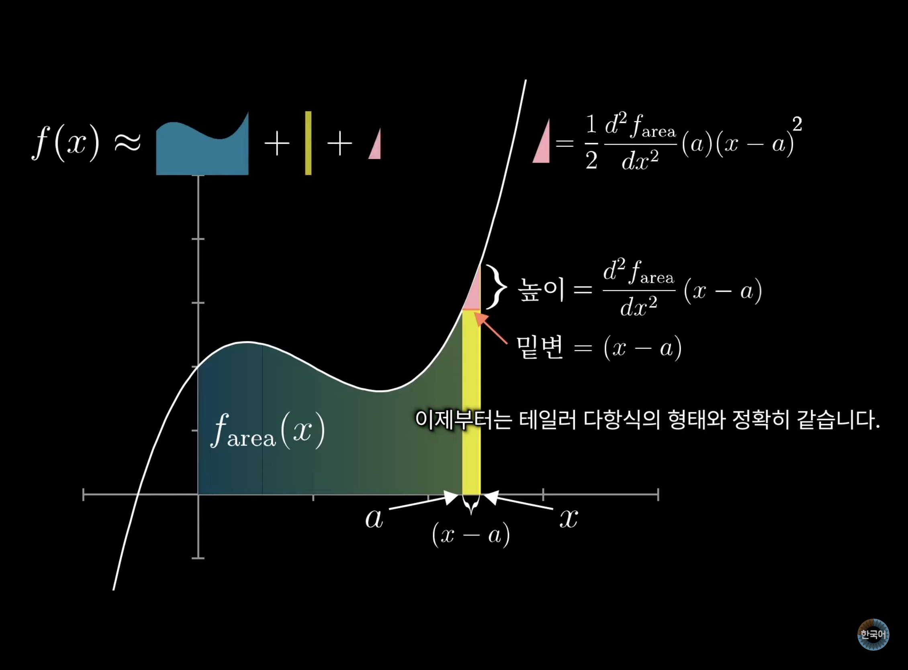

## 테일러 급수

> ### 📄 도함수

* $f(x) = ax^3 + bx^2 + cx + d$의 그래프에서 각각의 계수의 부호 구하기
    ```
    a : 그래프의 오른쪽 끝이 올라면 양, 내려가면 음
    d : f(0) 값 구하기 y절편
    c : f'(0)의 값 구하기 즉, 아무 점에서 접선의 기울기 구하기
    b : x = 0에서의 곡률, 위로 볼록이면 f''(0)은 음수, 아래로 볼록이면 f''(0)은 양수
    ```

* 1계 미분, 2계 미분
    | **특징**      | **1계 미분 $f'(x)$**      | **2계 미분 $f''(x)$**          |
    | ----------- | ------------------------ | ----------------------------- |
    | **의미**      | 함수의 변화율 (기울기)            | 변화율의 변화 (굽음, 곡률)              |
    | **해석**      | 접선의 기울기                  | 곡선의 굽음                        |
    | **실제 예**    | 속도 ($v = \frac{ds}{dt}$) | 가속도 ($a = \frac{d^2s}{dt^2}$) |
    | **기하학적 의미** | 그래프의 접선의 기울기             | 그래프의 곡률(굽음)                   |


> ### 📄 테일러 급수


#### 1). 급수 (Series)

* **개별적(이산적)인 항(수, 함수) 들을 무한하게 더하거나 빼는 무한합**
  *신기하게도 연속적인 성격을 지닌 함수도 이산적으로 합한다 라는 점이.. 특이하게 느껴진다.*
  영어로 시리즈라고 하는게 1탄 2탄 이런식으로 쭉- 나열된 이미지와 부합한다.
* Sequence(수열)과 Series(급수)의 차이는
  "수열은 그냥 수를 나열한 것"
  **"급수는 수열을 다 덧셈으로 연결한것"**


##### ① 급수의 종류

1. **등차 급수**
    * 가우스일화로 유명한 "등차수열의 합" 같은것
    * 이산적인 정수들의 항을 가지고 일정한 차이를 가지는 항들의 합 *그래서 n을 사용..*
    * 이산적이 아니라 연속적으로 확장해서 함수로 해석하자면, "일차 함수의 적분"
        * $a_n = a + (n - 1)d$
        * $S = \sum_{n=0}^\infty a + (n-1)d$
        * $\int_{1}^n a\ dx + \int_{1}^n (x - 1)d\ dx$

2. **등비 급수**
    * "등비수열의 합"같은 일정한 고정적인 차이가 아닌
      "비율"로 증가 or 감소하는 항들의 합
      * *이산적인 정수들의 항을 가지고 일정한 차이를 가지는 항들의 합 그래서 n을 사용.*
    * 여기서 $r$은 공비(비율)로, 특정 값으로 수렴하는 급수는 공비를 $[-1, 1]$ 사이의 값을 가지겠다.
    그 외에는 발산하거나 진동한다.
    * 이산적이 아니라 연속적으로 확장해서 함수로 해석하자면 "지수 함수의 적분"
      * $a_n = a + r^{n}$
      * $S = \sum_{n=0}^\infty ar^n$

1. **멱급수 (Power Series)**
   * 멱급수는 항의 형태가 $a_n$은 계수, $x$(함수)란 독립 변수(연속적인 값)으로 이뤄진 형태로
   * 멱급수 자체는 연속적인 함수로 해석 되지만, 본질적으로는 이산적인 항들의 합이다.
        * $a_nx^n$
        * $S=\sum_{n=0}^\infty\ a_nx^n$
    * 대표적으로 테일러 급수가 있다.
      > 어떤 함수 $f(x)$ 가 있을때, 임의의 점 $a$에 대한 미분계수를 구하고 구하고.. 해서 다항식의 무한 이산합을 통해 $f(x)$를 근사할 수 있다.

       $$
       f(x) = \sum_{n=0}^\infty\ \frac{f^{'n}(a)}{n!}(x-a)^n
       $$

2. **푸리에 급수**
   * 모든 주기 함수는 사인파($sin$ or $cos$)의 합으로 나타낼 수 있다.

        $$
        f(x) = a_0 + \sum_{n=1}^\infty \left( a_n \cos(nx) + b_n \sin(nx) \right)
        $$

#### 2). 정적분과 급수의 관계.

1. $\sum$ : 이산적인 항들의 합을 계산.
2. $\int$ : 무한소의 값의 누적 합을 계산.

$$
\lim_{n \to \infty} \sum_{k=1}^n f(x_k)\Delta x = \int_a^b f(x) \, dx \\
(단, \Delta x = \frac{b-a}{n}, x_k = a + k\Delta x)
$$

$$
\sum_{k=1}^n f(x_k) \Delta x \approx \int_a^b f(x) \, dx
$$

#### 3). 테일러 전개 (멱급수 전개)

<div align=center>
    
    <h5></h5>
</div>

<div align=center>
    <h4>함수를 다항함수로 근사하는 과정, 어려운 함수를 근사하는 강력한 도구</h4>
    <p>원본함수가 있는데. 다항함수들의 이산적인 합인 멱급수 꼴로 적당히 비슷하게 만드는 과정임</p>
</div>

##### ① 여기서 **"테일러 급수를 구한다"** 라는 행동은

* 여러번 미분 가능한 함수 $f(x)$가 있을때
임의의 점$(a)$ 에 대한 미분계수 $f'(a)$를 이용하고,
이 도함수에 대해서 또 미분계수를 구하고... 구하고.. 하여 다항식의 무한 합으로 근사하는 과정이다.
  * $f^{'n}(a)$ : 점 $a$에서 $f(x)$의 n번째 미분계수를 나타냄.
    * $f(x) = f(a) + \frac{f'(a)}{1!}(x-a) + \frac{f''(a)}{2!}(x-a)^2 + \cdots$
  * $$
      T_{f}(x) = \sum_{n=0}^\infty\ \frac{f^{'n}(a)}{n!}(x-a)^n
      $$

* 만약 $a$를 0으로 만든다면 맥클로린급수라고 말하고,
* 그리고 고등학생 수준의 초월함수들을 맥클로린 급수로 전개할 수 있다 *약간 쉬워진다.*
  * $$
    M_{f}(x) = \sum_{n=0}^\infty\ \frac{f^{'n}(0)}{n!}x^n
    $$
  * $sin(x) = x - \frac{x^3}{3!} + \frac{x^5}{5!} - \frac{x^7}{7!}$
  * $cos(x) = 1 - \frac{x^2}{2!} + \frac{x^4}{4!} - \frac{x^6}{6!}$
  * $e^x = \sum_{n=0}^{\infty} \frac{x^n}{n!}$
  * $e^{-x^2} = \sum_{n=0}^{\infty} \frac{(-1)^n x^{2n}}{n!}$


##### ② 원본함수와 테일러 전개 다항식의 관계

* 함수값, 미분계수 값도 동일하다. *그런데 표현할 수 없는 애들도 있다.*
* 따라서 테일러급수로 100% 원본함수로 나타낼 수 있는 것들은 **해석함수**라고 한다.

##### ③ 스몰 모션과 테일러 급수

* 그렇다면 구한 테일러 급수와 원래 함수와의 차이가 오차를 의미하고
이러한 오차가 0이 된다는 것은 "근사 라는 단어도 아깝고 정확히 원래 함수" 라는 의미가 된다.
* 특히 컴퓨터 비전에서는 함수의 작은 변화(스몰 모션)을 분석할 때 필수적이다.
* 즉 두 프레임 사이의 인접 픽셀 변화량(밝기 차이)을 미분과 테일러 급수로 근사하여,
선형 방정식으로 픽셀의 이동량(Optical Flow)을 계산할 수 있다.

---

### 참조
* [정적분과 급수의 관계, 외우면 힘들다. 이해하자!](https://blog.naver.com/freewheel3/220807402941)
* [어려운함수를 다항함수 꼴로 나타낼 수 있다면?? 테일러 급수 깔끔 정리!😘 | 테일러 정리(Taylor's theorem)](https://www.youtube.com/watch?v=5un8tY_CROE)
* [[고딩 버전] 테일러 급수 | 초월함수가 다항함수?!](https://www.youtube.com/watch?v=YHl5jqL-yZA)
* [제11장: 테일러 급수 | 미적분학의 본질](https://www.youtube.com/watch?v=xE0QTkGmIHo)
