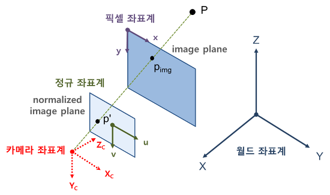
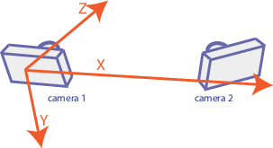

## Coordinate System In Geometric Vision

> ### 📄 1. Coordinate System

<div align=center>
    
    <h5></h5>
</div>

#### 1). World coordinate(3D)
* 모든 물체의 위치와 방향을 통일된 기준에서 표현할 수 있게 해주는 기준 좌표계" 이다.
* 그리고 이 월드 좌표계는 문제 상황에 맞게 임의로 정할 수 있는 좌표로 마음 먹기에 따라 설정할 수 있다.
  * 여러 물체, 에셋, 카메라 등등이 있을떄, 각가의 위치와 방향을 서로 비교하거나 계산할때, 하나의 공통으로 사용되는 기준 공긴이 필요하고 그게 월드 좌표계라는것이다
    ```
    여담으로, UnityEngin에서 UI 좌표계가 서로다른 피봇, 앵커, Width, Height
    이런것들이 모두 제각각인 상태에서, Emit&Attract 파티클을 제작하는데 있어
    아무리 position을 가져오더라도 모든것이 상대적인 좌표라
    올바른 연출을 보이는데 정말 진땀 뺏던 기억이 있다.

    이를 해결했던 것은 결국, 서로다른 공간의 요소들을
    계산을 위한 하나의 공통 공간으로 물체를 끌고와서 계산을 진행하고,
    다시 본래 속했던 부모로 보내줌으로 해결했었다.
    ```

* 원점 (origin)은 $(0,0,0)$
* 월드 좌표계의 임의의 점은 대문자로 표기 $P = (X, Y,Z)$

#### 2). Camera coordinate(3D)

<div align=center>
    
    <h5></h5>
</div>

* 카메라의 위치가 원점인 좌표계로
카메라 위치를 기준으로 물체의 위치를 상대적으로 나타내는데 사용한다.
* 아래로 총구를 겨눈 왼손 죄표계로 엄지방향이 카메라의 Forward Z축,
2차원 array 형태의 x, y 우하단으로 증가
* 렌즈의 중심을 원점(origin) $(0,0,0)$
* 카메라 좌표계의 임의의 점은 아래첨자를 c로 표기$P_c = (X_c, Y_c, Z_c)$

#### 3). Pixel/Screen coordinate(=image plane, 2D)

* "실제로 우리가 보는 2D 이미지(사진, 화면)위에서 사용 가능한 픽셀들의 위치를 숫자로 표현하게끔 하는 좌표계"
* 3D 세상의 위치 정보를 2D 평면 위로 $(x, y)$로 바꿔주는 공간으로
이러한 과정을 투영, 혹은 mapping 이라고 불린다.

* 만약 이산적인 Depth-Z 값도 추가한다면
  Z값에 대응되는 2D스크린이 존재해 차곡 차곡 쌓으면 깊이가 있는 스크린을 만들 수 있다.

* 스크린 좌표계에서 점
  * 카메라의 원점에서 쏜 Ray $\vec{P_0P} = (X, Y, Z)$ 벡터가 있고,
  이미지/스크린에 교점 $P_img=(x,y)$으로 투영되는 것을 점이라고 부른다.
* 스크린 좌표계에서 "선분"
  * 카메라의 원점이 하나의 꼭짓점이 되는 삼각형 평면이,
  스크린에 투영되는 것을 선이라 부른다.


#### 4). Normalized image plane (2D)

* 물리적으로 카메라는 여러 종류가 존재할 수 있다.
  * 동일한 장면을 동일한 위치와 동일한 각도에서 찍더라도,
  카메라의 렌즈에 의한 외곡, 초점거리 필터라든지 등등 세팅에 따라서 다른 영상을 얻게된다.
  * 이러한 카메라간 차이는 기하학적인 해석을 하는데 있어서 불필요한 요소라,
  이런것을 제거한 것이 바로 그것이다.

* 카메라의 내부 파라미터(intrinsic parameter)의 영향을 제거한 이미지 좌표계이며,
* 초점거리(focal length : "카메라 렌즈의 중심으로 부터 이미지 필름까지 거리) 는 무조건 1을 가지는 정규화 된 스크린 좌표계임.
  * 초점 거리는 3D 공간의 점을 2D 이미지 평면에 투영할 때, 투영의 비율(확대/축소)을 결정하는 중요한 파라미터로.
    1. 초점 거리가 길수록(값이 클수록) 멀리 있는 물체를 더 크게(줌인).
    2. 초점 거리가 짧을수록(값이 작을수록) 더 넓은 시야(와이드 앵글).

* 정규 좌표계의 원점은 정규 이미지 평면의 중점(광학축 Zc와의 교점)
  * $z = f = 1$인 평면의 방정식
  * $p' = (u, v)$ 모델링에서도 사용되는 UV 좌표 *픽셀 좌표계와 구분하기 위해 사용됨*

---

> ### 📄 2. Pixel -> Normiazed

* 동차 좌표계(Homogeneous Coordinate) 좌표계에서 아핀 변환을 수행하는 행렬은 다음과 같다.
* $f$ : 초점거리 focal length
* $c_x, c_y$ : 주점, 별건 아니고 평면과 광학축이 만나는 픽셀좌표로
그냥 픽셀좌표의 중심이라 생각하자

$$
\begin{bmatrix}
x \\
y \\
1
\end{bmatrix} =
\begin{bmatrix}
f, 0, c_x \\
0, f, c_y\\
0, 0, 1 \\
\end{bmatrix}_K
\begin{bmatrix}
u \\
v \\
1
\end{bmatrix}
$$

---


### 참고

https://boofcv.org/index.php?title=Tutorial_Geometric_Vision
https://blog.naver.com/tlqor123/220543002583
https://angeloyeo.github.io/2024/06/28/Affine_Transformation.html#google_vignette
https://wonjayk.tistory.com/92
https://darkpgmr.tistory.com/77
https://carmencincotti.com/2022-05-02/homogeneous-coordinates-clip-space-ndc/
https://gaussian37.github.io/vision-concept-homogeneous_coordinate/
https://3dmpengines.tistory.com/761?category=512287
https://www.youtube.com/watch?v=o-xwmTODTUI
https://www.youtube.com/watch?v=bLWiFQ_1GtU&list=PLyuV91SJJre4qehYiuFsgvdm8qp_YofIf&index=1
https://www.youtube.com/watch?v=N6vP0T1Xabg&list=PLoJdZ7VvEiRNQwM3pcwHWwLQutIYMs4KK&index=3
