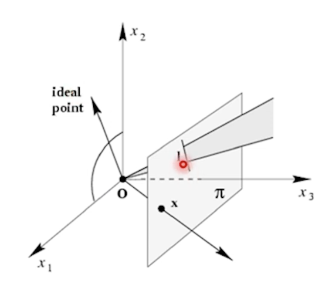

---

## Homogeneous coordinate

---

> ### 📄 1.  Inhomogeneous coordinate

> 우리가 일반적으로 아는 좌표계(Cartesian coordinate system)
> 2D Point $(x, y)$
> 3D Point $(X, Y, Z)$


#### 1). Transformation

1. **Similarity Transformation**
   * 이미지의 형태는 유지되며, R(회전), S(확대) 변환만 허용

---

> ### 📄 2. Homogeneous Coordinate

---

#### 아핀 변환 등등을 다양한 변환을 하나의 행렬로 구현하기위해 사용되는 좌표계

<div align=center>
    
    <h5>x 는 점(원점을 지나는 ray가 평면에 접접하는것)<br>
    l은 선(원점을 지나는 방사형 평면이 평면에 접하는것)<br>
    idle point는 x3에 해당하는 값이 0인것을 볼 수 있다.</h5>
</div>


#### 1). 성질

##### ① 표현하고자 하는 차원수보다 1차원 늘어난 벡터로 좌표를 표시

* 2D Point $(x, y, 1) = (kx, ky, k) (k \neq 0)$
* 3D Point $(X, Y, Z, 1) = (wX, wY, wZ, w) (w \neq 0)$

##### ② 동일한 자료형으로, 벡터와 정점을 구분하는 방법을 제공한다.

1. 마지막 원소 값을 $w=1$로 두면 **점**을 표현
    * 특히 이 부분은 동차 좌표의 마지막 요소로 앞 요소를 나눈값이
    $(\frac{x}{w} ,\frac{y}{w},\frac{z}{w})$ 실제 3차원 좌표가 된다.
2. 마지막 원소 값을 $w = 0$로 두면 **방향 벡터**를 표현
   * w = 0 일 경우 그 자체가 Vector ( x, y, z ) 를 나타낸다.
   * **방향 벡터**라 함은 다음과 같이 표현도 가능하다
   : **무한대의 점**, **평행선이 만나는 무한대의 교점**, **소실점** 등
   * 선 $l$과 $l'$이 평행할 때, 외적은 0

3. 점과 벡터간 연산 결과
    ```
    점 + 벡터 = 점
    1 + 0 = 1

    점 - 점 = 벡터
    1 - 1 = 0

    벡터 + 벡터 = 벡터
    0 + 0 = 0
    ```


##### ③ 스케일 불변("up to scale")
* "Homogeneous 좌표는 스케일 불변("up to scale")로 같다"
* 이는 스케일이 아무리 바뀐다 하더라도 동차 좌표계에선 동일한 점 좌표를 표현한다.
  * 예를 들어 2차원 사영 기하학에서 동차 좌표계의 좌표
  $( 1, 2, 1) = ( 2, 4, 1 ) = ( 5, 10, 5)$ 들은 모두 동일한 좌표이다.
  * 마찬가지로 동차 좌표계에서 (wx, wy, wz, w)는 (x, y, z, 1)과 같은 위치
  * 왜냐하면 두 점은 스케일에도 불면하게 모두 동일한 한 점 (x, y)로 투영되기 때문.
* 이러한 성질이 **투영선(RayCast)위의 모든 점을 하나의 Homogeneous 좌표로 표현할 수 있게 해준다**.

---

#### 2). 장점
1. 평행 이동을 단일행렬의 선형 변환으로 표현할 수 있게 됨, **아핀 변환(affine)** 이라 한다.
   그래픽스에서 3D 좌표 변환(예: 변환, 회전, 스케일링)은 4x4 행렬을 사용하여 수행된다.
2. 원근 투영을 단일행렬의 선형 변환으로 표현할 수 있게 됨, **투영 변환(Projection)** 이라 한다.
3. **점과 공간벡터(무한대 점)을 표현하는데 장점**
   * $w=1$ : 점
   * $w=0$ : 공간벡터(무한대 점, 평행선의 교점)
     *이런거 $(x,y,0)$*
4. 교점과, 두점이 이루는 선을 손 쉽게 **외적(Cross Product)** 으로 구할 수 있음
    * $x = l \times l'$ : 선 $l$과 $l'$이 교차하는 점은 외적으로 구할 수 있음
    * $l = x \times x'$ : 점 $x$과 $x'$이 이루는 선은 두 점을 외적으로 할 수 있다.

---

#### 3). Transformation
1. **Affine Transformation**
   * 이미지의 평행선은 유지되는 한 변환이 허용됨 Shear (납작, 홀쭉), T(평행 이동)
2. **Projection Transformation**
   * 평행한 직선이 소실점에서 만난다는 가정하에 적용되는 변환

---

> ### 📄 3. 사영 기하학


#### 1). 2D 좌표의 Inhomogeneous Coordinate에서의 직선의 방정식

---

#### Inhomogeneous: $ax + by + c = 0$
* Inhomogeneous(비동차) 좌표계는 우리가 일반적으로 사용하는 2차원 평면 좌표계.

##### ① 일반적인 직선의 방정식
* $(x, y)$는 평면 위의 점이고, $a, b, c$는 실수 계수들이다.

$$
ax + by + c = 0
$$

##### ② 기울기-절편 형태
* $m$은 기울기, $n$은 y절편.
* $m = \frac{-a}{b}$, $n = \frac{-c}{b}$

$$
y = mx + n
$$

---

#### 2). 2D 좌표의 Homogeneous Coordinate에서의 직선의 방정식

---

#### Homogeneous: $l^T p = 0$, $l = (a, b, c)$, $p = (x, y, 1)$

* Homogeneous(동차) 좌표계는 컴퓨터 비전, 그래픽스 등에서
변환을 쉽게 하기 위해 사용하는 좌표계.
* 2D 평면의 한 점 $(x, y)$는 homogeneous 좌표계에서 $(x, y, 1)$로 표현됩니다.

* 직선의 방정식은 다음과 같이 표현됩니다.

$$
l = (a, b, c), \
l^T = \begin{pmatrix}
a \\
b \\
c \\
\end{pmatrix}\\
p = (x, y, 1) \\
l^T \cdot p = 0
$$


* 즉, $a x + b y + c = 0$ 와 동일합니다.
