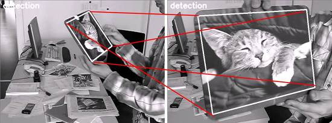
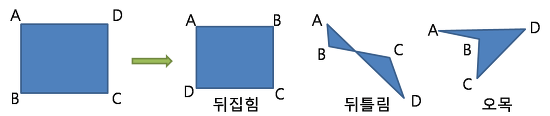

## 2D Transformation

### 2D 변환

    
    <h5></h5>

* 2D 변환은 두 이미지 사이의 matching 관계를 모델링할 때 사용하는 방법이다.
* 변환에 단계가 있다면 다음 순서로 점점 자유도가 높아지거나 이전 단계를 포함하는 단계이다.

#### 1). Rigid Transformation
* 형태와 크기를 유지한체 위치와 방향만 바뀔 수 있는 변환
* Ex). `X Translation`, `Y Translation`, `Rotation`
    * 자유도는 3

##### ① Translation

$
T =
\begin{pmatrix}
1 & 0 & X \\
0 & 1 & Y \\
0 & 0 & 1
\end{pmatrix}
$

* **분리 해석 시**
    $
    \begin{bmatrix}
    x_{new} \\
    y_{new} \\
    \end{bmatrix} =
    \begin{bmatrix}
    A_{11} & A_{12} \\
    A_{21} & A_{22} \\
    \end{bmatrix}
    \begin{bmatrix}
    x \\
    y \\
    \end{bmatrix} +
    \begin{bmatrix}
    X \\
    Y \\
    \end{bmatrix}
    $
  * 아핀 변환을 통해 생성된 열 (3x3 -> 3x4)을 나눠서 생각하면.
  * $L : 3 \times 3 행렬$, $t : 3D 열벡터$ $[L | t]$
    1. L은 이동변환 요소가 포함되지 않는다.
    2. t는 이동 변환 요소 뿐만 아니라 선형 변환 요소도 포함한다.

##### ② Rotation

$
R =
\begin{pmatrix}
cos(\theta)  &   sin(\theta) &  0 \\
-sin(\theta)  &   cos(\theta)  &  0 \\
0 & 0 & 1 \\
\end{pmatrix}
$

#### 2). Similarity Transformation
* Rigid에 추가적으로 스케일 변환까지 허용한 변환
* Ex). `+Scale`
    * 자유도는 4

##### ① Scale

$
S =
\begin{pmatrix}
W & 0 & 0 \\
0 & H & 0 \\
0 & 0 & 1 \\
\end{pmatrix}
$

#### 3). Affine Transformation
* 평행성과, width, height의 비율을 보존하는 변환
* Ex). `+Shearing/Deformation` `Reflection`
    * 자유도는 6

##### ① Shearing
* 현 차원에서 밀기 변환(Sheer)을 수행하면 이런것은 한차원 낮은 공간이 이동한다는 점을 이해하면 된다.

##### ② Reflection
* 축 반전이 가능하다.

#### 4). Homography (Projective Transformation)
* 외곡된 영상을 보정하는데 사용하기도 한다.
* 두가지 이미지를 가지고 있고, 4쌍으로 대응되는 점들만 있으면 선형 변환식을 유도할 수 있다.
    * 마지막 행이 드디어 0 0 1이 아니게 된다.
* Ex). `1점 투시` `2점 투시`
  * 자유도는 8

##### ①

#### 5). Homography 보완

    
    <h5><a href="https://darkpgmr.tistory.com/80">Homography 보완</a></h5>

##### ① 뒤집힘 (reflection) *affine* & *homography*
##### ② 뒤틀림 (twist) *affine*
##### ③ 오목 (concave) *affine*
* [볼록 다각형을 판단하는 방법](https://darkpgmr.tistory.com/86)

### 아핀 변환 리커버리 & 메트릭 프로퍼티 투 이미지

* 평행한 것들로 추정되거나 원래 그랬지만 프로젝티브에 의해 외곡된 것을
다시 평행하도록 변경하게 한다.

---

## 참조
* [홍정모 : 아핀변환](https://www.youtube.com/watch?v=bLWiFQ_1GtU)
* [아핀변환 : 분리해석](https://www.youtube.com/watch?v=bLWiFQ_1GtU)
* [이득우 : 아핀 변환에서 이동 변환 시각적인 해석](https://www.youtube.com/watch?v=nY6cZOY3VOs)
* [다크 프로그래머 : 2D 변환 (Transformations)](https://darkpgmr.tistory.com/82)
* [다크 프로그래머 : Homography 보완](https://darkpgmr.tistory.com/82)

https://3dmpengines.tistory.com/761?category=512287
https://www.youtube.com/watch?v=DSmXIYkp024
