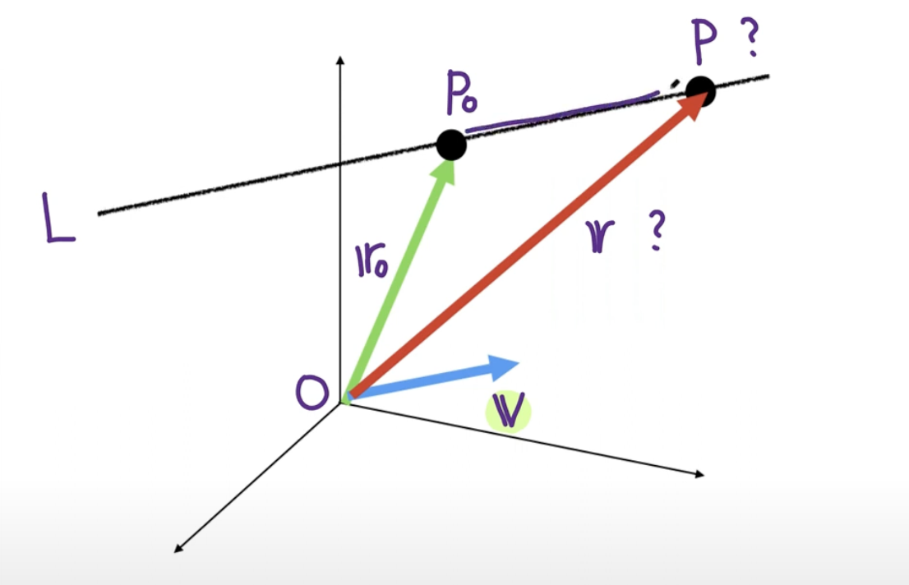
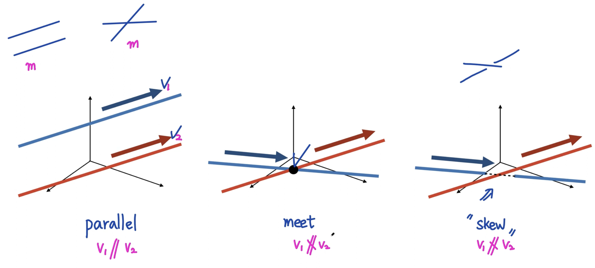
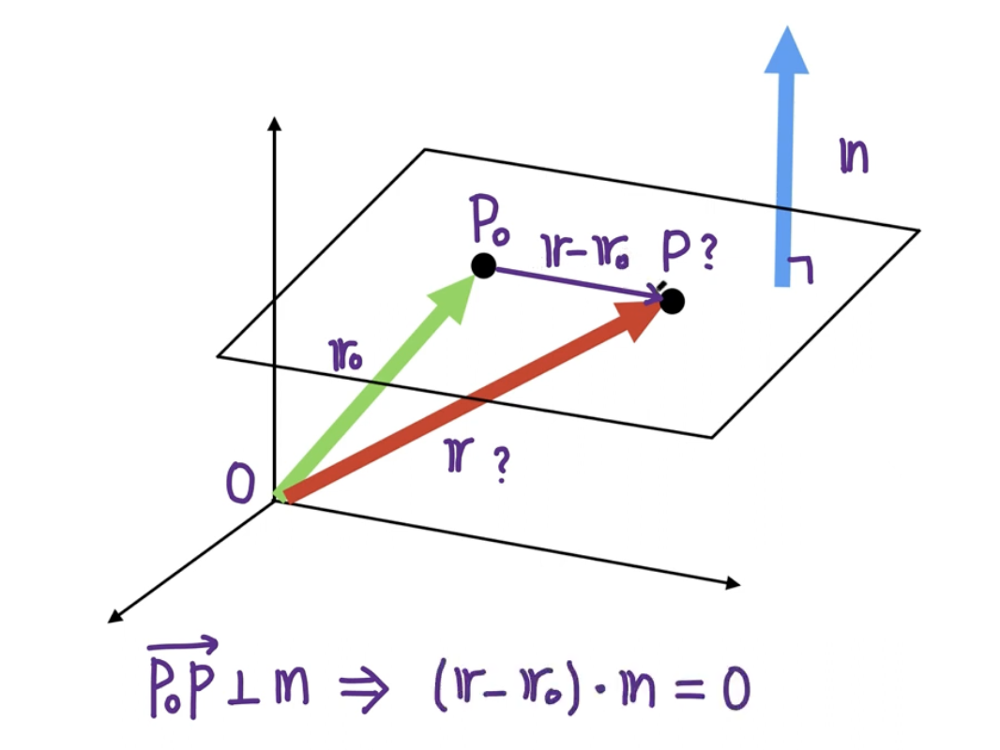
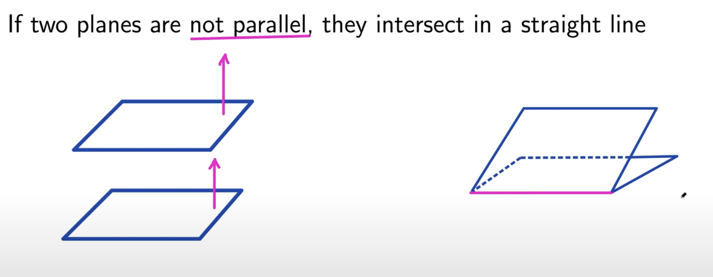
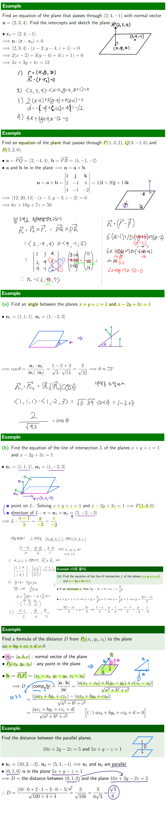

---

## 6. Equations Of Lines And Planes


---

> ### 📄 1. 공간에서의 직선의 방정식


<div align=center>
    
    <h5></h5>
</div>

---

#### 문제

* 직선$L$위의 점 $P_{0}(x_0, y_0, z_0)$, **직선 $L$위에 궁금한 점 $P(x, y, z)$**
* 원점부터 점 $P$까지 벡터 $\vec{OP_0} = r_0$ **궁금한 벡터 $\vec{OP} = r$**,
* $\vec{v}$ : 직선 $L$과 평행한 방향의 벡터
* $t$는 실수 집합 $\reals$의 원소로 **벡터의 스칼라 곱에 사용할 상수**

<br>

* **$L$위의 점 $P_{0}$와, $L$과 평행한 $\vec{v}$ 가 주어졌을때 점 $P(x, y, z)$ 또는 $\vec{r}$의 직선의 방정식을 구하세요**

---

#### 배울 수 있는 것.
```
1. 공간에서 "직선의 방정식"을 4가지의 방법으로 유도할 수 있다.
2. Parallel lines(평행선)과 Skew Line에 대해 이해할 수 있다.
3. Line Segment(선분)에 해당하는 직선의 방정식을 만들 수 있다.
4. Line Segment의 방정식이 t에 대한 "선형 보간" 식과 동일하다는 것을 알 수 있다.
```

---


#### 1). Formula of Lines

##### ① vector equation

* 전제
  * $\vec{OP_0} = r_0$
  * $\vec{P_0P}$와 $\vec{v}$가 평행이고,
  * $ \vec{P_0P} = t\vec{v}$ for some $t \in \reals$
  * **궁금한 벡터 $\vec{OP} = r$**,
* 그렇다면 vector equation은 다음과 같다.

$$
\vec{OP} = \vec{OP_0} + \vec{P_0P} \rArr \vec{r} = \vec{r_0} + t\vec{v}
$$

##### ② parametric equation ($L$위의 성분이 있는.)

* 전제
  * $v = \langle a, b, c\rangle$ $r_0 = \langle x_0, y_0, z_0\rangle$
  * **궁금한 벡터 $r = \langle x, y, z\rangle$**
  * vector equation에 의해 : $\langle x, y, z\rangle = \langle x_0, y_0, z_0\rangle + t \langle a, b, c\rangle$

* 그렇다면 parametric equation은 다음과 같다.

$$
\vec{r} =
\begin{pmatrix}
x \\
y \\
z \\
\end{pmatrix} =
\begin{pmatrix}
x_0 + t{a} \\
y_0 + t{b} \\
z_0 + t{c} \\
\end{pmatrix}
$$

##### ③ symmetric equation

* 전제
  * $v = \langle a, b, c\rangle$
  * parametric equation에서 t에 대해 정리하면. *($t = ...$ 꼴로 정리)*
* 그렇다면 symmetric equation은 다음과 같다.

$$
t = \frac{x - x_0}{a} = \frac{y - y_0}{b} = \frac{z - z_0}{c} \\
(단, abc \ne 0)
$$

* **만약! $a, b, c$ 셋중 하나라도 0일때**
  * $a = 0$일때, 다음과 같이 표현이라도 해 줘야 한다.

$$
x = x_0 \ , \frac{y - y_0}{b} = \frac{z - z_0}{c} \\
$$

##### ④ two points on the line

* 전제
  * 만약 점 $P_0(x_0, y_0, z_0)$와 점 $P_1(x_1,y_1,z_1)$가 직선 $L$위에 있다면

* 그렇다면 $\vec{v}$를 유도할 수 있고, symmetric equation에 의해

$$
\vec{v} = \langle x_1 - x_0,\ y_1 - y_0,\ z_1 - z_0\rangle
$$

$$
\frac{x - x_0}{x_1 - x_0} = \frac{y - y_0}{y_1 - y_0} = \frac{z - z_0}{z_1 - z_0} \\
$$

---

#### 2). 공간에서의 두 직선의 상태

<div align=center>
    
    <h5>평행하지 않다고 해서 언젠가 반드시 교점이 생기는것은 아니다. <br> 바로 Skew의 상태 "꼬인 상태"가 존재하기 때문이다.</h5>
</div>

* **skew : 꼬인 관계**
  * 꼬인 관계임을 알기위해서는 두개의 직선의 방정식을 사용하여
  연립 방정식을 구하는 방법밖에 없다.
    * 교점이 있다면 "Meet"
    * 교점이 없거나 (구한 해가 특정 연립방정식에 대해 성립되지 않을때)
    혹은 무한대의 점 에서 만난다면 "Skew"

---

#### 3). Line Segment (선분)

* 벡터 $\vec{r_0}$와 $\vec{r_1}$ 가 주어졌을때 벡터 방정식에 의한 Line Segment의 식은..

$$
\vec{v} = \vec{r_1} - \vec{r_0} = \langle x_1 - x_0,\ y_1 - y_0,\ z_1 - z_0\rangle
$$

$$
\vec{r} = \vec{r_0} + t{\vec{v}} \\
\vec{r} = 1(\vec{r_0}) + t{(\vec{r_1} - \vec{r_0})} \\
r(t) = (1 - t)r_0 + t{r_1}, \  0 \le t \le 1
$$

<div align=center>
<h5>와! 이거 t값에 대한 Linear Interpolation 식이랑 완전 똑같잖아?</p>
</div>

1. $t$가 $t=0$라면 $r = r_0$
2. $t$가 $t=1$라면 $r = r_1$


---

> ### 📄 2. 공간에서의 평면의 방정식

<div align=center>
    
    <h5></h5>
</div>

---

#### 문제

* 평면 위의 점 $P_{0}(x_0, y_0, z_0)$, **평면 위에 궁금한 점 $P(x, y, z)$**
* 원점부터 점 $P$까지 벡터 $\vec{OP_0} = r_0$ **궁금한 벡터 $\vec{OP} = r$**,
* $\vec{n}$ : 평면과 수직을 이루는 Normal Vector

<br>

* **평면 위의 점 $P_{0}$와, 평면에 수직인 $\vec{n}$ 가 주어졌을때 평면의 방정식을 구하세요**

---

#### 배울 수 있는 것.
```
1. 3가지의 평면의 방정식을 유도할 수 있다.
2. 평행한 두 평면에 대해 이해할 수 있다.
3. 두 평면이 이루는 각도를 계산할 수 있다.
4. 평행한 두 평면 사이 공간 거리를 계산할 수 있다.
```

---


#### 1). Formulas of Planes

##### ① vector equation

* 전제
  * 평면과 수직을 이루는 $\vec{n}$와 평면위의 직선 $\vec{P_0P}$은 수직이다.

* 그렇다면
  * $\vec{n}$과 $\vec{P_0P}$의 내적은 0
  $\vec{n} \cdot (\vec{r} - \vec{r_0}) = 0$
  * 그렇게 직관적이지는 않지만, 전개를 했을때,
  $\vec{n} \cdot \vec{r} = \vec{n} \cdot \vec{r_0}$

##### ② scalar equation

* 전제
  * $\vec{n} = \langle a, b, c\rangle$, $\vec{r_0} = \langle x_0, y_0, z_0\rangle$
  * **궁금한 벡터 $\vec{r} = \langle x, y, z\rangle$**
  * $\langle a, b, c\rangle \cdot \langle x - x_0, y - y_0, z - z_0\rangle = 0$
* 그렇다면
  * $a(x - x_0) + b(y - y_0) + c(z - z_0) = 0$

##### ③ linear equation

* 전제
  * $v = \langle a, b, c\rangle$
  * $r = \langle x, y, z\rangle$
  * $-d = (ax_0 + by_0 + cz_0)$

* 그렇다면
$$
ax + by + cz + d = 0
$$

---

#### 2). 두 평면간 상태

<div align=center>
    
    <h5></h5>
</div>

##### ① 평행할 때,
* 두 평면이 평행하다면 $\lrArr$ **두 평면의 법선벡터가 평행하다.**
  1. 두 평면 사이의 거리 $d$ 구하기

##### ② 평행하지 않을때,

* **법선벡터가 조금이라도 평행하지 않으면** 두 평면이 평행하지 않고, 접선을 그리며 만나거나.
    1. 두 평면 사이의 각도 구하기
    2. 두 평면으로 생기는 접선 방정식 구하기

<div align=center>
    
    <h5></h5>
</div>


---

> ### 📄 참고
* [경희 수학 미적분학2 : 공간에서의 직선의 방정식](https://youtu.be/NYpksl-OCZg?si=MA43sF_r-mybuD-B)
* [경희 수학 미적분학2 : 공간에서의 평면의 방정식](https://www.youtube.com/watch?v=htG5rRs-MNg)
